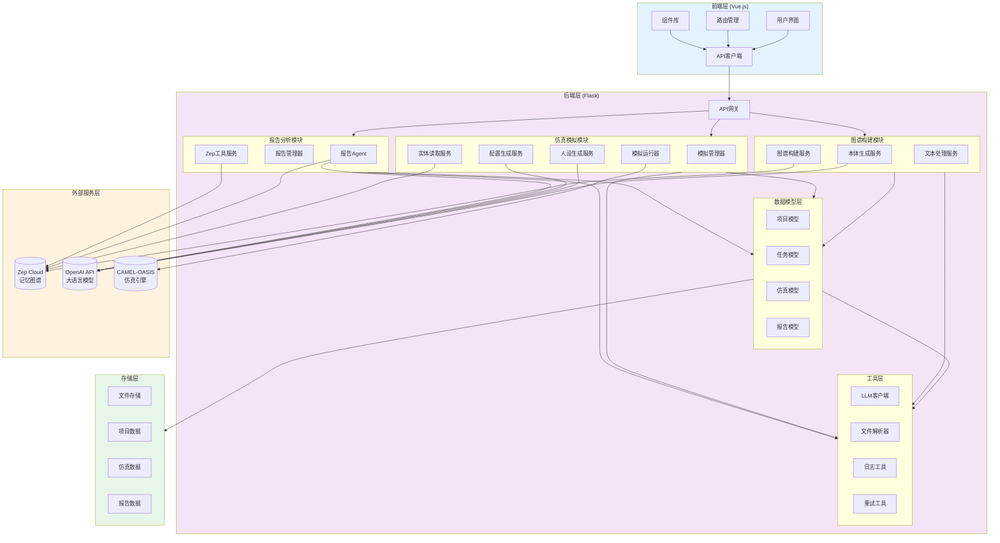
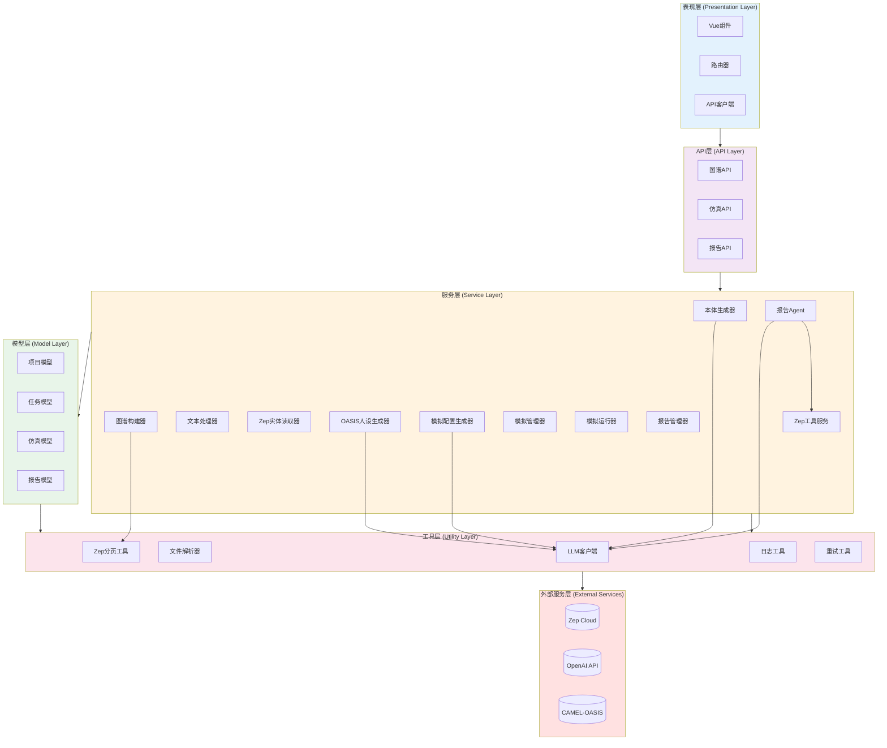

# 系统架构文档

## 整体架构图

MiroFish 采用前后端分离的三层架构设计，通过模块化的服务组件实现完整的智能体仿真预测流程。



## 数据流图

MiroFish 的数据流贯穿五个核心工作步骤，实现了从用户输入到预测输出的完整闭环。

```mermaid
flowchart LR
    User[用户请求] --> Step1

    subgraph Step1["步骤1: 本体生成"]
        A1[上传种子材料] --> A2[文件解析与文本提取]
        A2 --> A3[LLM本体生成]
        A3 --> A4[实体关系类型定义]
    end

    Step1 --> Step2

    subgraph Step2["步骤2: 图谱构建"]
        B1[文本分块处理] --> B2[创建Zep图谱]
        B2 --> B3[设置本体定义]
        B3 --> B4[批量添加文本]
        B4 --> B5[实体关系抽取]
        B5 --> B6[知识图谱存储]
    end

    Step2 --> Step3

    subgraph Step3["步骤3: 模拟配置"]
        C1[读取图谱实体] --> C2[过滤与分类]
        C2 --> C3[生成Agent人设]
        C3 --> C4[生成模拟配置]
        C4 --> C5[准备仿真环境]
    end

    Step3 --> Step4

    subgraph Step4["步骤4: 运行模拟"]
        D1[启动Twitter模拟] --> D2[启动Reddit模拟]
        D2 --> D3[Agent交互演化]
        D3 --> D4[实时数据采集]
        D4 --> D5[记忆更新]
    end

    Step4 --> Step5

    subgraph Step5["步骤5: 报告分析"]
        E1[ReportAgent启动] --> E2[图谱检索分析]
        E2 --> E3[生成预测报告]
        E3 --> E4[深度对话交互]
    end

    Step5 --> Output[预测报告与交互世界]

    A4 -.->|本体数据| B1
    B6 -.->|图谱数据| C1
    C5 -.->|配置数据| D1
    D5 -.->|仿真数据| E1

    style Step1 fill:#e3f2fd
    style Step2 fill:#f3e5f5
    style Step3 fill:#fff3e0
    style Step4 fill:#e8f5e9
    style Step5 fill:#fce4ec
```



### 数据流详细说明

#### 步骤1: 本体生成
- **输入**: 用户上传的文档文件（PDF/MD/TXT）+ 模拟需求描述
- **处理**:
  1. 文件解析器提取文本内容
  2. 文本处理器进行预处理（清洗、分块）
  3. LLM分析文本生成实体类型和关系类型定义
  4. 验证并优化本体结构（确保10个实体类型，包含兜底类型）
- **输出**: 本体定义（entity_types, edge_types）

#### 步骤2: 图谱构建
- **输入**: 提取的文本 + 本体定义
- **处理**:
  1. 文本分块（默认500字符，50字符重叠）
  2. 创建Zep Standalone Graph
  3. 设置本体定义到图谱
  4. 批量添加文本块到Zep
  5. 等待Zep处理完成（实体抽取、关系抽取）
  6. 获取图谱数据（节点、边）
- **输出**: 知识图谱（graph_id, nodes, edges）

#### 步骤3: 模拟配置
- **输入**: 图谱ID + 模拟需求
- **处理**:
  1. 从Zep读取图谱实体（过滤有效实体）
  2. LLM生成Agent人设（基于实体类型和属性）
  3. LLM生成模拟配置（参数设置）
  4. 准备OASIS仿真环境（生成配置文件）
- **输出**: Agent Profiles + 模拟配置

#### 步骤4: 运行模拟
- **输入**: Agent配置 + 模拟配置
- **处理**:
  1. 启动Twitter平台模拟进程
  2. 启动Reddit平台模拟进程
  3. Agents根据人设进行交互
  4. 实时采集动作数据（发帖、评论、点赞等）
  5. 更新Agent记忆（可选启用图谱记忆更新）
- **输出**: 模拟数据（帖子、动作、时间线）

#### 步骤5: 报告分析
- **输入**: 模拟数据 + 图谱 + 预测需求
- **处理**:
  1. ReportAgent启动，配备工具集
  2. 分析模拟结果，生成报告大纲
  3. 使用检索工具收集证据
  4. 分章节生成预测报告
  5. 支持与用户深度对话
- **输出**: 预测报告 + 对话交互

## 模块依赖关系

MiroFish 的模块之间存在清晰的依赖层次，确保了代码的可维护性和可扩展性。



### 依赖关系详解

#### API层依赖
- `graph_bp` → `OntologyGenerator`, `GraphBuilder`, `TextProcessor`, `FileParser`
- `simulation_bp` → `ZepEntityReader`, `OasisProfileGenerator`, `SimulationManager`, `SimulationRunner`
- `report_bp` → `ReportAgent`, `ReportManager`, `SimulationManager`

#### 服务层依赖
- `OntologyGenerator` → `LLMClient`
- `GraphBuilder` → `ZepPaging`, `TextProcessor`
- `OasisProfileGenerator` → `LLMClient`, `ZepEntityReader`
- `SimulationConfigGenerator` → `LLMClient`, `SimulationManager`
- `SimulationRunner` → `SimulationManager`, `SimulationConfigGenerator`
- `ReportAgent` → `LLMClient`, `ZepTools`, `SimulationManager`
- `ZepTools` → `ZepCloud`

#### 模型层依赖
- 所有模型独立，只依赖Python标准库和`dataclasses`
- 模型之间通过ID引用，避免循环依赖

#### 工具层依赖
- `LLMClient` → `OpenAI API`
- `FileParser` → `PyMuPDF`, `charset-normalizer`
- `ZepPaging` → `ZepCloud`

## 技术栈总览

### 前端技术栈

| 技术 | 版本 | 用途 |
|------|------|------|
| **Vue.js** | 3.5.24 | 渐进式前端框架 |
| **Vue Router** | 4.6.3 | 路由管理 |
| **Vite** | 7.2.4 | 构建工具 |
| **Axios** | 1.13.2 | HTTP客户端 |
| **D3.js** | 7.9.0 | 数据可视化（图谱展示） |

#### 前端目录结构
```
frontend/
├── src/
│   ├── api/              # API客户端封装
│   │   ├── index.js      # Axios实例配置
│   │   ├── graph.js      # 图谱相关API
│   │   ├── simulation.js # 仿真相关API
│   │   └── report.js     # 报告相关API
│   ├── components/       # Vue组件
│   │   ├── Step1GraphBuild.vue    # 步骤1：图谱构建
│   │   ├── Step2EnvSetup.vue      # 步骤2：环境配置
│   │   ├── Step3Simulation.vue    # 步骤3：模拟配置
│   │   ├── Step4Report.vue        # 步骤4：报告查看
│   │   └── Step5Interaction.vue   # 步骤5：深度交互
│   ├── views/            # 页面视图
│   ├── router/           # 路由配置
│   └── assets/           # 静态资源
├── package.json
└── vite.config.js
```

### 后端技术栈

| 技术 | 版本 | 用途 |
|------|------|------|
| **Python** | 3.11-3.12 | 运行环境 |
| **Flask** | 3.0.0+ | Web框架 |
| **Flask-CORS** | 6.0.0+ | 跨域支持 |
| **OpenAI SDK** | 1.0.0+ | LLM统一接口 |
| **Zep Cloud** | 3.13.0 | 记忆图谱服务 |
| **CAMEL-OASIS** | 0.2.5 | 多智能体仿真 |
| **CAMEL-AI** | 0.2.78 | AI框架 |
| **PyMuPDF** | 1.24.0+ | PDF解析 |
| **Pydantic** | 2.0.0+ | 数据验证 |
| **python-dotenv** | 1.0.0+ | 环境变量管理 |

#### 后端目录结构
```
backend/
├── app/
│   ├── api/              # API路由
│   │   ├── graph.py      # 图谱构建API
│   │   ├── simulation.py # 仿真运行API
│   │   └── report.py     # 报告生成API
│   ├── services/         # 业务逻辑服务
│   │   ├── ontology_generator.py      # 本体生成
│   │   ├── graph_builder.py           # 图谱构建
│   │   ├── text_processor.py          # 文本处理
│   │   ├── zep_entity_reader.py       # 实体读取
│   │   ├── oasis_profile_generator.py # 人设生成
│   │   ├── simulation_config_generator.py # 配置生成
│   │   ├── simulation_manager.py      # 模拟管理
│   │   ├── simulation_runner.py       # 模拟运行
│   │   ├── report_agent.py            # 报告Agent
│   │   └── zep_tools.py               # Zep工具
│   ├── models/           # 数据模型
│   │   ├── project.py    # 项目模型
│   │   ├── task.py       # 任务模型
│   │   └── simulation.py # 仿真模型（在services中）
│   ├── utils/            # 工具函数
│   │   ├── llm_client.py # LLM客户端
│   │   ├── file_parser.py # 文件解析
│   │   ├── logger.py     # 日志工具
│   │   ├── retry.py      # 重试工具
│   │   └── zep_paging.py # 分页工具
│   ├── config.py         # 配置管理
│   └── __init__.py       # 应用工厂
├── scripts/              # 辅助脚本
├── requirements.txt      # Python依赖
├── pyproject.toml       # 项目配置
└── run.py               # 启动入口
```

### 外部服务集成

#### Zep Cloud（记忆图谱）
- **用途**: 长期记忆存储、知识图谱构建、实体关系抽取
- **功能**:
  - Standalone Graph API
  - 实体类型和关系类型定义
  - 自动实体抽取和关系抽取
  - 图谱搜索和检索
- **配置**: `ZEP_API_KEY`

#### OpenAI API（大语言模型）
- **用途**: 统一的LLM接口，支持任意OpenAI兼容的API
- **功能**:
  - 本体生成（实体关系类型定义）
  - Agent人设生成
  - 模拟配置生成
  - ReportAgent推理与报告生成
  - 对话交互
- **配置**:
  - `LLM_API_KEY`
  - `LLM_BASE_URL`（默认: https://api.openai.com/v1）
  - `LLM_MODEL_NAME`（默认: gpt-4o-mini）
  - 支持阿里百炼等兼容API

#### CAMEL-OASIS（仿真引擎）
- **用途**: 多智能体社交媒体仿真
- **支持平台**:
  - Twitter（发帖、转发、点赞、关注等）
  - Reddit（发帖、评论、投票、搜索等）
- **配置**:
  - `OASIS_DEFAULT_MAX_ROUNDS`（默认: 10）
  - `OASIS_SIMULATION_DATA_DIR`（模拟数据存储目录）

### 存储架构

MiroFish 采用文件系统存储，支持本地和容器化部署：

```
MiroFish/
├── backend/
│   ├── uploads/          # 上传文件存储
│   │   ├── projects/     # 项目文件
│   │   └── simulations/  # 仿真数据
│   ├── projects/         # 项目数据（JSON）
│   ├── tasks/            # 任务数据（JSON）
│   ├── simulations/      # 仿真状态（JSON）
│   └── reports/          # 报告存储（Markdown）
```

#### 存储内容
- **项目数据**: 项目元数据、本体定义、文件信息
- **任务数据**: 异步任务状态、进度、结果
- **仿真数据**: Agent配置、模拟状态、时间线数据
- **报告数据**: 预测报告、章节内容、Agent日志

## 核心设计模式

### 1. 分层架构
- **表现层**: Vue.js组件，负责用户交互
- **API层**: Flask路由，负责请求处理
- **服务层**: 业务逻辑，负责核心功能实现
- **模型层**: 数据结构，负责数据定义和验证
- **工具层**: 通用功能，负责基础设施

### 2. 异步任务模式
- 使用Python threading实现后台任务
- TaskManager管理任务状态和进度
- 支持进度回调和状态查询

### 3. 工厂模式
- Flask应用工厂 (`create_app()`)
- LLM客户端工厂（支持多种LLM）
- 服务实例工厂（根据配置创建）

### 4. 策略模式
- 多平台仿真支持（Twitter/Reddit）
- 可配置的仿真策略
- 灵活的报告生成策略

### 5. 观察者模式
- 任务进度更新
- 实时状态推送
- 日志记录和监控

## 性能优化

### 前端优化
- Vite快速冷启动
- 组件懒加载
- API请求重试机制
- 增量数据获取（日志流式读取）

### 后端优化
- 文本分块处理（避免LLM token限制）
- 批量API调用（减少网络开销）
- 异步任务处理（避免阻塞）
- 连接池复用
- 缓存机制（图谱数据缓存）

### 外部服务优化
- Zep批量操作（batch_size=3）
- LLM调用优化（temperature控制）
- 并行仿真执行（Twitter + Reddit）

## 安全性考虑

### API安全
- CORS配置（生产环境需限制域名）
- 请求大小限制（50MB）
- 文件类型白名单
- 环境变量隔离

### 数据安全
- 敏感信息不记录日志
- API Key环境变量管理
- 文件上传路径验证
- 用户输入清理和验证

### 运行安全
- 进程隔离（仿真在独立进程中运行）
- 资源限制（最大轮数、超时控制）
- 优雅关闭（信号处理和清理）
- 错误恢复（重试机制）

---

**相关文档**:
- [项目概览](./README.md)
- [主文档](../../README.md)
- [智能体说明](../../AGENTS.md)
