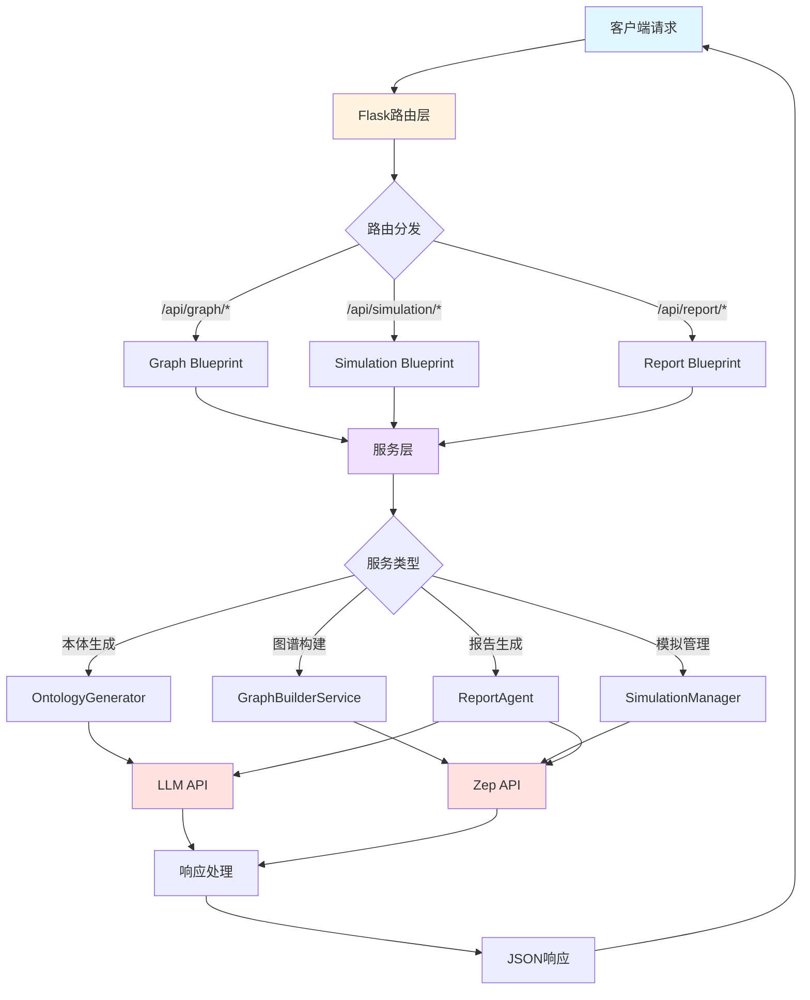
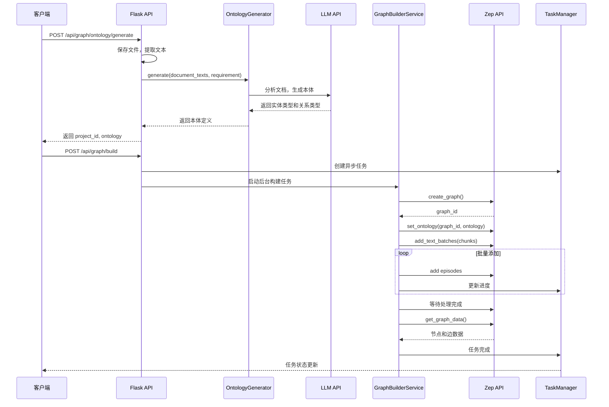
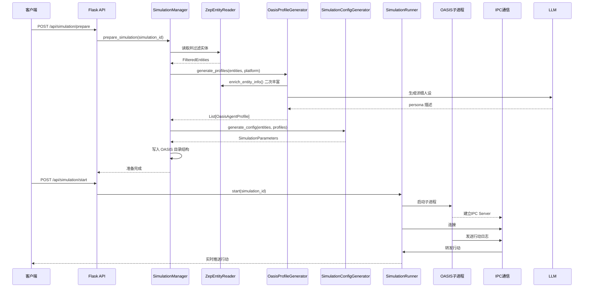
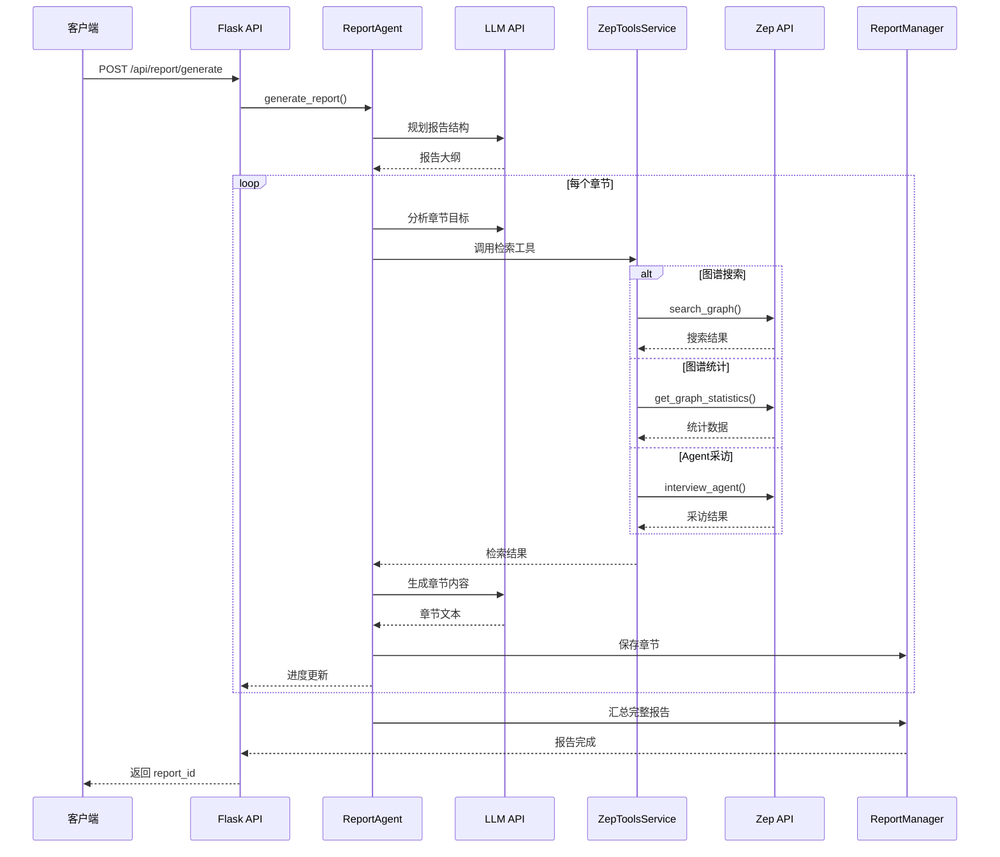
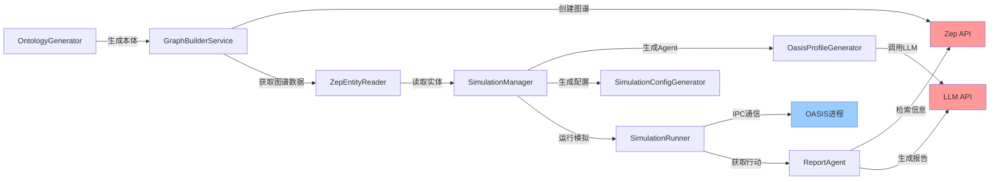

# 后端架构概览

## 1. Flask 应用架构

### 1.1 应用工厂模式

MiroFish 后端采用 **Flask Application Factory Pattern**（应用工厂模式），通过 `create_app()` 函数创建和配置应用实例。

**主要文件：** `/backend/app/__init__.py`

```python
def create_app(config_class=Config):
    """Flask应用工厂函数"""
    app = Flask(__name__)
    app.config.from_object(config_class)

    # 设置JSON编码：确保中文直接显示
    app.json.ensure_ascii = False

    # 启用CORS
    CORS(app, resources={r"/api/*": {"origins": "*"}})

    # 注册蓝图
    from .api import graph_bp, simulation_bp, report_bp
    app.register_blueprint(graph_bp, url_prefix='/api/graph')
    app.register_blueprint(simulation_bp, url_prefix='/api/simulation')
    app.register_blueprint(report_bp, url_prefix='/api/report')

    # 健康检查
    @app.route('/health')
    def health():
        return {'status': 'ok', 'service': 'MiroFish Backend'}

    return app
```

**优势：**
- 便于测试：可以为不同环境创建不同的应用实例
- 灵活配置：可以通过传入不同的配置类来定制应用
- 延迟初始化：避免循环导入问题

### 1.2 Blueprint 组织

后端使用 **Flask Blueprint** 将路由按功能模块划分为三个主要蓝图：

| Blueprint | 前缀 | 功能描述 | 文件位置 |
|-----------|------|---------|---------|
| `graph_bp` | `/api/graph` | 图谱相关接口（本体生成、图谱构建、项目管理） | `app/api/graph.py` |
| `simulation_bp` | `/api/simulation` | 模拟相关接口（实体读取、Agent生成、模拟运行） | `app/api/simulation.py` |
| `report_bp` | `/api/report` | 报告相关接口（报告生成、对话、日志） | `app/api/report.py` |

### 1.3 应用入口点

**主入口文件：** `/backend/run.py`

```python
def main():
    """主函数"""
    # 验证配置
    errors = Config.validate()
    if errors:
        print("配置错误:")
        for err in errors:
            print(f"  - {err}")
        sys.exit(1)

    # 创建应用
    app = create_app()

    # 启动服务
    app.run(host=host, port=port, debug=debug, threaded=True)
```

**启动方式：**
```bash
cd backend
python run.py
```

**默认配置：**
- Host: `0.0.0.0`
- Port: `5001`
- Debug: 从 `.env` 文件读取

---

## 2. 服务层架构

服务层是业务逻辑的核心，负责处理复杂的数据操作、外部API调用和业务流程编排。

### 2.1 服务层目录结构

```
backend/app/services/
├── ontology_generator.py          # 本体生成服务
├── graph_builder.py               # 图谱构建服务
├── text_processor.py              # 文本处理服务
├── zep_entity_reader.py           # Zep实体读取服务
├── oasis_profile_generator.py     # OASIS Agent配置生成服务
├── simulation_config_generator.py # 模拟配置生成服务
├── simulation_manager.py          # 模拟管理服务
├── simulation_runner.py           # 模拟运行服务
├── simulation_ipc.py              # 模拟进程通信服务
├── zep_graph_memory_updater.py    # Zep图谱记忆更新服务
├── zep_tools.py                   # Zep工具服务
└── report_agent.py                # 报告Agent服务
```

### 2.2 核心服务详解

#### 2.2.1 OntologyGenerator（本体生成服务）

**文件：** `app/services/ontology_generator.py`

**功能：**
- 分析上传的文档内容（PDF/MD/TXT）
- 根据模拟需求生成适合社交媒体舆论模拟的实体类型和关系类型定义
- 使用 LLM 进行智能分析和本体设计

**核心方法：**
```python
class OntologyGenerator:
    def generate(self, document_texts: List[str],
                 simulation_requirement: str,
                 additional_context: Optional[str] = None) -> Dict[str, Any]:
        """
        生成本体定义

        返回：
        {
            "entity_types": [...],  # 实体类型列表
            "edge_types": [...],    # 关系类型列表
            "analysis_summary": "..." # 分析摘要
        }
        """
```

**设计原则：**
- 实体必须是现实中真实存在的、可以在社媒上发声和互动的主体
- 抽象概念、主题、观点不能作为实体
- 专注于社交媒体舆论模拟场景

#### 2.2.2 GraphBuilderService（图谱构建服务）

**文件：** `app/services/graph_builder.py`

**功能：**
- 调用 Zep API 构建 Standalone Graph
- 创建图谱、设置本体、添加文本内容
- 等待 Zep 处理完成并获取图谱数据

**核心方法：**
```python
class GraphBuilderService:
    def create_graph(self, name: str) -> str:
        """创建图谱，返回 graph_id"""

    def set_ontology(self, graph_id: str, ontology: Dict) -> None:
        """设置本体定义"""

    def add_text_batches(self, graph_id: str, chunks: List[str],
                        batch_size: int = 3,
                        progress_callback: Optional[Callable] = None) -> List[str]:
        """批量添加文本块"""

    def _wait_for_episodes(self, episode_uuids: List[str],
                          progress_callback: Optional[Callable] = None) -> None:
        """等待所有 episode 处理完成"""

    def get_graph_data(self, graph_id: str) -> Dict[str, Any]:
        """获取图谱数据（节点和边）"""
```

**特点：**
- 支持进度回调，实时报告构建进度
- 批量处理文本块，提高效率
- 轮询检查 episode 处理状态

#### 2.2.3 OasisProfileGenerator（OASIS Agent 配置生成服务）

**文件：** `app/services/oasis_profile_generator.py`

**功能：**
- 将 Zep 图谱中的实体转换为 OASIS 模拟平台所需的 Agent Profile 格式
- 调用 Zep 检索功能二次丰富节点信息
- 使用 LLM 生成详细的 Agent 人设

**核心方法：**
```python
class OasisProfileGenerator:
    def generate_profiles(self, entities: List[EntityNode],
                         platform: PlatformType) -> List[OasisAgentProfile]:
        """
        生成 OASIS Agent Profile 列表

        参数：
            entities: Zep 实体节点列表
            platform: 平台类型 (TWITTER/REDDIT)

        返回：
            OasisAgentProfile 列表
        """

    def _enrich_entity_info(self, entity: EntityNode) -> str:
        """调用 Zep 检索丰富实体信息"""

    def _generate_persona_with_llm(self, entity: EntityNode,
                                  enriched_info: str) -> str:
        """使用 LLM 生成详细人设"""
```

**OasisAgentProfile 数据结构：**
```python
@dataclass
class OasisAgentProfile:
    user_id: int
    user_name: str
    name: str
    bio: str
    persona: str           # 详细人设描述
    age: Optional[int]
    gender: Optional[str]
    mbti: Optional[str]
    country: Optional[str]
    # Reddit 特有
    karma: int = 1000
    # Twitter 特有
    friend_count: int = 100
    follower_count: int = 150
    statuses_count: int = 500
```

#### 2.2.4 ReportAgent（报告生成服务）

**文件：** `app/services/report_agent.py`

**功能：**
- 使用 LangChain + Zep 实现 ReACT 模式的模拟报告生成
- 先规划目录结构，然后分段生成
- 每段采用 ReACT 多轮思考与反思模式
- 支持与用户对话，在对话中自主调用检索工具

**核心方法：**
```python
class ReportAgent:
    def generate_report(self, progress_callback: Optional[Callable] = None,
                       report_id: Optional[str] = None) -> SimulationReport:
        """
        生成模拟分析报告

        流程：
        1. 规划报告结构
        2. 逐章节生成内容
        3. 每章节使用 ReACT 模式：
           - Thought（思考）
           - Action（调用工具检索）
           - Observation（观察结果）
           - Reflection（反思）
        4. 汇总生成完整报告
        """

    def chat(self, message: str,
            chat_history: List[Dict] = None) -> Dict[str, Any]:
        """
        与 Agent 对话

        Agent 会自主调用检索工具来回答问题
        """
```

**报告生成流程：**
1. **规划阶段**：生成报告大纲和章节结构
2. **生成阶段**：逐章节生成内容，每个章节：
   - 分析章节目标
   - 调用 Zep 工具检索相关信息
   - 生成内容并反思
3. **汇总阶段**：合并所有章节，生成完整报告

#### 2.2.5 SimulationManager（模拟管理服务）

**文件：** `app/services/simulation_manager.py`

**功能：**
- 管理模拟的完整生命周期
- 协调 Zep 实体读取、Agent 生成、配置生成
- 管理模拟状态（创建、准备、就绪、运行中、已完成等）

**核心方法：**
```python
class SimulationManager:
    def create_simulation(self, project_id: str, graph_id: str,
                         enable_twitter: bool = True,
                         enable_reddit: bool = True) -> SimulationState:
        """创建新模拟"""

    def prepare_simulation(self, simulation_id: str) -> bool:
        """
        准备模拟（自动流程）

        1. 读取 Zep 实体
        2. 过滤实体
        3. 生成 Agent Profiles
        4. 生成模拟配置
        5. 写入 OASIS 目录
        """

    def start_simulation(self, simulation_id: str) -> bool:
        """启动模拟"""

    def stop_simulation(self, simulation_id: str) -> bool:
        """停止模拟"""

    def get_simulation(self, simulation_id: str) -> Optional[SimulationState]:
        """获取模拟状态"""
```

**模拟状态机：**
```
CREATED → PREPARING → READY → RUNNING → COMPLETED
           ↓           ↓         ↓
           └───────────┴─────────┴→ FAILED / STOPPED
```

#### 2.2.6 SimulationRunner（模拟运行服务）

**文件：** `app/services/simulation_runner.py`

**功能：**
- 在独立子进程中运行 OASIS 模拟
- 通过 IPC 与主进程通信
- 实时捕获模拟输出和 Agent 行动
- 支持暂停、恢复、停止操作

**核心方法：**
```python
class SimulationRunner:
    def start(self, simulation_id: str) -> bool:
        """启动模拟（在子进程中运行）"""

    def stop(self, simulation_id: str) -> bool:
        """停止模拟"""

    def get_actions(self, simulation_id: str,
                   last_seq: int = 0) -> List[AgentAction]:
        """获取 Agent 行动列表（增量）"""

    def get_current_round(self, simulation_id: str) -> int:
        """获取当前轮次"""
```

**进程架构：**
```
Main Process (Flask)
    ↓
SimulationRunner (IPC Client)
    ↓ (Unix Domain Socket)
Subprocess (OASIS Simulation)
    ↓
SimulationIPCServer (IPC Server)
```

---

## 3. API 路由结构

### 3.1 路由概览

```
/api/
├── /health                    # 健康检查
├── /graph/                    # 图谱相关接口
│   ├── /project/<id>          # 项目管理（GET/DELETE）
│   ├── /project/list          # 列出项目
│   ├── /project/<id>/reset    # 重置项目
│   ├── /ontology/generate     # 生成本体
│   ├── /build                 # 构建图谱
│   ├── /task/<id>             # 查询任务状态
│   ├── /data/<graph_id>       # 获取图谱数据
│   └── /delete/<graph_id>     # 删除图谱
├── /simulation/               # 模拟相关接口
│   ├── /entities/<graph_id>   # 获取实体
│   ├── /prepare               # 准备模拟
│   ├── /start                 # 启动模拟
│   ├── /stop                  # 停止模拟
│   ├── /status/<id>           # 查询模拟状态
│   ├── /actions/<id>          # 获取行动列表
│   ├── /interview             # Agent 采访
│   └── /list                  # 列出模拟
└── /report/                   # 报告相关接口
    ├── /generate              # 生成报告
    ├── /generate/status       # 查询生成状态
    ├── /<report_id>           # 获取报告详情
    ├── /by-simulation/<id>    # 根据模拟ID获取报告
    ├── /list                  # 列出报告
    ├── /<report_id>/download  # 下载报告
    ├── /chat                  # 与 Report Agent 对话
    ├── /<report_id>/progress  # 获取报告进度
    ├── /<report_id>/sections  # 获取章节列表
    └── /<report_id>/agent-log # 获取 Agent 日志
```

### 3.2 核心接口说明

#### 3.2.1 图谱接口

**POST `/api/graph/ontology/generate`**
- 上传文档并生成本体定义
- 返回：`project_id`, `ontology`, `files`, `total_text_length`

**POST `/api/graph/build`**
- 根据 `project_id` 构建图谱
- 异步执行，返回 `task_id`
- 支持进度查询：`GET /api/graph/task/{task_id}`

#### 3.2.2 模拟接口

**POST `/api/simulation/prepare`**
- 准备模拟（全自动流程）
- 读取实体 → 生成 Agent → 生成配置 → 写入目录
- 返回：`simulation_id`, `status`, `agent_counts`

**POST `/api/simulation/start`**
- 启动模拟
- 在子进程中运行 OASIS
- 返回：`simulation_id`, `status`, `pid`

**GET `/api/simulation/actions/<simulation_id>`**
- 获取 Agent 行动列表（增量）
- 参数：`last_seq`（上次获取的序号）
- 返回：`actions`, `current_round`, `has_more`

#### 3.2.3 报告接口

**POST `/api/report/generate`**
- 生成模拟分析报告（异步）
- 返回：`report_id`, `task_id`, `status`

**POST `/api/report/chat`**
- 与 Report Agent 对话
- Agent 自主调用检索工具
- 返回：`response`, `tool_calls`, `sources`

**GET `/api/report/<report_id>/sections`**
- 获取已生成的章节列表（分章节输出）
- 支持实时流式获取
- 返回：`sections`, `total_sections`, `is_complete`

---

## 4. 数据流

### 4.1 整体数据流



### 4.2 典型流程：本体生成与图谱构建



### 4.3 典型流程：模拟运行



### 4.4 典型流程：报告生成



### 4.5 请求处理流程

```
1. 请求接收
   ├─ Flask 路由接收 HTTP 请求
   ├─ CORS 中间件处理跨域
   └─ 请求日志中间件记录请求

2. 参数验证
   ├─ 解析 JSON 或 FormData
   ├─ 验证必填参数
   └─ 类型转换和默认值处理

3. 业务处理
   ├─ 调用服务层方法
   ├─ 服务层协调多个组件
   ├─ 调用外部 API（LLM/Zep）
   └─ 处理业务逻辑

4. 响应构造
   ├─ 统一响应格式：{ success, data, error }
   ├─ 设置正确的状态码
   └─ JSON 序列化（确保中文正确显示）

5. 响应返回
   ├─ 响应日志中间件记录响应
   └─ 返回给客户端
```

### 4.6 错误处理流程

```python
try:
    # 业务逻辑
    result = service.do_something()
    return jsonify({"success": True, "data": result})
except ValidationError as e:
    return jsonify({"success": False, "error": str(e)}), 400
except NotFoundError as e:
    return jsonify({"success": False, "error": str(e)}), 404
except Exception as e:
    logger.error(f"Unexpected error: {str(e)}")
    logger.debug(traceback.format_exc())
    return jsonify({
        "success": False,
        "error": str(e),
        "traceback": traceback.format_exc()
    }), 500
```

---

## 5. 服务间交互

### 5.1 服务交互图



### 5.2 服务依赖关系

| 服务 | 依赖服务 | 外部依赖 |
|------|---------|---------|
| OntologyGenerator | LLMClient | OpenAI API |
| GraphBuilderService | TextProcessor, ZepClient | Zep API |
| ZepEntityReader | ZepClient | Zep API |
| OasisProfileGenerator | ZepEntityReader, LLMClient | Zep API, OpenAI API |
| SimulationConfigGenerator | - | - |
| SimulationManager | ZepEntityReader, OasisProfileGenerator, SimulationConfigGenerator | - |
| SimulationRunner | SimulationIPCServer | OASIS (本地进程) |
| ReportAgent | ZepToolsService, LLMClient | Zep API, OpenAI API |

---

## 6. 配置管理

### 6.1 配置文件

**文件位置：** `/backend/app/config.py`

**配置来源：** 项目根目录的 `.env` 文件

**主要配置项：**

```python
class Config:
    # Flask配置
    SECRET_KEY = os.environ.get('SECRET_KEY')
    DEBUG = os.environ.get('FLASK_DEBUG')

    # LLM配置
    LLM_API_KEY = os.environ.get('LLM_API_KEY')
    LLM_BASE_URL = os.environ.get('LLM_BASE_URL')
    LLM_MODEL_NAME = os.environ.get('LLM_MODEL_NAME')

    # Zep配置
    ZEP_API_KEY = os.environ.get('ZEP_API_KEY')

    # 文件上传配置
    MAX_CONTENT_LENGTH = 50 * 1024 * 1024  # 50MB
    UPLOAD_FOLDER = 'uploads'
    ALLOWED_EXTENSIONS = {'pdf', 'md', 'txt', 'markdown'}

    # 文本处理配置
    DEFAULT_CHUNK_SIZE = 500
    DEFAULT_CHUNK_OVERLAP = 50

    # OASIS模拟配置
    OASIS_DEFAULT_MAX_ROUNDS = 10
    OASIS_SIMULATION_DATA_DIR = 'uploads/simulations'
```

### 6.2 配置验证

```python
@classmethod
def validate(cls) -> List[str]:
    """验证配置，返回错误列表"""
    errors = []

    if not cls.LLM_API_KEY:
        errors.append("LLM_API_KEY未配置")

    if not cls.ZEP_API_KEY:
        errors.append("ZEP_API_KEY未配置")

    return errors
```

---

## 7. 数据持久化

### 7.1 项目数据

**存储位置：** `/backend/uploads/projects/<project_id>/`

**文件结构：**
```
<project_id>/
├── project.json           # 项目元数据
├── files/                 # 上传的原始文件
│   ├── file1.pdf
│   └── file2.md
├── extracted_text.txt     # 提取的文本
└── ontology.json          # 本体定义（可选）
```

**Project 数据结构：**
```python
@dataclass
class Project:
    project_id: str
    name: str
    status: ProjectStatus
    simulation_requirement: str
    ontology: Optional[Dict] = None
    graph_id: Optional[str] = None
    files: List[Dict] = field(default_factory=list)
    total_text_length: int = 0
    created_at: str = field(default_factory=lambda: datetime.now().isoformat())
```

### 7.2 任务数据

**存储位置：** `/backend/uploads/tasks/<task_id>.json`

**Task 数据结构：**
```python
@dataclass
class Task:
    task_id: str
    task_type: str
    status: TaskStatus
    message: str
    progress: int = 0
    result: Optional[Dict] = None
    error: Optional[str] = None
    created_at: str = field(default_factory=lambda: datetime.now().isoformat())
```

### 7.3 模拟数据

**存储位置：** `/backend/uploads/simulations/<simulation_id>/`

**文件结构：**
```
<simulation_id>/
├── simulation.json        # 模拟元数据
├── twitter/               # Twitter模拟配置
│   ├── agents.json
│   ├── config.json
│   └── ...
└── reddit/                # Reddit模拟配置
    ├── agents.json
    ├── config.json
    └── ...
```

### 7.4 报告数据

**存储位置：** `/backend/uploads/reports/<report_id>/`

**文件结构：**
```
<report_id>/
├── report.json            # 报告元数据
├── report.md              # 完整Markdown报告
├── sections/              # 分章节文件
│   ├── section_01.md
│   ├── section_02.md
│   └── ...
├── agent_log.jsonl        # Agent执行日志
└── console_log.txt        # 控制台日志
```

---

## 8. 日志系统

### 8.1 日志配置

**文件位置：** `/backend/app/utils/logger.py`

**日志级别：**
- DEBUG: 详细调试信息
- INFO: 一般信息（请求、响应、业务流程）
- WARNING: 警告信息
- ERROR: 错误信息

### 8.2 日志文件

**日志位置：** `/backend/logs/`

**日志文件：**
- `mirofish.log`: 主日志
- `mirofish.api.log`: API日志
- `mirofish.simulation.log`: 模拟日志
- `mirofish.report_agent.log`: 报告Agent日志

### 8.3 日志格式

```
[2025-01-10 12:34:56] INFO: MiroFish Backend 启动中...
[2025-01-10 12:34:57] DEBUG: 请求: POST /api/graph/ontology/generate
[2025-01-10 12:35:00] INFO: 创建项目: proj_abc123
[2025-01-10 12:35:05] INFO: 本体生成完成: 15 个实体类型, 20 个关系类型
```

---

## 9. 总结

### 9.1 架构特点

1. **清晰的分层架构**
   - 路由层（API Blueprints）
   - 服务层（Business Logic）
   - 工具层（Utilities）
   - 数据层（Models）

2. **模块化设计**
   - 每个服务职责单一
   - 服务间依赖清晰
   - 易于测试和维护

3. **异步处理**
   - 耗时操作使用后台线程
   - 任务管理系统追踪进度
   - 实时状态更新

4. **进程隔离**
   - OASIS 模拟在独立子进程运行
   - IPC 通信解耦主从进程
   - 防止模拟崩溃影响主服务

5. **外部服务集成**
   - LLM API（OpenAI）
   - Zep API（图谱存储）
   - OASIS（模拟平台）

### 9.2 技术栈

- **Web框架**: Flask + Flask-CORS
- **HTTP客户端**: httpx
- **异步处理**: threading
- **进程通信**: Unix Domain Socket
- **日志**: logging
- **配置**: python-dotenv
- **LLM集成**: OpenAI SDK / LangChain
- **图谱服务**: Zep Cloud SDK

### 9.3 扩展性

1. **添加新的API端点**
   - 在相应的 Blueprint 中添加路由
   - 创建对应的服务方法
   - 更新文档

2. **添加新的服务**
   - 在 `services/` 目录创建新文件
   - 在 `services/__init__.py` 中导出
   - 在 API 层调用

3. **添加新的数据模型**
   - 在 `models/` 目录创建新文件
   - 定义数据类和数据访问方法

4. **集成新的外部服务**
   - 在 `utils/` 目录创建客户端
   - 在服务层调用
   - 更新配置文件

---

**相关文档：**
- [02-服务详解.md](./02-services.md) - 各服务的详细说明
- [03-API文档.md](./03-api.md) - 完整的API接口文档
- [04-数据模型.md](./04-models.md) - 数据模型详解
