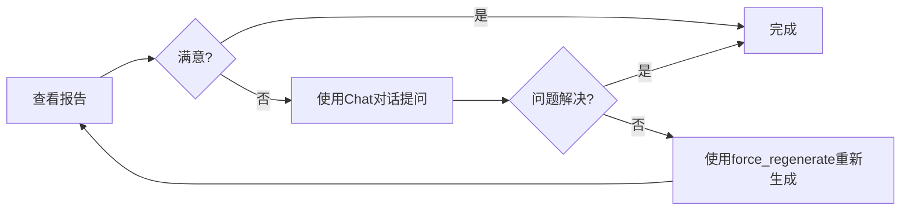

# Report API 文档

本文档详细介绍 MiroFish 后端的 Report API，包括报告生成、查询、交互式对话等所有接口。

## 目录

- [1. 概述](#1-概述)
- [2. 报告生成 API](#2-报告生成-api)
- [3. 报告查询 API](#3-报告查询-api)
- [4. 交互式对话 API](#4-交互式对话-api)
- [5. 日志与监控 API](#5-日志与监控-api)
- [6. 调试工具 API](#6-调试工具-api)
- [7. 数据模型](#7-数据模型)
- [8. 错误处理](#8-错误处理)

---

## 1. 概述

Report API 提供了模拟分析报告的生成、查询和交互式对话功能。基于 LangChain + Zep 实现 ReACT 模式的智能报告生成系统。

### 1.1 核心功能

- **异步报告生成**：后台生成报告，支持进度查询和实时日志
- **分章节输出**：支持流式获取已生成的章节内容
- **交互式对话**：与 Report Agent 对话，自主调用检索工具回答问题
- **详细日志**：提供 Agent 执行日志和控制台日志两种日志类型
- **状态管理**：完整的报告状态跟踪（生成中、已完成、失败）

### 1.2 API 基础信息

- **基础路径**: `/api/report`
- **内容类型**: `application/json`
- **认证方式**: 当前无认证（开发环境）
- **响应格式**: JSON

### 1.3 报告状态

| 状态 | 说明 |
|------|------|
| `generating` | 报告生成中 |
| `completed` | 报告已完成 |
| `failed` | 报告生成失败 |

---

## 2. 报告生成 API

### 2.1 生成报告

**接口**: `POST /api/report/generate`

**功能**: 启动模拟分析报告生成任务（异步操作）

#### 请求参数

```json
{
  "simulation_id": "sim_xxxx",      // 必填，模拟ID
  "force_regenerate": false          // 可选，是否强制重新生成，默认false
}
```

| 参数 | 类型 | 必填 | 说明 |
|------|------|------|------|
| `simulation_id` | string | 是 | 模拟ID |
| `force_regenerate` | boolean | 否 | 是否强制重新生成，默认为 `false`。如果为 `false` 且已有完成的报告，则直接返回现有报告 |

#### 响应格式

**成功响应** (200 OK):

```json
{
  "success": true,
  "data": {
    "simulation_id": "sim_xxxx",
    "report_id": "report_xxxx",          // 报告ID
    "task_id": "task_xxxx",              // 任务ID，用于查询进度
    "status": "generating",              // 状态：generating, completed
    "message": "报告生成任务已启动，请通过 /api/report/generate/status 查询进度",
    "already_generated": false           // 是否已有完成的报告
  }
}
```

**如果报告已存在** (200 OK):

```json
{
  "success": true,
  "data": {
    "simulation_id": "sim_xxxx",
    "report_id": "report_xxxx",
    "status": "completed",
    "message": "报告已存在",
    "already_generated": true
  }
}
```

**错误响应**:

```json
// 400 Bad Request - 缺少参数
{
  "success": false,
  "error": "请提供 simulation_id"
}

// 404 Not Found - 模拟不存在
{
  "success": false,
  "error": "模拟不存在: sim_xxxx"
}

// 400 Bad Request - 缺少图谱ID
{
  "success": false,
  "error": "缺少图谱ID，请确保已构建图谱"
}
```

#### 使用示例

```javascript
// 前端调用示例
import { generateReport } from '@/api/report'

const startReportGeneration = async (simulationId) => {
  try {
    const response = await generateReport({
      simulation_id: simulationId,
      force_regenerate: false
    })

    if (response.data.already_generated) {
      console.log('报告已存在:', response.data.report_id)
    } else {
      console.log('报告生成任务已启动:', response.data.task_id)
      // 开始轮询进度
      pollProgress(response.data.task_id)
    }
  } catch (error) {
    console.error('启动报告生成失败:', error)
  }
}
```

---

### 2.2 查询生成进度

**接口**: `POST /api/report/generate/status`

**功能**: 查询报告生成任务的实时进度

#### 请求参数

```json
{
  "task_id": "task_xxxx",          // 可选，任务ID
  "simulation_id": "sim_xxxx"      // 可选，模拟ID
}
```

| 参数 | 类型 | 必填 | 说明 |
|------|------|------|------|
| `task_id` | string | 否* | 任务ID（与 simulation_id 二选一） |
| `simulation_id` | string | 否 | 模拟ID。如果提供且报告已完成，直接返回报告信息 |

* 至少需要提供其中一个参数

#### 响应格式

**成功响应** (200 OK):

```json
{
  "success": true,
  "data": {
    "task_id": "task_xxxx",
    "status": "processing",            // processing, completed, failed
    "progress": 45,                    // 进度百分比 0-100
    "message": "[关键发现] 正在生成分析内容...",
    "created_at": "2025-12-09T12:34:56Z",
    "updated_at": "2025-12-09T12:36:20Z"
  }
}
```

**报告已完成** (200 OK):

```json
{
  "success": true,
  "data": {
    "simulation_id": "sim_xxxx",
    "report_id": "report_xxxx",
    "status": "completed",
    "progress": 100,
    "message": "报告已生成",
    "already_completed": true
  }
}
```

**错误响应**:

```json
// 400 Bad Request - 缺少参数
{
  "success": false,
  "error": "请提供 task_id 或 simulation_id"
}

// 404 Not Found - 任务不存在
{
  "success": false,
  "error": "任务不存在: task_xxxx"
}
```

#### 使用示例

```javascript
// 轮询进度示例
const pollProgress = async (taskId) => {
  const interval = setInterval(async () => {
    try {
      const response = await getReportStatus({ task_id: taskId })

      console.log(`进度: ${response.data.progress}% - ${response.data.message}`)

      if (response.data.status === 'completed') {
        clearInterval(interval)
        console.log('报告生成完成!')
        // 跳转到报告详情页
      } else if (response.data.status === 'failed') {
        clearInterval(interval)
        console.error('报告生成失败')
      }
    } catch (error) {
      console.error('查询进度失败:', error)
      clearInterval(interval)
    }
  }, 2000) // 每2秒查询一次
}
```

---

## 3. 报告查询 API

### 3.1 获取报告详情

**接口**: `GET /api/report/{report_id}`

**功能**: 获取指定报告的完整详情

#### 路径参数

| 参数 | 类型 | 必填 | 说明 |
|------|------|------|------|
| `report_id` | string | 是 | 报告ID |

#### 响应格式

**成功响应** (200 OK):

```json
{
  "success": true,
  "data": {
    "report_id": "report_xxxx",
    "simulation_id": "sim_xxxx",
    "status": "completed",
    "outline": {
      "title": "社交媒体传播分析报告",
      "sections": [
        {
          "index": 1,
          "title": "执行摘要",
          "description": "简要概述整个报告的核心发现和结论"
        },
        {
          "index": 2,
          "title": "模拟背景",
          "description": "描述模拟的目标、场景和配置"
        },
        {
          "index": 3,
          "title": "关键发现",
          "description": "详细分析模拟过程中的关键发现和洞察"
        }
      ]
    },
    "markdown_content": "# 社交媒体传播分析报告\n\n## 执行摘要\n\n...",
    "created_at": "2025-12-09T12:34:56Z",
    "completed_at": "2025-12-09T12:38:20Z"
  }
}
```

**错误响应** (404 Not Found):

```json
{
  "success": false,
  "error": "报告不存在: report_xxxx"
}
```

---

### 3.2 根据模拟ID获取报告

**接口**: `GET /api/report/by-simulation/{simulation_id}`

**功能**: 根据模拟ID获取该模拟的报告

#### 路径参数

| 参数 | 类型 | 必填 | 说明 |
|------|------|------|------|
| `simulation_id` | string | 是 | 模拟ID |

#### 响应格式

**成功响应** (200 OK):

```json
{
  "success": true,
  "data": {
    "report_id": "report_xxxx",
    "simulation_id": "sim_xxxx",
    "status": "completed",
    // ... 其他报告字段
  },
  "has_report": true
}
```

**无报告** (404 Not Found):

```json
{
  "success": false,
  "error": "该模拟暂无报告: sim_xxxx",
  "has_report": false
}
```

---

### 3.3 获取报告列表

**接口**: `GET /api/report/list`

**功能**: 列出所有报告，支持按模拟ID过滤

#### 查询参数

| 参数 | 类型 | 必填 | 说明 |
|------|------|------|------|
| `simulation_id` | string | 否 | 按模拟ID过滤 |
| `limit` | integer | 否 | 返回数量限制，默认50 |

#### 响应格式

**成功响应** (200 OK):

```json
{
  "success": true,
  "data": [
    {
      "report_id": "report_xxxx1",
      "simulation_id": "sim_xxxx",
      "status": "completed",
      "created_at": "2025-12-09T12:34:56Z"
    },
    {
      "report_id": "report_xxxx2",
      "simulation_id": "sim_yyyy",
      "status": "generating",
      "created_at": "2025-12-09T13:00:00Z"
    }
  ],
  "count": 2
}
```

---

### 3.4 下载报告

**接口**: `GET /api/report/{report_id}/download`

**功能**: 下载报告的 Markdown 文件

#### 路径参数

| 参数 | 类型 | 必填 | 说明 |
|------|------|------|------|
| `report_id` | string | 是 | 报告ID |

#### 响应

- **Content-Type**: `text/markdown`
- **Content-Disposition**: `attachment; filename="{report_id}.md"`
- **Body**: Markdown 格式的报告内容

#### 使用示例

```javascript
// 下载报告示例
const downloadReport = async (reportId) => {
  try {
    const response = await axios.get(
      `/api/report/${reportId}/download`,
      { responseType: 'blob' }
    )

    // 创建下载链接
    const url = window.URL.createObjectURL(new Blob([response.data]))
    const link = document.createElement('a')
    link.href = url
    link.setAttribute('download', `${reportId}.md`)
    document.body.appendChild(link)
    link.click()
    link.remove()
  } catch (error) {
    console.error('下载报告失败:', error)
  }
}
```

---

### 3.5 删除报告

**接口**: `DELETE /api/report/{report_id}`

**功能**: 删除指定报告

#### 路径参数

| 参数 | 类型 | 必填 | 说明 |
|------|------|------|------|
| `report_id` | string | 是 | 报告ID |

#### 响应格式

**成功响应** (200 OK):

```json
{
  "success": true,
  "message": "报告已删除: report_xxxx"
}
```

**错误响应** (404 Not Found):

```json
{
  "success": false,
  "error": "报告不存在: report_xxxx"
}
```

---

### 3.6 检查报告状态

**接口**: `GET /api/report/check/{simulation_id}`

**功能**: 检查模拟是否有报告，以及报告状态（用于判断是否解锁 Interview 功能）

#### 路径参数

| 参数 | 类型 | 必填 | 说明 |
|------|------|------|------|
| `simulation_id` | string | 是 | 模拟ID |

#### 响应格式

**成功响应** (200 OK):

```json
{
  "success": true,
  "data": {
    "simulation_id": "sim_xxxx",
    "has_report": true,
    "report_status": "completed",           // completed, generating, failed
    "report_id": "report_xxxx",
    "interview_unlocked": true              // 是否解锁 Interview 功能
  }
}
```

#### 使用场景

```javascript
// 检查是否可以进入 Interview 功能
const checkInterviewAccess = async (simulationId) => {
  const response = await checkReportStatus(simulationId)

  if (response.data.interview_unlocked) {
    // 解锁 Interview 功能
    enableInterviewMode()
  } else {
    // 提示用户先生成报告
    showMessage('请先生成报告以解锁 Interview 功能')
  }
}
```

---

## 4. 交互式对话 API

### 4.1 报告交互机制说明

Report API 提供了灵活的报告交互机制，允许用户在查看报告后提供反馈并重新生成：

**交互流程：**

1. **用户对话反馈** → 通过 `POST /api/report/chat` 与 Report Agent 对话
   - 用户可以提出问题、指出报告不足
   - Agent 会自主调用检索工具回答问题
   - 对话历史会被记录，用于多轮交互

2. **强制重新生成** → 通过 `POST /api/report/generate` 设置 `force_regenerate: true`
   - 用户对报告不满意时可以强制重新生成
   - 系统会重新执行完整的报告生成流程
   - 之前的报告内容会被覆盖



---

### 4.2 与 Report Agent 对话

**接口**: `POST /api/report/chat`

**功能**: 与 Report Agent 进行交互式对话，Agent 会自主调用检索工具回答问题

#### 请求参数

```json
{
  "simulation_id": "sim_xxxx",                    // 必填，模拟ID
  "message": "请解释一下舆情走向",                 // 必填，用户消息
  "chat_history": [                               // 可选，对话历史
    {
      "role": "user",
      "content": "之前的用户问题"
    },
    {
      "role": "assistant",
      "content": "之前的助手回答"
    }
  ]
}
```

| 参数 | 类型 | 必填 | 说明 |
|------|------|------|------|
| `simulation_id` | string | 是 | 模拟ID |
| `message` | string | 是 | 用户消息 |
| `chat_history` | array | 否 | 对话历史，用于多轮对话上下文 |

#### 响应格式

**成功响应** (200 OK):

```json
{
  "success": true,
  "data": {
    "response": "根据分析，舆情走向呈现以下特点：\n\n1. 初始阶段：...\n2. 传播阶段：...",
    "tool_calls": [
      {
        "tool": "search_graph",
        "query": "舆情传播趋势",
        "results_count": 15
      },
      {
        "tool": "get_graph_statistics",
        "node_count": 120,
        "edge_count": 350
      }
    ],
    "sources": [
      {
        "type": "graph_node",
        "id": "node_xxxx",
        "content": "节点内容摘要"
      }
    ]
  }
}
```

**错误响应**:

```json
// 400 Bad Request - 缺少参数
{
  "success": false,
  "error": "请提供 simulation_id"
}

// 404 Not Found - 模拟不存在
{
  "success": false,
  "error": "模拟不存在: sim_xxxx"
}

// 400 Bad Request - 缺少图谱ID
{
  "success": false,
  "error": "缺少图谱ID"
}
```

#### 使用示例

```javascript
// 对话示例
const chatWithAgent = async (simulationId, message, history) => {
  try {
    const response = await chatWithReport({
      simulation_id: simulationId,
      message: message,
      chat_history: history
    })

    // 显示 Agent 回复
    displayMessage(response.data.response, 'assistant')

    // 显示使用的工具（可选）
    if (response.data.tool_calls && response.data.tool_calls.length > 0) {
      displayToolCalls(response.data.tool_calls)
    }

    // 更新对话历史
    const newHistory = [
      ...history,
      { role: 'user', content: message },
      { role: 'assistant', content: response.data.response }
    ]

    return newHistory
  } catch (error) {
    console.error('对话失败:', error)
  }
}
```

---

## 5. 日志与监控 API

### 5.1 获取报告生成进度

**接口**: `GET /api/report/{report_id}/progress`

**功能**: 获取报告生成的实时进度信息

#### 路径参数

| 参数 | 类型 | 必填 | 说明 |
|------|------|------|------|
| `report_id` | string | 是 | 报告ID |

#### 响应格式

**成功响应** (200 OK):

```json
{
  "success": true,
  "data": {
    "status": "generating",
    "progress": 45,
    "message": "正在生成章节: 关键发现",
    "current_section": "关键发现",
    "completed_sections": [
      "执行摘要",
      "模拟背景"
    ],
    "updated_at": "2025-12-09T12:36:20Z"
  }
}
```

---

### 5.2 获取已生成的章节列表

**接口**: `GET /api/report/{report_id}/sections`

**功能**: 获取已生成的章节内容（支持流式输出，无需等待整个报告完成）

#### 路径参数

| 参数 | 类型 | 必填 | 说明 |
|------|------|------|------|
| `report_id` | string | 是 | 报告ID |

#### 响应格式

**成功响应** (200 OK):

```json
{
  "success": true,
  "data": {
    "report_id": "report_xxxx",
    "sections": [
      {
        "filename": "section_01.md",
        "section_index": 1,
        "content": "## 执行摘要\n\n简要概述整个报告的核心发现和结论..."
      },
      {
        "filename": "section_02.md",
        "section_index": 2,
        "content": "## 模拟背景\n\n描述模拟的目标、场景和配置..."
      }
    ],
    "total_sections": 2,
    "is_complete": false          // 是否全部章节已完成
  }
}
```

#### 使用场景

```javascript
// 流式显示章节内容
const streamSections = async (reportId) => {
  const interval = setInterval(async () => {
    try {
      const response = await getReportSections(reportId)
      const { sections, is_complete } = response.data

      // 渲染已生成的章节
      sections.forEach(section => {
        renderSection(section)
      })

      if (is_complete) {
        clearInterval(interval)
        console.log('所有章节已生成完成')
      }
    } catch (error) {
      console.error('获取章节失败:', error)
    }
  }, 3000) // 每3秒检查一次
}
```

---

### 5.3 获取单个章节内容

**接口**: `GET /api/report/{report_id}/section/{section_index}`

**功能**: 获取指定章节的内容

#### 路径参数

| 参数 | 类型 | 必填 | 说明 |
|------|------|------|------|
| `report_id` | string | 是 | 报告ID |
| `section_index` | integer | 是 | 章节索引（从1开始） |

#### 响应格式

**成功响应** (200 OK):

```json
{
  "success": true,
  "data": {
    "filename": "section_01.md",
    "section_index": 1,
    "content": "## 执行摘要\n\n简要概述整个报告的核心发现和结论..."
  }
}
```

**错误响应** (404 Not Found):

```json
{
  "success": false,
  "error": "章节不存在: section_01.md"
}
```

---

### 5.4 获取 Agent 日志（增量）

**接口**: `GET /api/report/{report_id}/agent-log`

**功能**: 获取 Report Agent 的详细执行日志（增量获取）

#### 路径参数

| 参数 | 类型 | 必填 | 说明 |
|------|------|------|------|
| `report_id` | string | 是 | 报告ID |

#### 查询参数

| 参数 | 类型 | 必填 | 说明 |
|------|------|------|------|
| `from_line` | integer | 否 | 从第几行开始读取，默认0（用于增量获取） |

#### 响应格式

**成功响应** (200 OK):

```json
{
  "success": true,
  "data": {
    "logs": [
      {
        "timestamp": "2025-12-13T12:34:56Z",
        "elapsed_seconds": 12.5,
        "report_id": "report_xxxx",
        "action": "tool_call",
        "stage": "generating",
        "section_title": "执行摘要",
        "section_index": 1,
        "details": {
          "tool_name": "insight_forge",
          "parameters": {
            "query": "关键发现"
          },
          "result": {
            "insights": ["发现1", "发现2"]
          }
        }
      },
      {
        "timestamp": "2025-12-13T12:35:08Z",
        "elapsed_seconds": 24.3,
        "report_id": "report_xxxx",
        "action": "llm_response",
        "stage": "generating",
        "section_title": "执行摘要",
        "section_index": 1,
        "details": {
          "prompt_tokens": 1500,
          "completion_tokens": 800,
          "model": "gpt-4"
        }
      }
    ],
    "total_lines": 25,
    "from_line": 0,
    "has_more": false
  }
}
```

#### 日志动作类型

| action | 说明 |
|--------|------|
| `report_start` | 报告生成开始 |
| `planning_start` | 报告规划开始 |
| `planning_complete` | 报告规划完成 |
| `section_start` | 章节生成开始 |
| `tool_call` | 工具调用（图谱搜索、统计等） |
| `llm_response` | LLM 响应 |
| `section_complete` | 章节生成完成 |
| `report_complete` | 报告生成完成 |
| `report_failed` | 报告生成失败 |

---

### 5.5 获取 Agent 日志（完整）

**接口**: `GET /api/report/{report_id}/agent-log/stream`

**功能**: 一次性获取完整的 Agent 日志

#### 路径参数

| 参数 | 类型 | 必填 | 说明 |
|------|------|------|------|
| `report_id` | string | 是 | 报告ID |

#### 响应格式

**成功响应** (200 OK):

```json
{
  "success": true,
  "data": {
    "logs": [
      // 完整的日志数组
    ],
    "count": 25
  }
}
```

---

### 5.6 获取控制台日志（增量）

**接口**: `GET /api/report/{report_id}/console-log`

**功能**: 获取控制台输出日志（增量获取）

#### 路径参数

| 参数 | 类型 | 必填 | 说明 |
|------|------|------|------|
| `report_id` | string | 是 | 报告ID |

#### 查询参数

| 参数 | 类型 | 必填 | 说明 |
|------|------|------|------|
| `from_line` | integer | 否 | 从第几行开始读取，默认0 |

#### 响应格式

**成功响应** (200 OK):

```json
{
  "success": true,
  "data": {
    "logs": [
      "[19:46:14] INFO: 搜索完成: 找到 15 条相关事实",
      "[19:46:14] INFO: 图谱搜索: graph_id=xxx, query=...",
      "[19:46:15] INFO: LLM 响应: 生成 800 tokens",
      "[19:46:16] INFO: 章节 [执行摘要] 生成完成"
    ],
    "total_lines": 100,
    "from_line": 0,
    "has_more": false
  }
}
```

---

### 5.7 获取控制台日志（完整）

**接口**: `GET /api/report/{report_id}/console-log/stream`

**功能**: 一次性获取完整的控制台日志

#### 路径参数

| 参数 | 类型 | 必填 | 说明 |
|------|------|------|------|
| `report_id` | string | 是 | 报告ID |

#### 响应格式

**成功响应** (200 OK):

```json
{
  "success": true,
  "data": {
    "logs": [
      // 完整的日志数组
    ],
    "count": 100
  }
}
```

---

## 6. 调试工具 API

### 6.1 图谱搜索工具

**接口**: `POST /api/report/tools/search`

**功能**: 直接调用图谱搜索工具（供调试使用）

#### 请求参数

```json
{
  "graph_id": "mirofish_xxxx",
  "query": "搜索查询",
  "limit": 10                          // 可选，默认10
}
```

#### 响应格式

**成功响应** (200 OK):

```json
{
  "success": true,
  "data": {
    "tool": "search_graph",
    "query": "搜索查询",
    "results": [
      {
        "type": "node",
        "id": "node_xxxx",
        "label": "实体标签",
        "properties": {
          "name": "实体名称",
          "description": "描述"
        },
        "score": 0.95
      }
    ],
    "count": 10
  }
}
```

---

### 6.2 图谱统计工具

**接口**: `POST /api/report/tools/statistics`

**功能**: 获取图谱统计信息（供调试使用）

#### 请求参数

```json
{
  "graph_id": "mirofish_xxxx"
}
```

#### 响应格式

**成功响应** (200 OK):

```json
{
  "success": true,
  "data": {
    "tool": "get_graph_statistics",
    "graph_id": "mirofish_xxxx",
    "statistics": {
      "node_count": 120,
      "edge_count": 350,
      "node_types": {
        "Person": 50,
        "Organization": 30,
        "Event": 40
      },
      "edge_types": {
        "KNOWS": 100,
        "PARTICIPATED_IN": 150,
        "INFLUENCES": 100
      }
    }
  }
}
```

---

## 7. 数据模型

### 7.1 Report 对象

```typescript
interface Report {
  report_id: string                    // 报告ID，格式: report_{uuid}
  simulation_id: string                // 关联的模拟ID
  status: 'generating' | 'completed' | 'failed'  // 报告状态
  outline: ReportOutline               // 报告大纲
  markdown_content: string             // Markdown 格式的完整报告内容
  error?: string                       // 错误信息（仅在失败时）
  created_at: string                   // 创建时间（ISO 8601）
  completed_at?: string                // 完成时间（ISO 8601）
}

interface ReportOutline {
  title: string                        // 报告标题
  sections: ReportSection[]            // 章节列表
}

interface ReportSection {
  index: number                        // 章节序号
  title: string                        // 章节标题
  description: string                  // 章节描述
}
```

### 7.2 Task 对象

```typescript
interface Task {
  task_id: string                      // 任务ID，格式: task_{uuid}
  task_type: string                    // 任务类型，如 'report_generate'
  status: 'pending' | 'processing' | 'completed' | 'failed'  // 任务状态
  progress: number                     // 进度百分比 0-100
  message: string                      // 状态消息
  result?: any                         // 任务结果（仅在完成时）
  error?: string                       // 错误信息（仅在失败时）
  metadata: Record<string, any>        // 元数据
  created_at: string                   // 创建时间
  updated_at: string                   // 更新时间
}
```

### 7.3 Agent Log 对象

```typescript
interface AgentLog {
  timestamp: string                    // 时间戳（ISO 8601）
  elapsed_seconds: number              // 从开始到现在的耗时（秒）
  report_id: string                    // 报告ID
  action: string                       // 动作类型
  stage: string                        // 阶段
  section_title?: string               // 当前章节标题
  section_index?: number               // 当前章节索引
  details: Record<string, any>         // 详细信息
}
```

---

## 8. 错误处理

### 8.1 标准错误响应格式

```json
{
  "success": false,
  "error": "错误描述信息",
  "traceback": "详细错误堆栈（仅在开发环境）"
}
```

### 8.2 常见错误码

| HTTP 状态码 | 说明 |
|------------|------|
| 200 | 请求成功 |
| 400 | 请求参数错误 |
| 404 | 资源不存在 |
| 500 | 服务器内部错误 |

### 8.3 错误处理最佳实践

```javascript
// 前端错误处理示例
const handleReportGeneration = async (simulationId) => {
  try {
    const response = await generateReport({ simulation_id: simulationId })

    if (response.data.already_generated) {
      // 报告已存在，直接跳转
      navigateToReport(response.data.report_id)
    } else {
      // 开始轮询进度
      pollProgress(response.data.task_id)
    }
  } catch (error) {
    if (error.response) {
      // 服务器返回的错误
      switch (error.response.status) {
        case 400:
          console.error('参数错误:', error.response.data.error)
          break
        case 404:
          console.error('资源不存在:', error.response.data.error)
          break
        case 500:
          console.error('服务器错误:', error.response.data.error)
          break
        default:
          console.error('未知错误:', error.response.data.error)
      }
    } else {
      // 网络错误或其他错误
      console.error('请求失败:', error.message)
    }
  }
}
```

---

## 附录：完整工作流程示例

### 典型的报告生成流程

```javascript
// 1. 启动报告生成
const { data } = await generateReport({
  simulation_id: 'sim_xxxx',
  force_regenerate: false
})

// 2. 如果报告已存在，直接使用
if (data.already_generated) {
  const report = await getReport(data.report_id)
  displayReport(report.data)
  return
}

// 3. 如果开始生成，轮询进度
const taskId = data.task_id
const pollInterval = setInterval(async () => {
  const { data: progress } = await getReportStatus({ task_id: taskId })

  updateProgressUI(progress.progress, progress.message)

  if (progress.status === 'completed') {
    clearInterval(pollInterval)
    // 获取完整报告
    const report = await getReport(progress.result.report_id)
    displayReport(report.data)
  } else if (progress.status === 'failed') {
    clearInterval(pollInterval)
    showError('报告生成失败')
  }
}, 2000)

// 4. 可选：实时获取 Agent 日志
const logInterval = setInterval(async () => {
  const { data: logData } = await getAgentLog(reportId, fromLine)
  displayAgentLogs(logData.logs)
  fromLine = logData.total_lines

  if (!logData.has_more) {
    clearInterval(logInterval)
  }
}, 3000)
```

### 交互式对话流程

```javascript
// 1. 初始化对话历史
let chatHistory = []

// 2. 发送消息
const sendMessage = async (message) => {
  // 添加用户消息到历史
  chatHistory.push({
    role: 'user',
    content: message
  })

  // 调用对话 API
  const { data } = await chatWithReport({
    simulation_id: 'sim_xxxx',
    message: message,
    chat_history: chatHistory
  })

  // 显示 Agent 回复
  displayMessage(data.response, 'assistant')

  // 显示工具调用（可选）
  if (data.tool_calls) {
    displayToolCalls(data.tool_calls)
  }

  // 添加助手回复到历史
  chatHistory.push({
    role: 'assistant',
    content: data.response
  })

  return chatHistory
}
```

---

## 相关文档

- [后端架构概览](./01-overview.md)
- [数据模型](./05-data-models.md)
- [前端 API 集成](../04-frontend/03-api-integration.md)
- [Report Agent 服务](./06-services/report-agent.md)
