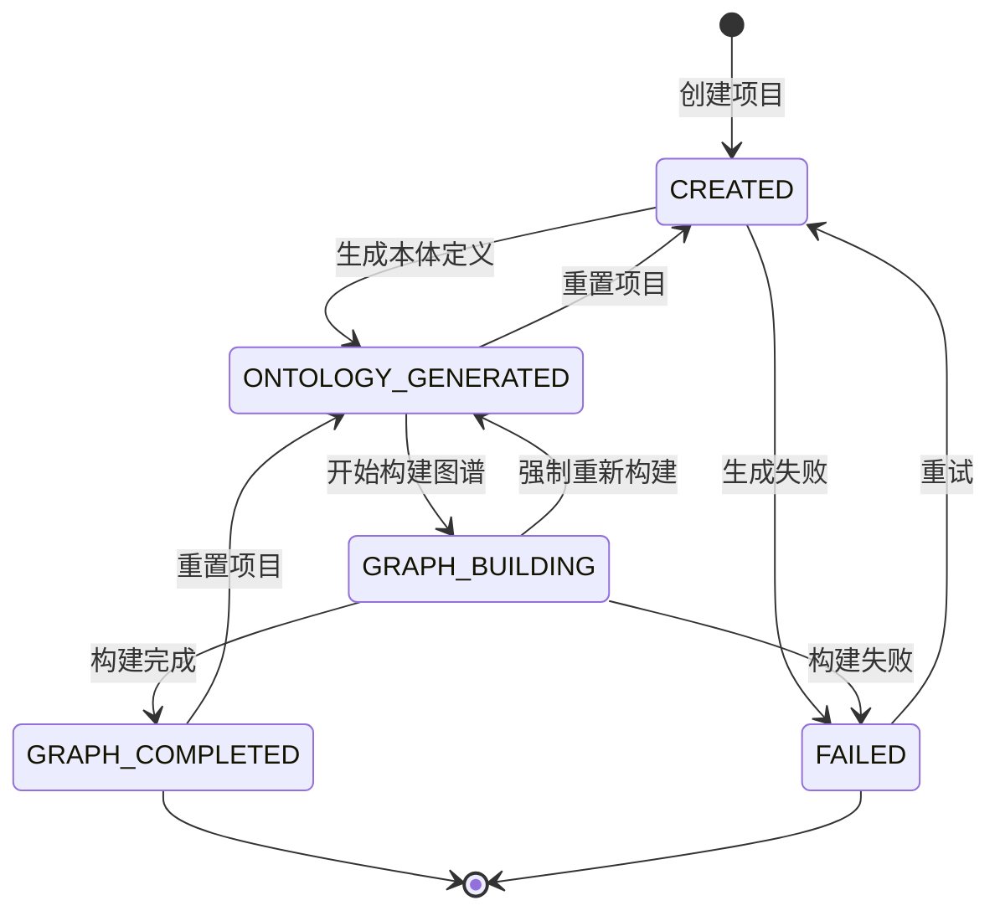
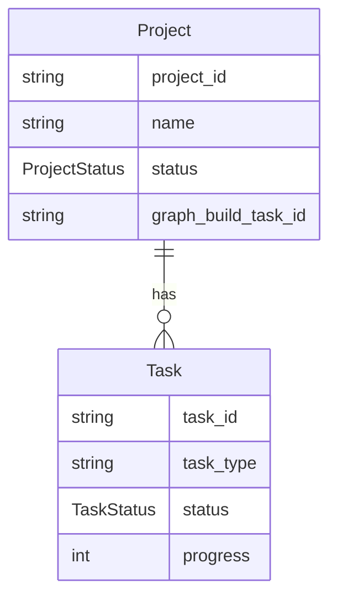
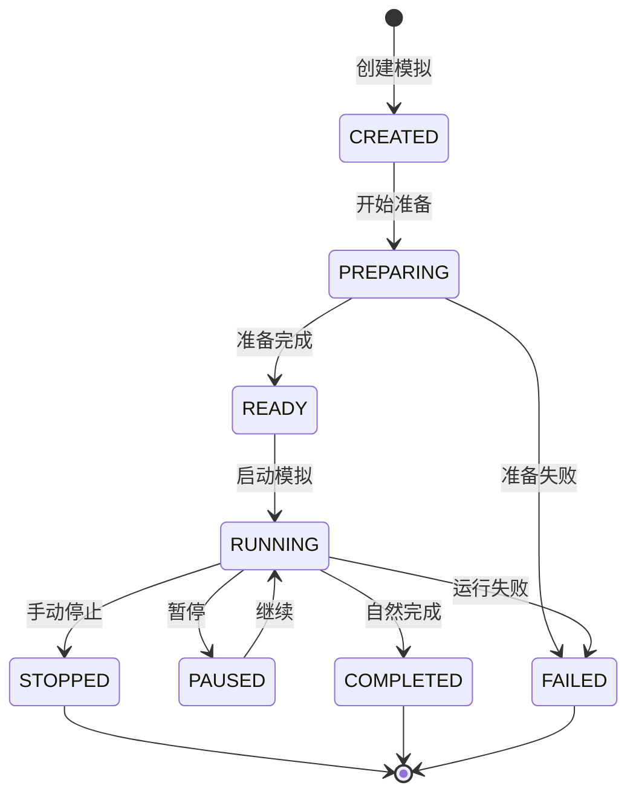
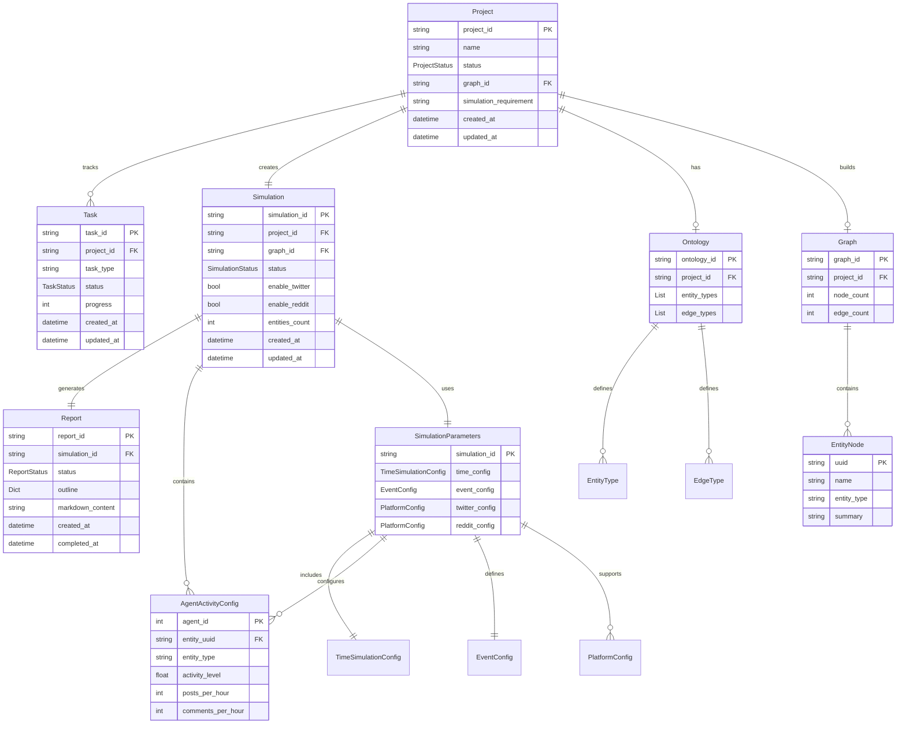

# 数据模型

本文档详细描述 MiroFish 系统中的核心数据模型，包括字段定义、状态转换和模型关系。

## 目录

- [Project 模型](#project-模型)
- [Task 模型](#task-模型)
- [Simulation 模型](#simulation-模型)
- [Report 模型](#report-模型)
- [Graph/Ontology 模型](#graphontology-模型)
- [实体关系图](#实体关系图)

---

## Project 模型

Project 模型是系统的核心数据模型，用于管理项目的完整生命周期，从文件上传到本体生成，再到图谱构建。

### 字段列表

| 字段名 | 类型 | 必填 | 说明 |
|--------|------|------|------|
| `project_id` | string | 是 | 项目唯一标识符，格式：`proj_{12位hex}` |
| `name` | string | 是 | 项目名称，默认为 "Unnamed Project" |
| `status` | ProjectStatus | 是 | 项目当前状态（见下方状态值） |
| `created_at` | string | 是 | 项目创建时间（ISO 8601格式） |
| `updated_at` | string | 是 | 项目最后更新时间（ISO 8601格式） |
| `files` | List[File] | 否 | 上传的文件列表，包含文件名、路径、大小 |
| `total_text_length` | int | 否 | 提取的文本总长度（字符数） |
| `ontology` | Dict | 否 | 本体定义，包含 entity_types 和 edge_types |
| `analysis_summary` | string | 否 | 本体分析摘要 |
| `graph_id` | string | 否 | Zep 图谱 ID |
| `graph_build_task_id` | string | 否 | 图谱构建任务 ID |
| `simulation_requirement` | string | 否 | 模拟需求描述 |
| `chunk_size` | int | 否 | 文本分块大小，默认 500 |
| `chunk_overlap` | int | 否 | 文本分块重叠，默认 50 |
| `error` | string | 否 | 错误信息 |

### 状态值

Project 模型使用 `ProjectStatus` 枚举来表示项目状态：

```python
class ProjectStatus(str, Enum):
    CREATED = "created"                    # 刚创建，文件已上传
    ONTOLOGY_GENERATED = "ontology_generated"  # 本体已生成
    GRAPH_BUILDING = "graph_building"      # 图谱构建中
    GRAPH_COMPLETED = "graph_completed"    # 图谱构建完成
    FAILED = "failed"                      # 失败
```

### 状态转换图



### 状态转换说明

| 当前状态 | 可转换到 | 转换条件 | API 操作 |
|----------|----------|----------|----------|
| CREATED | ONTOLOGY_GENERATED | LLM 成功生成本体定义 | `POST /api/graph/ontology/generate` |
| CREATED | FAILED | 本体生成失败 | `POST /api/graph/ontology/generate` |
| ONTOLOGY_GENERATED | GRAPH_BUILDING | 开始图谱构建任务 | `POST /api/graph/build` |
| ONTOLOGY_GENERATED | CREATED | 用户重置项目 | `POST /api/graph/project/{id}/reset` |
| GRAPH_BUILDING | GRAPH_COMPLETED | 图谱构建成功完成 | 自动转换 |
| GRAPH_BUILDING | FAILED | 图谱构建失败 | 自动转换 |
| GRAPH_BUILDING | ONTOLOGY_GENERATED | 强制重新构建 | `POST /api/graph/build` (force=true) |
| GRAPH_COMPLETED | ONTOLOGY_GENERATED | 重置以重新构建 | `POST /api/graph/project/{id}/reset` |

---

## Task 模型

Task 模型用于跟踪长时间运行的任务（如图谱构建、报告生成等），提供任务状态管理和进度跟踪。

### 字段列表

| 字段名 | 类型 | 必填 | 说明 |
|--------|------|------|------|
| `task_id` | string | 是 | 任务唯一标识符（UUID） |
| `task_type` | string | 是 | 任务类型（如 "构建图谱"、"报告生成"） |
| `status` | TaskStatus | 是 | 任务状态（见下方状态值） |
| `created_at` | datetime | 是 | 任务创建时间 |
| `updated_at` | datetime | 是 | 任务最后更新时间 |
| `progress` | int | 否 | 总进度百分比（0-100） |
| `message` | string | 否 | 状态消息 |
| `result` | Dict | 否 | 任务结果（任务完成后） |
| `error` | string | 否 | 错误信息（任务失败时） |
| `metadata` | Dict | 否 | 额外元数据 |
| `progress_detail` | Dict | 否 | 详细进度信息 |

### 状态值

Task 模型使用 `TaskStatus` 枚举来表示任务状态：

```python
class TaskStatus(str, Enum):
    PENDING = "pending"          # 等待中
    PROCESSING = "processing"    # 处理中
    COMPLETED = "completed"      # 已完成
    FAILED = "failed"            # 失败
```

### 与 Project 的关系

Task 模型与 Project 模型是关联关系：

- 一个 Project 可以有多个关联的 Task（如图谱构建任务、报告生成任务）
- Task 的 `metadata` 字段中存储 `project_id` 以建立关联
- Project 模型中的 `graph_build_task_id` 字段存储图谱构建任务的 ID

**关系类型**: 一对多（1:N）
- 一个 Project 可以关联多个 Task
- 一个 Task 只能关联一个 Project



---

## Simulation 模型

Simulation 模型管理模拟的完整生命周期，包括实体读取、配置生成、模拟运行等。

### 核心数据结构

#### SimulationState

模拟状态的核心数据类：

| 字段名 | 类型 | 必填 | 说明 |
|--------|------|------|------|
| `simulation_id` | string | 是 | 模拟唯一标识符，格式：`sim_{12位hex}` |
| `project_id` | string | 是 | 关联的项目 ID |
| `graph_id` | string | 是 | 关联的图谱 ID |
| `enable_twitter` | bool | 是 | 是否启用 Twitter 平台 |
| `enable_reddit` | bool | 是 | 是否启用 Reddit 平台 |
| `status` | SimulationStatus | 是 | 模拟状态 |
| `entities_count` | int | 否 | 实体数量 |
| `profiles_count` | int | 否 | 生成的 Agent Profile 数量 |
| `entity_types` | List[str] | 否 | 实体类型列表 |
| `config_generated` | bool | 否 | 配置是否已生成 |
| `config_reasoning` | string | 否 | 配置生成推理说明 |
| `current_round` | int | 否 | 当前模拟轮次 |
| `twitter_status` | string | 否 | Twitter 平台状态 |
| `reddit_status` | string | 否 | Reddit 平台状态 |
| `created_at` | string | 是 | 创建时间 |
| `updated_at` | string | 是 | 更新时间 |
| `error` | string | 否 | 错误信息 |

### 状态值

```python
class SimulationStatus(str, Enum):
    CREATED = "created"        # 已创建
    PREPARING = "preparing"    # 准备中（读取实体、生成配置）
    READY = "ready"            # 准备就绪
    RUNNING = "running"        # 运行中
    PAUSED = "paused"          # 已暂停
    STOPPED = "stopped"        # 已停止
    COMPLETED = "completed"    # 已完成
    FAILED = "failed"          # 失败
```

### 状态转换图



### 模拟配置参数

Simulation 使用 `SimulationParameters` 数据类存储完整配置：

#### TimeSimulationConfig

时间模拟配置（基于中国人作息习惯）：

| 字段名 | 类型 | 默认值 | 说明 |
|--------|------|--------|------|
| `total_simulation_hours` | int | 72 | 模拟总时长（小时） |
| `minutes_per_round` | int | 60 | 每轮代表的时间（分钟） |
| `agents_per_hour_min` | int | 5 | 每小时最少激活 Agent 数 |
| `agents_per_hour_max` | int | 20 | 每小时最多激活 Agent 数 |
| `peak_hours` | List[int] | [19,20,21,22] | 高峰时段 |
| `peak_activity_multiplier` | float | 1.5 | 高峰活跃度系数 |
| `off_peak_hours` | List[int] | [0,1,2,3,4,5] | 低谷时段 |
| `off_peak_activity_multiplier` | float | 0.05 | 低谷活跃度系数 |
| `morning_hours` | List[int] | [6,7,8] | 早间时段 |
| `morning_activity_multiplier` | float | 0.4 | 早间活跃度系数 |
| `work_hours` | List[int] | [9-18] | 工作时段 |
| `work_activity_multiplier` | float | 0.7 | 工作活跃度系数 |

#### AgentActivityConfig

单个 Agent 的活动配置：

| 字段名 | 类型 | 默认值 | 说明 |
|--------|------|--------|------|
| `agent_id` | int | - | Agent ID |
| `entity_uuid` | string | - | 关联的实体 UUID |
| `entity_name` | string | - | 实体名称 |
| `entity_type` | string | - | 实体类型 |
| `activity_level` | float | 0.5 | 整体活跃度（0.0-1.0） |
| `posts_per_hour` | float | 1.0 | 每小时发帖次数 |
| `comments_per_hour` | float | 2.0 | 每小时评论次数 |
| `active_hours` | List[int] | [8-23] | 活跃时间段（0-23） |
| `response_delay_min` | int | 5 | 最小响应延迟（分钟） |
| `response_delay_max` | int | 60 | 最大响应延迟（分钟） |
| `sentiment_bias` | float | 0.0 | 情感倾向（-1.0到1.0） |
| `stance` | string | "neutral" | 立场 |
| `influence_weight` | float | 1.0 | 影响力权重 |

#### EventConfig

事件配置：

| 字段名 | 类型 | 默认值 | 说明 |
|--------|------|--------|------|
| `initial_posts` | List[Dict] | [] | 初始帖子列表 |
| `scheduled_events` | List[Dict] | [] | 定时事件列表 |
| `hot_topics` | List[str] | [] | 热点话题关键词 |
| `narrative_direction` | string | "" | 舆论引导方向 |

#### PlatformConfig

平台特定配置：

| 字段名 | 类型 | 默认值 | 说明 |
|--------|------|--------|------|
| `platform` | string | - | 平台名称（twitter/reddit） |
| `recency_weight` | float | 0.4 | 时间新鲜度权重 |
| `popularity_weight` | float | 0.3 | 热度权重 |
| `relevance_weight` | float | 0.3 | 相关性权重 |
| `viral_threshold` | int | 10 | 病毒传播阈值 |
| `echo_chamber_strength` | float | 0.5 | 回声室效应强度 |

---

## Report 模型

Report 模型用于管理模拟分析报告的生成和存储。

### 核心数据结构

#### Report

报告数据类：

| 字段名 | 类型 | 必填 | 说明 |
|--------|------|------|------|
| `report_id` | string | 是 | 报告唯一标识符，格式：`report_{12位hex}` |
| `simulation_id` | string | 是 | 关联的模拟 ID |
| `status` | ReportStatus | 是 | 报告状态 |
| `outline` | Dict | 否 | 报告大纲结构 |
| `markdown_content` | string | 否 | Markdown 格式的完整内容 |
| `created_at` | string | 是 | 创建时间 |
| `completed_at` | string | 否 | 完成时间 |
| `error` | string | 否 | 错误信息 |

### 状态值

```python
class ReportStatus(str, Enum):
    PENDING = "pending"        # 等待中
    PLANNING = "planning"      # 规划大纲中
    GENERATING = "generating"  # 生成内容中
    COMPLETED = "completed"    # 已完成
    FAILED = "failed"          # 失败
```

### 与其他模型的关系

- **Report ↔ Simulation**: 一对一关系，一个模拟对应一个报告
- **Report ↔ Project**: 间接关联，通过 Simulation 关联

---

## Graph/Ontology 模型

### Ontology 结构

本体定义包含实体类型和关系类型：

```python
{
    "entity_types": [
        {
            "name": "Person",
            "description": "人物",
            "properties": ["name", "age", "role"]
        },
        ...
    ],
    "edge_types": [
        {
            "name": "KNOWS",
            "description": "认识关系",
            "source_type": "Person",
            "target_type": "Person"
        },
        ...
    ]
}
```

### EntityNode 结构

从 Zep 图谱读取的实体节点：

| 字段名 | 类型 | 说明 |
|--------|------|------|
| `uuid` | string | 实体唯一标识符 |
| `name` | string | 实体名称 |
| `entity_type` | string | 实体类型（从 Label 提取） |
| `summary` | string | 实体摘要/描述 |
| `data` | Dict | 实体附加数据 |

---

## 实体关系图

以下是系统核心模型之间的实体关系图：



### 关系说明

| 关系 | 类型 | 说明 |
|------|------|------|
| Project → Task | 一对多 | 一个项目可以有多个任务（图谱构建、报告生成等） |
| Project → Simulation | 一对一 | 一个项目对应一个模拟 |
| Project → Ontology | 一对一 | 一个项目有一个本体定义 |
| Project → Graph | 一对一 | 一个项目对应一个图谱 |
| Simulation → Report | 一对一 | 一个模拟生成一个报告 |
| Simulation → SimulationParameters | 一对一 | 模拟使用一套配置参数 |
| SimulationParameters → AgentActivityConfig | 一对多 | 配置包含多个 Agent 配置 |
| Graph → EntityNode | 一对多 | 图谱包含多个实体节点 |

---

## 数据持久化

### 存储位置

所有数据模型都持久化存储在文件系统中：

```
uploads/
├── projects/              # 项目数据
│   └── {project_id}/
│       ├── project.json   # 项目元数据
│       ├── files/         # 上传的文件
│       └── extracted_text.txt
├── simulations/           # 模拟数据
│   └── {simulation_id}/
│       ├── state.json     # 模拟状态
│       ├── config.json    # 模拟配置
│       └── agents/        # OASIS Agent 配置
└── reports/               # 报告数据
    └── {report_id}/
        ├── report.json    # 报告元数据
        ├── report.md      # Markdown 内容
        ├── agent_log.jsonl  # Agent 执行日志
        └── sections/      # 分章节内容
```

### 管理器类

每个模型都有对应的管理器类负责持久化：

- `ProjectManager`: 项目的 CRUD 操作
- `TaskManager`: 任务的状态管理（内存+单例模式）
- `SimulationManager`: 模拟的 CRUD 操作
- `ReportManager`: 报告的 CRUD 操作

---

## 附录：枚举类型汇总

### ProjectStatus

```python
CREATED = "created"
ONTOLOGY_GENERATED = "ontology_generated"
GRAPH_BUILDING = "graph_building"
GRAPH_COMPLETED = "graph_completed"
FAILED = "failed"
```

### TaskStatus

```python
PENDING = "pending"
PROCESSING = "processing"
COMPLETED = "completed"
FAILED = "failed"
```

### SimulationStatus

```python
CREATED = "created"
PREPARING = "preparing"
READY = "ready"
RUNNING = "running"
PAUSED = "paused"
STOPPED = "stopped"
COMPLETED = "completed"
FAILED = "failed"
```

### ReportStatus

```python
PENDING = "pending"
PLANNING = "planning"
GENERATING = "generating"
COMPLETED = "completed"
FAILED = "failed"
```

### PlatformType

```python
TWITTER = "twitter"
REDDIT = "reddit"
```

---

## 相关文档

- [02-架构设计.md](./02-架构设计.md) - 系统整体架构
- [04-API接口文档.md](./04-API接口文档.md) - API 接口定义
- [01-项目概述.md](./01-项目概述.md) - 项目简介和功能说明
