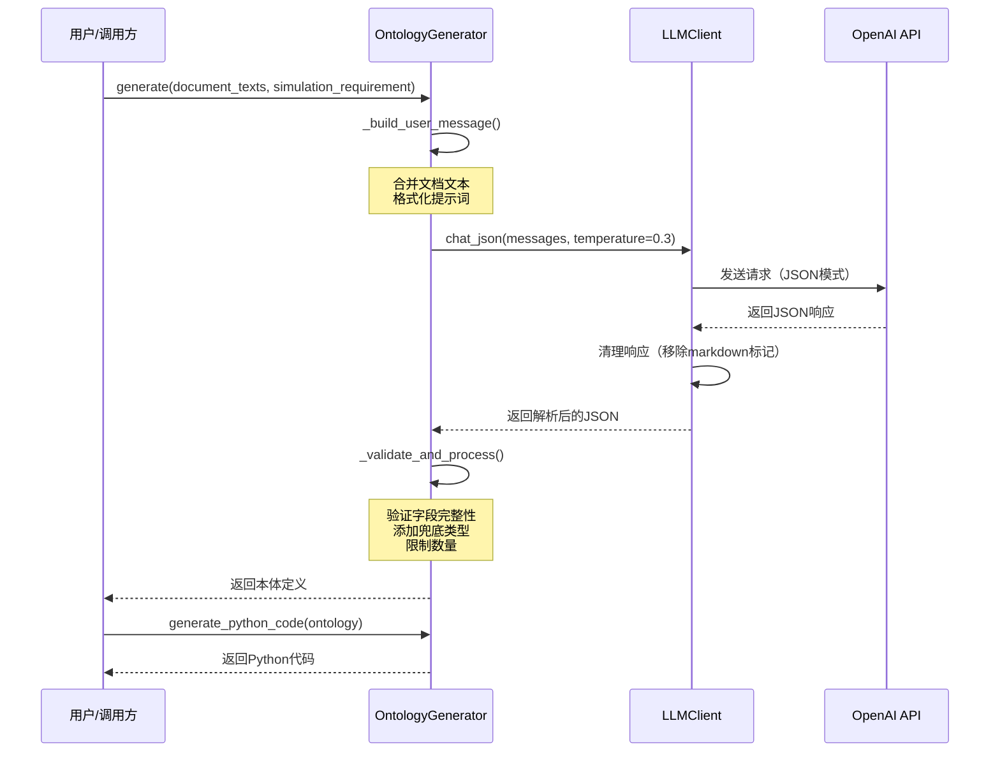
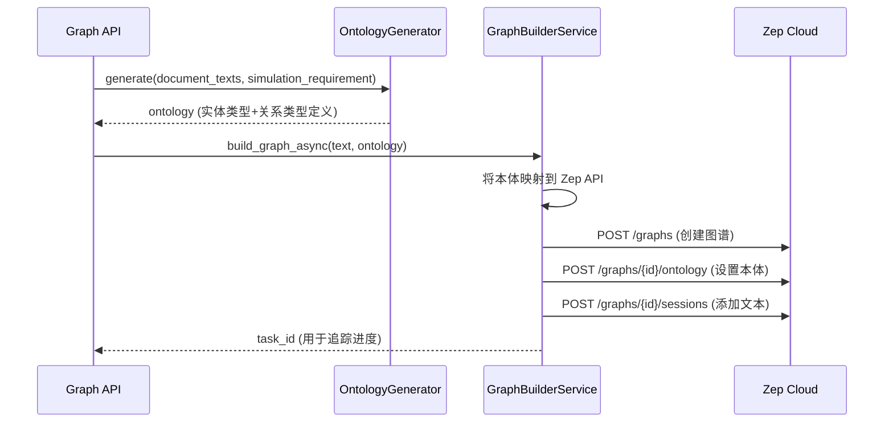

# 本体生成器服务 (OntologyGenerator)

## 服务概述

### 功能描述

本体生成器服务 (`OntologyGenerator`) 是 MiroFish 系统中的核心服务之一，负责从文本内容中自动提取和生成适合社会舆论模拟的实体类型和关系类型定义。该服务利用大语言模型（LLM）的语义理解能力，分析给定文本的结构化内容，设计出符合社交媒体舆论模拟场景的知识图谱本体。

### 主要特性

- **智能本体设计**：基于文本内容自动设计实体类型和关系类型
- **层次化类型系统**：支持具体类型和兜底类型的混合设计
- **规范化输出**：生成符合 Zep Graph API 规范的 JSON 格式本体定义
- **代码生成**：可将本体定义转换为 Python 代码（Pydantic 模型）
- **数量控制**：严格遵守 10 个实体类型和 10 个关系类型的限制

### 使用场景

1. **新建模拟项目**：当用户上传新的文档并创建模拟项目时，系统自动分析文档内容并生成适合的本体定义
2. **本体定制**：根据特定领域（如教育、医疗、商业）的文本特点，生成领域特定的实体和关系类型
3. **快速原型**：为知识图谱构建提供快速的原型设计，无需手动定义所有实体和关系

### 与 LLM 的集成方式

本体生成器通过 `LLMClient` 与大语言模型集成：

- **API 兼容性**：使用 OpenAI API 格式，支持 GPT-4、Claude、MiniMax 等多种模型
- **JSON 模式**：强制 LLM 输出结构化 JSON 格式，确保结果可解析
- **提示词工程**：使用精心设计的系统提示词，引导 LLM 生成符合社会舆论模拟需求的本体
- **温度参数**：使用较低的温度（0.3）以确保输出的稳定性和一致性

## 核心类和方法

### OntologyGenerator 类

本体生成器的主类，负责协调整本体生成流程。

#### 类定义

```python
class OntologyGenerator:
    """本体生成器，分析文本内容，生成实体和关系类型定义"""
```

#### 构造函数

```python
def __init__(self, llm_client: Optional[LLMClient] = None)
```

**参数说明：**
- `llm_client` (Optional[LLMClient]): LLM 客户端实例。如果不提供，会自动创建默认实例

**说明：**
- 允许注入自定义的 LLMClient 实例，便于测试和配置不同的 LLM 服务

#### generate() 方法

生成本体定义的核心方法。

```python
def generate(
    self,
    document_texts: List[str],
    simulation_requirement: str,
    additional_context: Optional[str] = None
) -> Dict[str, Any]
```

**参数说明：**

| 参数 | 类型 | 必填 | 说明 |
|------|------|------|------|
| `document_texts` | `List[str]` | 是 | 文档文本列表，支持多个文档的合并分析 |
| `simulation_requirement` | `str` | 是 | 模拟需求描述，例如"模拟大学生学术不端事件的舆论演变" |
| `additional_context` | `Optional[str]` | 否 | 额外上下文信息，用于补充说明模拟场景 |

**返回值说明：**

返回一个字典，包含以下字段：

```python
{
    "entity_types": [
        {
            "name": "Student",                    # 实体类型名称（PascalCase）
            "description": "...",                 # 简短描述（英文，≤100字符）
            "attributes": [
                {
                    "name": "full_name",          # 属性名（snake_case）
                    "type": "text",               # 属性类型
                    "description": "..."          # 属性描述
                }
            ],
            "examples": ["张三", "李四"]          # 示例实体
        }
    ],
    "edge_types": [
        {
            "name": "STUDIES_AT",                # 关系类型名称（UPPER_SNAKE_CASE）
            "description": "...",                # 简短描述（英文，≤100字符）
            "source_targets": [                  # 允许的源-目标实体类型对
                {"source": "Student", "target": "University"}
            ],
            "attributes": []                     # 关系属性（通常为空）
        }
    ],
    "analysis_summary": "..."                   # 对文本内容的简要分析（中文）
}
```

**使用示例：**

```python
from backend.app.services.ontology_generator import OntologyGenerator

generator = OntologyGenerator()

ontology = generator.generate(
    document_texts=[
        "某大学学生张某因论文抄袭被学校处分...",
        "涉事导师李某表示对此事负责..."
    ],
    simulation_requirement="模拟大学学术不端事件发生后，各利益相关方在社交媒体上的舆论反应",
    additional_context="重点关注学生、导师、学校、媒体等角色的互动"
)

print(ontology["entity_types"])  # 输出实体类型列表
print(ontology["edge_types"])    # 输出关系类型列表
```

#### generate_python_code() 方法

将本体定义转换为可执行的 Python 代码。

```python
def generate_python_code(self, ontology: Dict[str, Any]) -> str
```

**参数说明：**

| 参数 | 类型 | 必填 | 说明 |
|------|------|------|------|
| `ontology` | `Dict[str, Any]` | 是 | 由 `generate()` 方法返回的本体定义 |

**返回值说明：**

返回 Python 代码字符串，包含：
- Pydantic 模型类定义（继承自 `EntityModel` 和 `EdgeModel`）
- 类型配置字典（`ENTITY_TYPES`、`EDGE_TYPES`）
- 边的源-目标映射（`EDGE_SOURCE_TARGETS`）

**使用示例：**

```python
ontology = generator.generate(...)
python_code = generator.generate_python_code(ontology)

# 保存为 Python 文件
with open("custom_ontology.py", "w", encoding="utf-8") as f:
    f.write(python_code)
```

**生成的代码示例：**

```python
"""
自定义实体类型定义
由MiroFish自动生成，用于社会舆论模拟
"""

from pydantic import Field
from zep_cloud.external_clients.ontology import EntityModel, EntityText, EdgeModel


# ============== 实体类型定义 ==============

class Student(EntityModel):
    """A student enrolled in an educational institution."""
    full_name: EntityText = Field(
        description="Full name of the student",
        default=None
    )
    major: EntityText = Field(
        description="Major or field of study",
        default=None
    )


class Professor(EntityModel):
    """A faculty member or academic researcher."""
    full_name: EntityText = Field(
        description="Full name of the professor",
        default=None
    )
    department: EntityText = Field(
        description="Academic department",
        default=None
    )


# ============== 关系类型定义 ==============

class StudiesAt(EdgeModel):
    """Student is enrolled at an educational institution."""
    pass


class Advises(EdgeModel):
    """Professor supervises or mentors a student."""
    pass


# ============== 类型配置 ==============

ENTITY_TYPES = {
    "Student": Student,
    "Professor": Professor,
    # ...
}

EDGE_TYPES = {
    "STUDIES_AT": StudiesAt,
    "ADVISES": Advises,
    # ...
}

EDGE_SOURCE_TARGETS = {
    "STUDIES_AT": [{"source": "Student", "target": "University"}],
    "ADVISES": [{"source": "Professor", "target": "Student"}],
    # ...
}
```

### 私有方法

#### _build_user_message()

构建发送给 LLM 的用户消息。

```python
def _build_user_message(
    self,
    document_texts: List[str],
    simulation_requirement: str,
    additional_context: Optional[str]
) -> str
```

**功能说明：**
- 合并多个文档文本，用分隔符连接
- 如果文本超过 50,000 字符，进行截断（仅影响传给 LLM 的内容）
- 格式化为结构化的用户提示词

#### _validate_and_process()

验证和后处理 LLM 返回的结果。

```python
def _validate_and_process(self, result: Dict[str, Any]) -> Dict[str, Any]
```

**功能说明：**
- 确保必要字段存在（`entity_types`、`edge_types`、`analysis_summary`）
- 验证实体类型和关系类型的完整性
- 自动添加兜底类型（`Person` 和 `Organization`）
- 强制遵守数量限制（最多 10 个实体类型，10 个关系类型）
- 截断过长的描述（≤100 字符）

## 处理流程

### 完整流程图



### 详细处理步骤

#### 1. 输入处理阶段

**文档文本处理：**
- 接收多个文档文本（`List[str]`）
- 使用 `\n\n---\n\n` 作为分隔符合并文本
- 如果总长度超过 50,000 字符，截取前 50,000 字符并添加提示信息

**提示词构建：**
```
## 模拟需求
{simulation_requirement}

## 文档内容
{combined_text}

## 额外说明（可选）
{additional_context}
```

#### 2. LLM 调用阶段

**消息构建：**
```python
messages = [
    {"role": "system", "content": ONTOLOGY_SYSTEM_PROMPT},
    {"role": "user", "content": user_message}
]
```

**参数配置：**
- `temperature=0.3`：较低的温度确保输出稳定
- `max_tokens=4096`：足够的输出长度
- `response_format={"type": "json_object"}`：强制 JSON 格式

**响应处理：**
- 移除可能的 markdown 代码块标记（```json ... ```）
- 移除推理模型的 ```

思考内容标签
- 解析 JSON 并验证格式

#### 3. 结果解析与验证阶段

**字段完整性检查：**
```python
# 确保必要字段存在
if "entity_types" not in result:
    result["entity_types"] = []
if "edge_types" not in result:
    result["edge_types"] = []
if "analysis_summary" not in result:
    result["analysis_summary"] = ""
```

**实体类型验证：**
- 确保每个实体有 `attributes` 和 `examples` 字段
- 截断过长的 `description`（≤100 字符）

**关系类型验证：**
- 确保每个关系有 `source_targets` 和 `attributes` 字段
- 截断过长的 `description`（≤100 字符）

**兜底类型处理：**
```python
# 定义兜底类型
person_fallback = {
    "name": "Person",
    "description": "Any individual person not fitting other specific person types.",
    "attributes": [
        {"name": "full_name", "type": "text", "description": "..."},
        {"name": "role", "type": "text", "description": "..."}
    ],
    "examples": ["ordinary citizen", "anonymous netizen"]
}

organization_fallback = {
    "name": "Organization",
    "description": "Any organization not fitting other specific organization types.",
    # ...
}

# 检查是否已存在，不存在则添加
if "Person" not in entity_names:
    result["entity_types"].append(person_fallback)
if "Organization" not in entity_names:
    result["entity_types"].append(organization_fallback)
```

**数量限制：**
```python
MAX_ENTITY_TYPES = 10
MAX_EDGE_TYPES = 10

# 如果超过限制，移除末尾的类型
if len(result["entity_types"]) > MAX_ENTITY_TYPES:
    result["entity_types"] = result["entity_types"][:MAX_ENTITY_TYPES]
```

#### 4. 代码生成阶段（可选）

**Python 代码生成流程：**
1. 遍历实体类型，生成 Pydantic 模型类
2. 遍历关系类型，生成 EdgeModel 类
3. 生成类型配置字典（`ENTITY_TYPES`、`EDGE_TYPES`）
4. 生成边的源-目标映射（`EDGE_SOURCE_TARGETS`）

## 依赖配置

### OpenAI API 配置

本体生成器依赖 `LLMClient`，需要配置以下环境变量：

```bash
# 必需配置
export LLM_API_KEY="your-api-key-here"
export LLM_BASE_URL="https://api.openai.com/v1"  # 或其他兼容的 API 地址
export LLM_MODEL_NAME="gpt-4"  # 或 "claude-3-5-sonnet", "mini-max" 等

# 可选配置
export LLM_TEMPERATURE=0.3  # 默认温度
export LLM_MAX_TOKENS=4096  # 默认最大 token 数
```

### 配置文件位置

在 `backend/app/config.py` 中定义：

```python
class Config:
    LLM_API_KEY: str = os.getenv("LLM_API_KEY", "")
    LLM_BASE_URL: str = os.getenv("LLM_BASE_URL", "https://api.openai.com/v1")
    LLM_MODEL_NAME: str = os.getenv("LLM_MODEL_NAME", "gpt-4")
```

### Prompt 模板位置

系统提示词定义在 `ontology_generator.py` 文件中：

```python
# 位置：backend/app/services/ontology_generator.py
# 变量名：ONTOLOGY_SYSTEM_PROMPT
# 行号：第 12-155 行

ONTOLOGY_SYSTEM_PROMPT = """你是一个专业的知识图谱本体设计专家..."""
```

**提示词核心要点：**
1. 强调输出有效的 JSON 格式
2. 明确社会舆论模拟的场景需求
3. 规定实体必须是现实中可发声的主体
4. 要求正好 10 个实体类型（8 个具体类型 + 2 个兜底类型）
5. 限制属性名不能使用系统保留字（`name`、`uuid`、`group_id` 等）
6. 提供实体类型和关系类型的参考示例

### 依赖包

本体生成器服务的依赖项：

```python
# backend/app/services/ontology_generator.py

from typing import Dict, Any, List, Optional
from ..utils.llm_client import LLMClient

# LLMClient 依赖
from openai import OpenAI
import json
import re
```

**安装命令：**

```bash
pip install openai pydantic
```

## 使用示例

### 完整示例

```python
from backend.app.services.ontology_generator import OntologyGenerator

# 1. 初始化生成器
generator = OntologyGenerator()

# 2. 准备输入数据
documents = [
    """
    某知名高校学生张某因毕业论文抄袭被学校撤销学位。
    涉事导师李某被暂停招生资格。学校宣传部发布通报称，
    将加强学术诚信教育。此事在微博引发热议...
    """,
    """
    教育部相关负责人表示，将督促高校落实学术不端处理机制。
    多所高校宣布将开展学术诚信自查...
    """
]

simulation_req = """
模拟高校学术不端事件的舆论演变过程，重点关注：
1. 学生、导师、学校三方的立场和互动
2. 媒体报道和公众舆论的变化
3. 教育部门的介入和影响
"""

# 3. 生成本体定义
ontology = generator.generate(
    document_texts=documents,
    simulation_requirement=simulation_req,
    additional_context="假设发生在2024年，社交媒体平台主要是微博"
)

# 4. 查看结果
print("实体类型数量:", len(ontology["entity_types"]))
print("关系类型数量:", len(ontology["edge_types"]))
print("分析摘要:", ontology["analysis_summary"])

# 5. 生成 Python 代码
python_code = generator.generate_python_code(ontology)

# 6. 保存代码
with open("custom_ontology.py", "w", encoding="utf-8") as f:
    f.write(python_code)

print("本体定义已保存到 custom_ontology.py")
```

### 预期输出示例

```python
{
    "entity_types": [
        {
            "name": "Student",
            "description": "A student enrolled in an educational institution.",
            "attributes": [
                {"name": "full_name", "type": "text", "description": "Full name"},
                {"name": "major", "type": "text", "description": "Field of study"}
            ],
            "examples": ["张某", "本科生", "研究生"]
        },
        {
            "name": "Professor",
            "description": "A faculty member or academic researcher.",
            "attributes": [
                {"name": "full_name", "type": "text", "description": "Full name"},
                {"name": "department", "type": "text", "description": "Department"}
            ],
            "examples": ["李某", "导师", "系主任"]
        },
        # ... 更多实体类型
        {
            "name": "Person",
            "description": "Any individual person not fitting other specific person types.",
            "attributes": [
                {"name": "full_name", "type": "text", "description": "Full name"},
                {"name": "role", "type": "text", "description": "Role or occupation"}
            ],
            "examples": ["ordinary citizen", "anonymous netizen"]
        },
        {
            "name": "Organization",
            "description": "Any organization not fitting other specific organization types.",
            "attributes": [
                {"name": "org_name", "type": "text", "description": "Organization name"},
                {"name": "org_type", "type": "text", "description": "Organization type"}
            ],
            "examples": ["small business", "community group"]
        }
    ],
    "edge_types": [
        {
            "name": "STUDIES_AT",
            "description": "Student is enrolled at an educational institution.",
            "source_targets": [
                {"source": "Student", "target": "University"}
            ],
            "attributes": []
        },
        {
            "name": "ADVISES",
            "description": "Professor supervises or mentors a student.",
            "source_targets": [
                {"source": "Professor", "target": "Student"}
            ],
            "attributes": []
        },
        # ... 更多关系类型
    ],
    "analysis_summary": "根据提供的文本内容，这是一个关于高校学术不端事件的案例。涉及的主要角色包括学生、导师、学校、教育部门和媒体。生成的本体设计包含8个具体类型，覆盖了事件中的关键参与者，并添加了Person和Organization作为兜底类型，确保所有实体都能正确归类。"
}
```

## 注意事项

### 实体类型设计规范

1. **必须是现实主体**：实体必须是现实中可以在社交媒体上发声和互动的主体，不能是抽象概念
2. **层次结构**：必须包含具体类型（8个）和兜底类型（2个：Person 和 Organization）
3. **命名规范**：使用 PascalCase（如 `Student`、`Professor`）
4. **属性限制**：不能使用系统保留字（`name`、`uuid`、`group_id`、`created_at`、`summary`）

### 关系类型设计规范

1. **数量限制**：6-10 个关系类型
2. **命名规范**：使用 UPPER_SNAKE_CASE（如 `STUDIES_AT`、`ADVISES`）
3. **源-目标映射**：必须明确每个关系允许的源实体类型和目标实体类型
4. **反映真实互动**：关系应该反映社交媒体环境中的真实联系

### 文本长度限制

- **最大输入长度**：50,000 字符（仅影响传给 LLM 的内容）
- **超长文本处理**：自动截断并添加提示信息
- **建议**：对于超长文档，建议先进行摘要或分段处理

### API 调用注意事项

1. **API 密钥安全**：不要将 API 密钥硬编码到代码中，使用环境变量
2. **错误处理**：建议使用 try-except 捕获可能的 API 调用错误
3. **重试机制**：对于网络错误，可以实现重试逻辑
4. **成本控制**：注意监控 API 调用次数和成本

### 常见问题

**Q: 为什么必须包含 Person 和 Organization 兜底类型？**

A: 因为文本中会出现各种无法预料的实体，如"路人甲"、"某网友"、"小公司"等。如果没有兜底类型，这些实体将无法正确分类，影响图谱构建的完整性。

**Q: 属性名为什么不能使用 `name`？**

A: `name` 是 Zep Graph API 的系统保留字段，用于存储实体的主要标识符。自定义属性应使用其他名称，如 `full_name`、`org_name` 等。

**Q: 如何提高本体生成的准确性？**

A: 可以通过以下方式：
1. 提供更详细的 `simulation_requirement` 描述
2. 在 `additional_context` 中补充领域特定信息
3. 使用更强大的 LLM 模型（如 GPT-4）
4. 生成后进行人工审核和调整

**Q: 生成的 Python 代码可以直接使用吗？**

A: 可以，但需要确保项目已安装 `zep-cloud` 和 `pydantic` 包。生成的代码符合 Zep Graph API 的规范，可以直接导入使用。

## 与 Graph Builder 的集成

### 集成概述

`OntologyGenerator` 和 `GraphBuilderService` 是知识图谱构建流程中的两个关键服务，它们协同工作完成从文本到图谱的完整转换：



### 数据流向

1. **本体生成阶段**：
   - `OntologyGenerator.generate()` 返回的 `ontology` 字典包含：
     - `entity_types`: 实体类型定义数组
     - `edge_types`: 关系类型定义数组
     - `analysis_summary`: 分析摘要

2. **图谱构建阶段**：
   - `GraphBuilderService.build_graph_async()` 接收 `ontology` 参数
   - 将本体定义转换为 Zep Graph API 格式
   - 通过 Zep API 创建图谱并设置本体

### 代码示例：完整集成流程

```python
from backend.app.services.ontology_generator import OntologyGenerator
from backend.app.services.graph_builder import GraphBuilderService

# 第一步：生成本体定义
og = OntologyGenerator()
ontology = og.generate(
    document_texts=["某大学学生张某因论文抄袭..."],
    simulation_requirement="模拟学术不端事件的舆论演变"
)

# 第二步：使用本体构建图谱
gb = GraphBuilderService()
task_id = gb.build_graph_async(
    text="完整的文档文本内容...",
    ontology=ontology,  # 直接使用 OntologyGenerator 的输出
    graph_name="学术不端事件图谱"
)

print(f"图谱构建任务已启动，任务ID: {task_id}")
```

### 本体格式转换

`GraphBuilderService` 会将 `OntologyGenerator` 生成的本体格式转换为 Zep Cloud API 所需的格式：

**OntologyGenerator 输出格式：**
```python
{
    "entity_types": [
        {
            "name": "Student",
            "description": "A student enrolled...",
            "attributes": [
                {"name": "full_name", "type": "text", "description": "..."}
            ],
            "examples": ["张某", "李某"]
        }
    ],
    "edge_types": [
        {
            "name": "STUDIES_AT",
            "description": "Student is enrolled...",
            "source_targets": [
                {"source": "Student", "target": "University"}
            ],
            "attributes": []
        }
    ]
}
```

**Zep Cloud API 格式（由 GraphBuilder 自动转换）：**
```python
# 实体类型配置
ENTITY_TYPES = {
    "Student": Student,  # Pydantic 模型类
}

# 关系类型配置
EDGE_TYPES = {
    "STUDIES_AT": StudiesAt,
}

# 源-目标映射
EDGE_SOURCE_TARGETS = {
    "STUDIES_AT": [{"source": "Student", "target": "University"}],
}
```

### API 端点集成

在 `backend/app/api/graph.py` 中，两个服务通过 `/api/graph` 端点集成：

```python
# POST /api/graph/ontology/generate - 生成本体
ontology = ontology_generator.generate(
    document_texts=texts,
    simulation_requirement=requirement
)

# POST /api/graph/build - 构建图谱
task_id = graph_builder.build_graph_async(
    text=combined_text,
    ontology=ontology,  # 使用上一步生成的本体
    graph_name=project_id
)
```

### 关键集成点

| 集成点 | OntologyGenerator | GraphBuilderService |
|--------|-------------------|---------------------|
| **输出格式** | `Dict[str, Any]` with `entity_types` and `edge_types` | 接收相同格式的 `ontology` 参数 |
| **实体类型限制** | 最多 10 个（含 2 个兜底类型） | 使用所有生成的类型 |
| **关系类型限制** | 最多 10 个 | 使用所有生成的类型 |
| **属性命名** | 避免 Zep 保留字（`name`, `uuid` 等） | 直接映射到 Zep API |
| **Python 代码** | 可选生成 Pydantic 模型 | 可选用于类型验证 |
