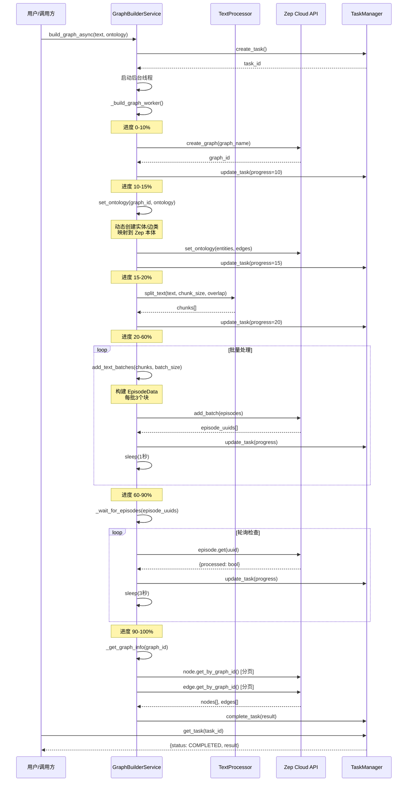

# 图谱构建服务 (GraphBuilder)

## 服务概述

### 功能描述

图谱构建服务 (`GraphBuilderService`) 是 MiroFish 系统的核心服务之一，负责将文本内容转化为结构化的知识图谱并存储到 Zep Cloud。该服务实现了完整的图谱构建流程，包括文本分块、实体提取、关系识别和图谱存储等关键步骤。

### 主要特性

- **异步构建**：支持长时间运行的图谱构建任务，通过任务管理系统跟踪进度
- **智能分块**：采用重叠分块策略，在句子边界处分割，保持上下文完整性
- **本体映射**：将 OntologyGenerator 生成的本体定义映射到 Zep Graph API
- **批量处理**：支持批量添加文本块，优化 API 调用效率
- **状态追踪**：实时追踪 Zep 的处理状态，确保所有文本块都被正确处理
- **分页查询**：自动处理分页逻辑，获取完整的节点和边数据

### 与 Zep Cloud 的集成

图谱构建服务深度集成 Zep Cloud API，提供以下功能：

1. **Graph 管理**：创建、删除、查询知识图谱
2. **Ontology 设置**：动态设置实体类型和关系类型
3. **Episode 添加**：批量添加文本数据到图谱
4. **状态监控**：追踪文本处理状态，等待 Zep 完成实体和关系提取
5. **数据检索**：分页获取图谱的节点和边数据

### 使用场景

1. **新项目初始化**：用户上传文档后，自动构建知识图谱
2. **增量更新**：向现有图谱添加新的文本数据
3. **图谱重构**：基于新的本体定义重新构建图谱
4. **数据导出**：导出完整的图谱数据用于分析和可视化

## 核心类和方法

### GraphBuilderService 类

图谱构建服务的主类，负责协调整个图谱构建流程。

#### 类定义

```python
class GraphBuilderService:
    """
    图谱构建服务
    负责调用Zep API构建知识图谱
    """
```

#### 构造函数

```python
def __init__(self, api_key: Optional[str] = None)
```

**参数说明：**
- `api_key` (Optional[str]): Zep API 密钥。如果不提供，从 `Config.ZEP_API_KEY` 读取

**异常：**
- `ValueError`: 当 ZEP_API_KEY 未配置时抛出

**说明：**
- 初始化 Zep 客户端
- 创建任务管理器实例
- 验证 API 密钥配置

#### build_graph_async() 方法

异步构建知识图谱的核心方法。

```python
def build_graph_async(
    self,
    text: str,
    ontology: Dict[str, Any],
    graph_name: str = "MiroFish Graph",
    chunk_size: int = 500,
    chunk_overlap: int = 50,
    batch_size: int = 3
) -> str
```

**参数说明：**

| 参数 | 类型 | 必填 | 默认值 | 说明 |
|------|------|------|--------|------|
| `text` | `str` | 是 | - | 输入文本内容 |
| `ontology` | `Dict[str, Any]` | 是 | - | 本体定义（来自 OntologyGenerator） |
| `graph_name` | `str` | 否 | "MiroFish Graph" | 图谱名称 |
| `chunk_size` | `int` | 否 | 500 | 文本块大小（字符数） |
| `chunk_overlap` | `int` | 否 | 50 | 块重叠大小（字符数） |
| `batch_size` | `int` | 否 | 3 | 每批发送的块数量 |

**返回值：**
- `str`: 任务 ID，用于查询构建进度和结果

**使用示例：**

```python
from backend.app.services.graph_builder import GraphBuilderService

# 初始化服务
builder = GraphBuilderService()

# 异步构建图谱
task_id = builder.build_graph_async(
    text="某大学学生张某因论文抄袭被学校处分...",
    ontology=ontology,  # 来自 OntologyGenerator
    graph_name="学术不端事件图谱",
    chunk_size=500,
    chunk_overlap=50,
    batch_size=3
)

print(f"任务ID: {task_id}")
```

#### create_graph() 方法

创建新的 Zep 图谱。

```python
def create_graph(self, name: str) -> str
```

**参数说明：**
- `name` (str): 图谱名称

**返回值：**
- `str`: 图谱 ID（格式：`mirofish_{16位hex}`）

**说明：**
- 生成唯一的图谱 ID
- 调用 Zep API 创建图谱
- 设置默认描述信息

#### set_ontology() 方法

设置图谱的本体定义。

```python
def set_ontology(self, graph_id: str, ontology: Dict[str, Any])
```

**参数说明：**
- `graph_id` (str): 图谱 ID
- `ontology` (Dict[str, Any]): 本体定义，包含 `entity_types` 和 `edge_types`

**功能说明：**

该方法动态创建 Pydantic 模型类并注册到 Zep：

1. **实体类型处理**：
   - 遍历 `entity_types`，为每个类型创建 `EntityModel` 子类
   - 处理保留名称冲突（`uuid`、`name`、`group_id` 等）
   - 为每个属性创建 `Field` 定义，包含描述信息

2. **关系类型处理**：
   - 遍历 `edge_types`，为每个类型创建 `EdgeModel` 子类
   - 构建 `source_targets` 映射，定义允许的源-目标实体对
   - 处理属性定义

3. **API 调用**：
   - 调用 `client.graph.set_ontology()` 注册本体
   - 抑制 Pydantic v2 的警告信息

**保留名称列表：**
```python
RESERVED_NAMES = {
    'uuid', 'name', 'group_id',
    'name_embedding', 'summary', 'created_at'
}
```

**安全名称转换：**
- 如果属性名是保留名称，自动添加 `entity_` 前缀
- 例如：`name` → `entity_name`

#### add_text_batches() 方法

分批添加文本到图谱。

```python
def add_text_batches(
    self,
    graph_id: str,
    chunks: List[str],
    batch_size: int = 3,
    progress_callback: Optional[Callable] = None
) -> List[str]
```

**参数说明：**
- `graph_id` (str): 图谱 ID
- `chunks` (List[str]): 文本块列表
- `batch_size` (int): 每批处理的块数量
- `progress_callback` (Optional[Callable]): 进度回调函数

**返回值：**
- `List[str]`: 所有 episode 的 UUID 列表

**处理流程：**

1. 将文本块分组为批次
2. 为每批创建 `EpisodeData` 对象
3. 调用 `client.graph.add_batch()` 发送到 Zep
4. 收集返回的 episode UUID
5. 每批之间延迟 1 秒，避免请求过快

**EpisodeData 结构：**
```python
EpisodeData(
    data=chunk,      # 文本内容
    type="text"      # 类型标识
)
```

#### get_graph_data() 方法

获取完整的图谱数据。

```python
def get_graph_data(self, graph_id: str) -> Dict[str, Any]
```

**参数说明：**
- `graph_id` (str): 图谱 ID

**返回值：**
```python
{
    "graph_id": str,
    "nodes": [
        {
            "uuid": str,
            "name": str,
            "labels": List[str],
            "summary": str,
            "attributes": Dict,
            "created_at": str
        }
    ],
    "edges": [
        {
            "uuid": str,
            "name": str,
            "fact": str,
            "fact_type": str,
            "source_node_uuid": str,
            "target_node_uuid": str,
            "source_node_name": str,
            "target_node_name": str,
            "attributes": Dict,
            "created_at": str,
            "valid_at": str,
            "invalid_at": str,
            "expired_at": str,
            "episodes": List[str]
        }
    ],
    "node_count": int,
    "edge_count": int
}
```

**说明：**
- 使用分页工具获取所有节点和边
- 创建节点映射用于获取节点名称
- 提取时间信息（`created_at`、`valid_at` 等）
- 提取 episode 关联信息

#### delete_graph() 方法

删除图谱。

```python
def delete_graph(self, graph_id: str)
```

**参数说明：**
- `graph_id` (str): 要删除的图谱 ID

**说明：**
- 调用 Zep API 删除图谱
- 操作不可逆，请谨慎使用

### 辅助类

#### GraphInfo

图谱信息数据类。

```python
@dataclass
class GraphInfo:
    """图谱信息"""
    graph_id: str
    node_count: int
    edge_count: int
    entity_types: List[str]

    def to_dict(self) -> Dict[str, Any]:
        return {
            "graph_id": self.graph_id,
            "node_count": self.node_count,
            "edge_count": self.edge_count,
            "entity_types": self.entity_types,
        }
```

## 文本处理

### 分块策略

图谱构建服务使用 `TextProcessor` 进行文本分块，采用智能重叠策略。

#### 核心算法

**函数签名：**
```python
def split_text_into_chunks(
    text: str,
    chunk_size: int = 500,
    overlap: int = 50
) -> List[str]
```

**处理流程：**

1. **边界判断**：
   - 如果文本长度 ≤ `chunk_size`，直接返回整个文本
   - 否则进行分块处理

2. **智能分割**：
   - 尝试在句子边界处分割
   - 按优先级查找分隔符：
     ```python
     ['。', '！', '？', '.\n', '!\n', '?\n', '\n\n', '. ', '! ', '? ']
     ```
   - 如果在 `chunk_size * 0.3` 到 `chunk_size` 之间找到分隔符，在该处分割
   - 否则按固定大小分割

3. **重叠处理**：
   - 下一个块的起始位置 = 当前块结束位置 - `overlap`
   - 确保上下文信息不会丢失

**示例：**

```python
text = "这是一个关于学术不端的案例。学生张某抄袭了论文。导师李某被问责。学校发布了处理决定。"

chunks = split_text_into_chunks(text, chunk_size=30, overlap=10)

# 结果：
# [
#   "这是一个关于学术不端的案例。",  # 在句子边界分割
#   "案例。学生张某抄袭了论文。",     # 有10个字符重叠
#   "论文。导师李某被问责。",         # 继续重叠
#   "问责。学校发布了处理决定。"
# ]
```

#### 分块参数建议

| 场景 | chunk_size | overlap | 说明 |
|------|------------|---------|------|
| 短文本（<5000字） | 500 | 50 | 标准配置 |
| 长文本（>5000字） | 1000 | 100 | 减少块数量 |
| 专业文档 | 800 | 150 | 保持更多上下文 |
| 社交媒体内容 | 300 | 30 | 内容较短，小块处理 |

### 文本预处理

在分块之前，建议进行文本预处理：

```python
from backend.app.services.text_processor import TextProcessor

# 预处理文本
cleaned_text = TextProcessor.preprocess_text(raw_text)

# 分块处理
chunks = TextProcessor.split_text(
    cleaned_text,
    chunk_size=500,
    overlap=50
)
```

**预处理功能：**
- 标准化换行符（`\r\n` → `\n`）
- 移除连续空行（保留最多两个换行）
- 移除行首行尾空白

### 文本统计

```python
stats = TextProcessor.get_text_stats(text)

# 返回：
# {
#     "total_chars": 12345,    # 总字符数
#     "total_lines": 234,      # 总行数
#     "total_words": 567       # 总词数
# }
```

## Zep 集成

### Memory 存储结构

Zep Cloud 使用 Graph 数据模型存储知识图谱，包含节点（Nodes）和边（Edges）。

#### 节点（Node）结构

```python
{
    "uuid_": str,                    # 节点唯一标识
    "name": str,                     # 节点名称（实体标识）
    "labels": List[str],             # 类型标签
                                     # 例如：["Entity", "Student", "Person"]
    "summary": str,                  # 实体摘要描述
    "attributes": Dict,              # 自定义属性
                                     # 例如：{"entity_full_name": "张三"}
    "created_at": datetime           # 创建时间
}
```

**节点标签说明：**
- `Entity`: 所有节点的基础标签
- 具体类型标签：如 `Student`、`Professor` 等
- 兜底类型标签：如 `Person`、`Organization`

#### 边（Edge）结构

```python
{
    "uuid_": str,                    # 边唯一标识
    "name": str,                     # 边名称（关系类型）
                                     # 例如："STUDIES_AT", "ADVISES"
    "fact": str,                     # 关系事实描述
    "fact_type": str,                # 事实类型
    "source_node_uuid": str,         # 源节点 UUID
    "target_node_uuid": str,         # 目标节点 UUID
    "attributes": Dict,              # 自定义属性
    "created_at": datetime,          # 创建时间
    "valid_at": datetime,            # 有效时间
    "invalid_at": datetime,          # 失效时间（可选）
    "expired_at": datetime,          # 过期时间（可选）
    "episodes": List[str]            # 关联的 Episode UUID 列表
}
```

**时间属性说明：**
- `created_at`: 边的创建时间
- `valid_at`: 关系开始有效的时间
- `invalid_at`: 关系失效的时间（如友谊结束）
- `expired_at`: 关系过期的时间

#### Episode 结构

Episode 是文本处理的基本单元。

```python
{
    "uuid_": str,                    # Episode 唯一标识
    "data": str,                     # 文本内容
    "type": str,                     # 类型标识（通常为 "text"）
    "processed": bool,               # 是否已处理完成
    "created_at": datetime           # 创建时间
}
```

**处理流程：**
1. 添加 Episode 到图谱
2. Zep 自动提取实体和关系
3. 提取完成后，`processed` 标记为 `True`
4. 提取的节点和边关联到 Episode UUID

### 检索方法

#### 分页查询工具

图谱构建服务提供了分页查询工具，封装在 `zep_paging.py` 中。

**fetch_all_nodes() - 获取所有节点**

```python
from backend.app.utils.zep_paging import fetch_all_nodes

nodes = fetch_all_nodes(
    client=builder.client,
    graph_id=graph_id,
    page_size=100,      # 每页节点数
    max_items=2000      # 最大节点数
)
```

**特性：**
- 自动处理 UUID 游标分页
- 单页失败时自动重试（指数退避）
- 限制最大返回数量（默认 2000）
- 记录详细日志

**fetch_all_edges() - 获取所有边**

```python
from backend.app.utils.zep_paging import fetch_all_edges

edges = fetch_all_edges(
    client=builder.client,
    graph_id=graph_id,
    page_size=100       # 每页边数
)
```

**特性：**
- 自动处理 UUID 游标分页
- 单页失败时自动重试
- 返回所有边（无数量限制）

#### 重试机制

分页查询包含内置的重试机制：

```python
def _fetch_page_with_retry(
    api_call: Callable,
    max_retries: int = 3,
    retry_delay: float = 2.0
) -> list:
    """单页请求，失败时指数退避重试"""
```

**重试策略：**
- 最多重试 3 次
- 初始延迟 2 秒
- 每次重试延迟翻倍（2s → 4s → 8s）
- 仅重试网络/IO 类错误（ConnectionError、TimeoutError 等）
- 记录重试日志

### Zep API 调用示例

#### 创建图谱

```python
from zep_cloud.client import Zep

client = Zep(api_key="your-api-key")

# 创建图谱
graph = client.graph.create(
    graph_id="mirofish_abc123",
    name="示例图谱",
    description="这是一个示例知识图谱"
)
```

#### 设置本体

```python
from zep_cloud.external_clients.ontology import EntityModel, EdgeModel
from pydantic import Field

# 定义实体类型
class Student(EntityModel):
    """A student enrolled in a university."""
    full_name: EntityText = Field(
        description="Full name of the student",
        default=None
    )

# 设置本体
client.graph.set_ontology(
    graph_ids=["mirofish_abc123"],
    entities={"Student": Student},
    edges={}
)
```

#### 添加文本

```python
from zep_cloud import EpisodeData

# 单个文本
episode = EpisodeData(data="学生张某在某大学学习...", type="text")
result = client.graph.episode.add(
    graph_id="mirofish_abc123",
    episode=episode
)

# 批量添加
episodes = [
    EpisodeData(data="文本1...", type="text"),
    EpisodeData(data="文本2...", type="text"),
    EpisodeData(data="文本3...", type="text"),
]
results = client.graph.add_batch(
    graph_id="mirofish_abc123",
    episodes=episodes
)
```

#### 查询节点和边

```python
# 查询节点（单页）
nodes = client.graph.node.get_by_graph_id(
    graph_id="mirofish_abc123",
    limit=100,
    uuid_cursor=None  # 首页为 None
)

# 查询边（单页）
edges = client.graph.edge.get_by_graph_id(
    graph_id="mirofish_abc123",
    limit=100,
    uuid_cursor=None
)
```

#### 删除图谱

```python
client.graph.delete(graph_id="mirofish_abc123")
```

## 处理流程

### 完整流程图



### 详细处理步骤

#### 1. 任务初始化阶段

**创建任务：**
```python
task_id = self.task_manager.create_task(
    task_type="graph_build",
    metadata={
        "graph_name": graph_name,
        "chunk_size": chunk_size,
        "text_length": len(text),
    }
)
```

**启动后台线程：**
- 使用 `threading.Thread` 创建工作线程
- 设置为守护线程（`daemon=True`）
- 立即返回 `task_id` 给调用方

#### 2. 图谱创建阶段（进度 0-10%）

**生成图谱 ID：**
```python
graph_id = f"mirofish_{uuid.uuid4().hex[:16]}"
# 示例：mirofish_a1b2c3d4e5f6g7h8
```

**调用 Zep API：**
```python
self.client.graph.create(
    graph_id=graph_id,
    name=graph_name,
    description="MiroFish Social Simulation Graph"
)
```

#### 3. 本体设置阶段（进度 10-15%）

**动态类创建：**
- 遍历实体类型定义
- 使用 `type()` 动态创建 Pydantic 类
- 处理保留名称冲突
- 添加类型注解（`__annotations__`）

**示例：**
```python
# 输入
entity_def = {
    "name": "Student",
    "description": "A student",
    "attributes": [
        {"name": "name", "type": "text", "description": "Full name"}
    ]
}

# 输出（动态创建）
class Student(EntityModel):
    """A student"""
    entity_name: EntityText = Field(description="Full name", default=None)
```

#### 4. 文本分块阶段（进度 15-20%）

**分块处理：**
```python
chunks = TextProcessor.split_text(
    text,
    chunk_size=chunk_size,
    overlap=chunk_overlap
)
```

**更新进度：**
```python
self.task_manager.update_task(
    task_id,
    progress=20,
    message=f"文本已分割为 {len(chunks)} 个块"
)
```

#### 5. 批量添加阶段（进度 20-60%）

**批次计算：**
```python
total_chunks = len(chunks)
total_batches = (total_chunks + batch_size - 1) // batch_size

for i in range(0, total_chunks, batch_size):
    batch_chunks = chunks[i:i + batch_size]
    batch_num = i // batch_size + 1
```

**构建 Episodes：**
```python
episodes = [
    EpisodeData(data=chunk, type="text")
    for chunk in batch_chunks
]
```

**发送到 Zep：**
```python
batch_result = self.client.graph.add_batch(
    graph_id=graph_id,
    episodes=episodes
)

# 收集 UUID
for ep in batch_result:
    ep_uuid = getattr(ep, 'uuid_', None) or getattr(ep, 'uuid', None)
    if ep_uuid:
        episode_uuids.append(ep_uuid)
```

**进度计算：**
```python
progress = 20 + int((i + len(batch_chunks)) / total_chunks * 40)
# 进度范围：20% - 60%
```

#### 6. 等待处理阶段（进度 60-90%）

**轮询逻辑：**
```python
pending_episodes = set(episode_uuids)
completed_count = 0

while pending_episodes:
    for ep_uuid in list(pending_episodes):
        episode = self.client.graph.episode.get(uuid_=ep_uuid)
        is_processed = getattr(episode, 'processed', False)

        if is_processed:
            pending_episodes.remove(ep_uuid)
            completed_count += 1

    # 更新进度
    progress = 60 + int(completed_count / total_episodes * 30)

    # 等待3秒后继续
    time.sleep(3)
```

**超时处理：**
```python
timeout = 600  # 10分钟
start_time = time.time()

if time.time() - start_time > timeout:
    # 超时退出
    break
```

#### 7. 图谱信息获取阶段（进度 90-100%）

**分页获取节点：**
```python
nodes = fetch_all_nodes(self.client, graph_id)
# 自动处理分页，最多返回2000个节点
```

**分页获取边：**
```python
edges = fetch_all_edges(self.client, graph_id)
# 自动处理分页，返回所有边
```

**统计实体类型：**
```python
entity_types = set()
for node in nodes:
    if node.labels:
        for label in node.labels:
            if label not in ["Entity", "Node"]:
                entity_types.add(label)
```

**完成任务：**
```python
self.task_manager.complete_task(task_id, {
    "graph_id": graph_id,
    "graph_info": graph_info.to_dict(),
    "chunks_processed": total_chunks,
})
```

### 错误处理

**异常捕获：**
```python
try:
    # 构建逻辑
    pass
except Exception as e:
    import traceback
    error_msg = f"{str(e)}\n{traceback.format_exc()}"
    self.task_manager.fail_task(task_id, error_msg)
```

**错误信息包含：**
- 异常类型和消息
- 完整的堆栈跟踪
- 任务状态标记为 `FAILED`

## 依赖配置

### Zep Cloud API 配置

图谱构建服务需要配置 Zep Cloud API 访问：

```bash
# 必需配置
export ZEP_API_KEY="your-zep-api-key-here"

# 可选配置（如果使用自定义 Zep 实例）
# export ZEP_BASE_URL="https://api.zep-cloud.com"
```

### 配置文件位置

在 `backend/app/config.py` 中定义：

```python
class Config:
    ZEP_API_KEY: str = os.getenv("ZEP_API_KEY", "")
```

### 依赖包

图谱构建服务的依赖项：

```python
# backend/app/services/graph_builder.py

from zep_cloud.client import Zep
from zep_cloud import EpisodeData, EntityEdgeSourceTarget
from typing import Dict, Any, List, Optional
from dataclasses import dataclass
import uuid
import time
import threading
```

**安装命令：**

```bash
pip install zep-cloud pydantic
```

**版本要求：**
- `zep-cloud` >= 0.1.0
- `pydantic` >= 2.0.0

## 使用示例

### 完整示例

```python
from backend.app.services.graph_builder import GraphBuilderService
from backend.app.services.ontology_generator import OntologyGenerator
from backend.app.models.task import TaskManager

# 1. 生成本体定义
generator = OntologyGenerator()
ontology = generator.generate(
    document_texts=["某大学学生张某因论文抄袭被学校处分..."],
    simulation_requirement="模拟学术不端事件的舆论演变"
)

# 2. 初始化图谱构建服务
builder = GraphBuilderService()

# 3. 异步构建图谱
task_id = builder.build_graph_async(
    text="某大学学生张某因毕业论文抄袭被学校撤销学位。"
        "涉事导师李某被暂停招生资格。"
        "学校宣传部发布通报称，将加强学术诚信教育。",
    ontology=ontology,
    graph_name="学术不端事件图谱",
    chunk_size=500,
    chunk_overlap=50,
    batch_size=3
)

print(f"任务已创建，ID: {task_id}")

# 4. 查询任务进度
task_manager = TaskManager()
while True:
    task = task_manager.get_task(task_id)
    print(f"进度: {task.progress}% - {task.message}")

    if task.status.value == "completed":
        print("构建完成！")
        print(f"图谱ID: {task.result['graph_id']}")
        print(f"节点数: {task.result['graph_info']['node_count']}")
        print(f"边数: {task.result['graph_info']['edge_count']}")
        print(f"实体类型: {task.result['graph_info']['entity_types']}")
        break
    elif task.status.value == "failed":
        print(f"构建失败: {task.error}")
        break

    import time
    time.sleep(2)

# 5. 获取完整图谱数据
graph_data = builder.get_graph_data(task.result['graph_id'])

print(f"\n节点列表（共{len(graph_data['nodes'])}个）:")
for node in graph_data['nodes'][:5]:  # 显示前5个
    print(f"  - {node['name']} ({', '.join(node['labels'])})")

print(f"\n边列表（共{len(graph_data['edges'])}条）:")
for edge in graph_data['edges'][:5]:  # 显示前5条
    print(f"  - {edge['source_node_name']} --[{edge['name']}]--> {edge['target_node_name']}")
```

### 同步构建（阻塞方式）

如果需要同步等待构建完成，可以使用轮询：

```python
import time
from backend.app.services.graph_builder import GraphBuilderService
from backend.app.models.task import TaskManager

builder = GraphBuilderService()
task_manager = TaskManager()

# 启动异步任务
task_id = builder.build_graph_async(text, ontology)

# 轮询等待完成
while True:
    task = task_manager.get_task(task_id)

    if task.status.value == "completed":
        print(f"成功！图谱ID: {task.result['graph_id']}")
        break
    elif task.status.value == "failed":
        print(f"失败: {task.error}")
        break

    print(f"等待中... {task.progress}%")
    time.sleep(1)
```

### 从文件构建图谱

```python
from backend.app.services.text_processor import TextProcessor
from backend.app.services.graph_builder import GraphBuilderService

# 1. 从文件提取文本
file_paths = [
    "/path/to/document1.pdf",
    "/path/to/document2.md"
]
text = TextProcessor.extract_from_files(file_paths)

# 2. 预处理文本
cleaned_text = TextProcessor.preprocess_text(text)

# 3. 构建图谱
builder = GraphBuilderService()
task_id = builder.build_graph_async(
    text=cleaned_text,
    ontology=ontology,
    graph_name="文档图谱",
    chunk_size=800,      # 较大的块
    chunk_overlap=150    # 较大的重叠
)
```

### 获取特定图谱信息

```python
from backend.app.services.graph_builder import GraphBuilderService

builder = GraphBuilderService()

# 获取图谱数据
graph_data = builder.get_graph_data("mirofish_abc123")

# 分析实体类型分布
entity_type_count = {}
for node in graph_data['nodes']:
    for label in node['labels']:
        if label not in ["Entity", "Node"]:
            entity_type_count[label] = entity_type_count.get(label, 0) + 1

print("实体类型分布:")
for entity_type, count in sorted(entity_type_count.items(), key=lambda x: -x[1]):
    print(f"  {entity_type}: {count}")

# 分析关系类型分布
edge_type_count = {}
for edge in graph_data['edges']:
    edge_type = edge['name']
    edge_type_count[edge_type] = edge_type_count.get(edge_type, 0) + 1

print("\n关系类型分布:")
for edge_type, count in sorted(edge_type_count.items(), key=lambda x: -x[1]):
    print(f"  {edge_type}: {count}")
```

### 删除图谱

```python
from backend.app.services.graph_builder import GraphBuilderService

builder = GraphBuilderService()

# 删除图谱（不可逆操作）
builder.delete_graph("mirofish_abc123")
print("图谱已删除")
```

## 性能优化

### 批处理优化

**调整批大小：**

| batch_size | 优点 | 缺点 | 适用场景 |
|------------|------|------|----------|
| 1 | 最简单，失败影响最小 | 请求次数多，速度慢 | 调试、测试 |
| 3 | 平衡速度和稳定性 | - | 默认推荐 |
| 5-10 | 速度快 | 单次失败影响大 | 稳定环境、大量数据 |

**示例：**
```python
# 快速构建（稳定环境）
task_id = builder.build_graph_async(
    text=text,
    ontology=ontology,
    batch_size=10  # 较大批次
)

# 稳健构建（不稳定环境）
task_id = builder.build_graph_async(
    text=text,
    ontology=ontology,
    batch_size=1  # 单批处理
)
```

### 分块优化

**根据文本类型调整：**

```python
# 长文档（>10000字）
task_id = builder.build_graph_async(
    text=text,
    ontology=ontology,
    chunk_size=1000,   # 较大块
    chunk_overlap=150  # 较大重叠
)

# 社交媒体内容
task_id = builder.build_graph_async(
    text=text,
    ontology=ontology,
    chunk_size=300,    # 较小块
    chunk_overlap=30   # 较小重叠
)

# 专业文档
task_id = builder.build_graph_async(
    text=text,
    ontology=ontology,
    chunk_size=800,    # 中等块
    chunk_overlap=200  # 大重叠保持上下文
)
```

### 并发处理

**构建多个图谱：**

```python
from concurrent.futures import ThreadPoolExecutor

builder = GraphBuilderService()

# 准备多个构建任务
tasks = [
    (text1, ontology1, "图谱1"),
    (text2, ontology2, "图谱2"),
    (text3, ontology3, "图谱3"),
]

def build_graph(text, ontology, name):
    task_id = builder.build_graph_async(text, ontology, name)
    return task_id

# 并发构建（最多3个并发）
with ThreadPoolExecutor(max_workers=3) as executor:
    futures = [
        executor.submit(build_graph, text, ontology, name)
        for text, ontology, name in tasks
    ]

    task_ids = [f.result() for f in futures]

print(f"已启动 {len(task_ids)} 个构建任务")
```

## 注意事项

### API 限制

**Zep Cloud 限制：**
- 单次请求最大文本长度：取决于 Zep 计划
- 并发请求数限制：建议不超过 10 个并发
- 存储空间限制：注意监控图谱大小

**建议：**
- 使用适当的 `batch_size` 避免超时
- 监控 API 调用次数和成本
- 定期清理不需要的图谱

### 保留名称

**Zep 保留字段：**
```python
RESERVED_NAMES = {
    'uuid',           # 节点/边的唯一标识
    'name',           # 主要名称
    'group_id',       # 分组标识
    'name_embedding', # 名称嵌入向量
    'summary',        # 摘要
    'created_at'      # 创建时间
}
```

**处理方式：**
- 本体定义中的属性名不能使用保留名称
- GraphBuilder 会自动添加 `entity_` 前缀
- 例如：`name` → `entity_name`

### 错误处理

**常见错误：**

1. **API 密钥错误**
```python
ValueError: ZEP_API_KEY 未配置
```
解决：设置环境变量 `ZEP_API_KEY`

2. **网络超时**
```python
ConnectionError: Timeout connecting to Zep API
```
解决：检查网络连接，增加重试次数

3. **本体验证失败**
```python
ValidationError: Invalid ontology definition
```
解决：检查本体定义格式，确保所有必需字段存在

4. **Episode 处理超时**
```python
TimeoutError: Episodes not processed after 600 seconds
```
解决：增加超时时间，或减少批次大小

### 任务管理

**任务生命周期：**
```python
PENDING → PROCESSING → COMPLETED
                    ↘ FAILED
```

**任务清理：**
```python
from backend.app.models.task import TaskManager

task_manager = TaskManager()

# 清理24小时前的旧任务
task_manager.cleanup_old_tasks(max_age_hours=24)
```

### 最佳实践

1. **文本预处理**
   - 始终使用 `TextProcessor.preprocess_text()` 清理文本
   - 移除多余的空白和格式问题

2. **分块策略**
   - 根据文本类型选择合适的 `chunk_size`
   - 保持 10-20% 的重叠以维持上下文

3. **批处理**
   - 默认使用 `batch_size=3`
   - 在稳定环境中可以增加到 5-10

4. **错误监控**
   - 实现回调函数监控构建进度
   - 记录详细的错误日志

5. **资源清理**
   - 定期删除不需要的图谱
   - 清理旧的任务记录

### 常见问题

**Q: 为什么需要等待 Episode 处理完成？**

A: Zep 在添加 Episode 后需要时间进行实体和关系提取。如果不等待，查询图谱时可能无法获取到完整的节点和边数据。`_wait_for_episodes()` 方法会轮询检查每个 Episode 的 `processed` 状态，确保所有数据都处理完成。

**Q: 如何加快图谱构建速度？**

A: 可以通过以下方式：
1. 增加批大小（`batch_size`）
2. 减少重叠大小（`chunk_overlap`）
3. 使用并发构建多个图谱
4. 选择网络延迟较低的时间段

**Q: 构建失败后如何重试？**

A: 检查错误信息，修正问题后：
```python
# 获取失败的任务
task = task_manager.get_task(task_id)
print(task.error)  # 查看错误信息

# 修正问题后重新构建
new_task_id = builder.build_graph_async(text, ontology)
```

**Q: 如何验证图谱构建质量？**

A: 可以通过以下指标：
1. 节点数量：是否提取到预期的实体
2. 边数量：是否识别到足够的关系
3. 实体类型分布：是否符合预期
4. 关系类型分布：是否覆盖主要互动

**Q: 能否更新已存在的图谱？**

A: 可以通过添加新的 Episode 来更新图谱：
```python
# 向现有图谱添加新文本
episode_uuids = builder.add_text_batches(
    graph_id="existing_graph_id",
    chunks=new_text_chunks,
    batch_size=3
)
```

**Q: 如何导出图谱数据？**

A: 使用 `get_graph_data()` 方法导出完整数据：
```python
graph_data = builder.get_graph_data(graph_id)

# 保存为 JSON
import json
with open("graph_data.json", "w", encoding="utf-8") as f:
    json.dump(graph_data, f, ensure_ascii=False, indent=2)
```
