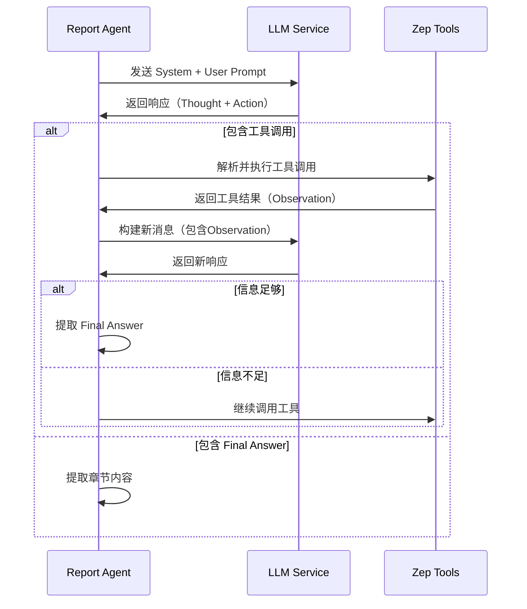

# Report Agent 服务文档

## 1. 服务概述

### 1.1 功能描述

Report Agent 是一个基于 **ReACT 框架**（Reasoning + Acting）的智能报告生成服务，负责生成和交互式查询模拟预测报告。该服务采用 LangChain 风格的工具调用模式，通过多轮思考与反思机制，自动从 Zep 图谱中检索相关信息并生成结构化的预测报告。

**核心功能：**
1. **报告生成**：根据模拟需求和 Zep 图谱信息自动生成预测报告
2. **大纲规划**：智能分析模拟场景，规划最优的报告章节结构
3. **ReACT 循环**：每章节采用多轮 Thought-Action-Observation 循环生成内容
4. **交互式查询**：支持用户对话，在对话中自主调用检索工具
5. **详细日志**：记录每一步操作过程，便于调试和优化

### 1.2 技术架构

```
┌─────────────────────────────────────────────────────────────┐
│                      Report Agent                            │
├─────────────────────────────────────────────────────────────┤
│  ReACT Framework                                            │
│  ┌─────────────────────────────────────────────────────┐   │
│  │  Thought (思考) → Action (行动) → Observation (观察) │   │
│  └─────────────────────────────────────────────────────┘   │
├─────────────────────────────────────────────────────────────┤
│  LangChain 风格工具调用                                      │
│  ├── InsightForge (深度洞察检索)                            │
│  ├── PanoramaSearch (广度全景搜索)                          │
│  ├── QuickSearch (快速检索)                                 │
│  └── InterviewAgents (Agent 采访)                           │
├─────────────────────────────────────────────────────────────┤
│  数据源                                                      │
│  └── Zep Knowledge Graph (模拟图谱)                         │
└─────────────────────────────────────────────────────────────┘
```

### 1.3 ReACT 模式说明

ReACT（Reasoning + Acting）是一种将推理和行动结合的 Agent 框架：

1. **Thought（思考）**：分析当前需要什么信息
2. **Action（行动）**：调用工具获取信息
3. **Observation（观察）**：分析工具返回结果
4. **循环**：重复上述过程直到信息足够
5. **Final Answer（最终回答）**：基于收集的信息生成内容

**文件位置：** `/backend/app/services/report_agent.py`

---

## 2. 核心类和方法

### 2.1 ReportAgent 类

**类定义：**
```python
class ReportAgent:
    """
    Report Agent - 模拟报告生成Agent

    采用ReACT（Reasoning + Acting）模式：
    1. 规划阶段：分析模拟需求，规划报告目录结构
    2. 生成阶段：逐章节生成内容，每章节可多次调用工具获取信息
    3. 反思阶段：检查内容完整性和准确性
    """
```

**初始化参数：**
```python
def __init__(
    self,
    graph_id: str,
    simulation_id: str,
    simulation_requirement: str,
    llm_client: Optional[LLMClient] = None,
    zep_tools: Optional[ZepToolsService] = None
)
```

| 参数 | 类型 | 说明 |
|------|------|------|
| `graph_id` | str | Zep 图谱 ID |
| `simulation_id` | str | 模拟 ID |
| `simulation_requirement` | str | 模拟需求描述 |
| `llm_client` | LLMClient | LLM 客户端（可选） |
| `zep_tools` | ZepToolsService | Zep 工具服务（可选） |

**配置常量：**
```python
MAX_TOOL_CALLS_PER_SECTION = 5  # 每章节最大工具调用次数
MAX_REFLECTION_ROUNDS = 3        # 最大反思轮数
MAX_TOOL_CALLS_PER_CHAT = 2      # 对话中最大工具调用次数
```

### 2.2 主要方法

#### 2.2.1 generate_report - 生成完整报告

```python
def generate_report(
    self,
    progress_callback: Optional[Callable] = None
) -> Report
```

**功能：** 生成完整的模拟预测报告

**流程：**
1. 初始化日志记录器
2. 规划报告大纲（`plan_outline`）
3. 逐章节生成内容（`_generate_section_react`）
4. 汇总完整报告
5. 保存日志文件

**返回：** `Report` 对象，包含报告 ID、状态、大纲、Markdown 内容等

**示例：**
```python
agent = ReportAgent(
    graph_id="graph_123",
    simulation_id="sim_456",
    simulation_requirement="模拟大学生对校园政策的反应"
)

report = agent.generate_report(
    progress_callback=lambda stage, progress, msg: print(f"{stage}: {progress}% - {msg}")
)

print(f"报告标题: {report.outline.title}")
print(f"章节数: {len(report.outline.sections)}")
```

#### 2.2.2 plan_outline - 规划报告大纲

```python
def plan_outline(
    self,
    progress_callback: Optional[Callable] = None
) -> ReportOutline
```

**功能：** 使用 LLM 分析模拟需求，规划报告的目录结构

**输出格式：**
```json
{
    "title": "报告标题",
    "summary": "报告摘要",
    "sections": [
        {"title": "章节1标题", "description": "章节描述"},
        {"title": "章节2标题", "description": "章节描述"}
    ]
}
```

**章节数量限制：**
- 最少 2 个章节
- 最多 5 个章节
- 不支持子章节

#### 2.2.3 _generate_section_react - ReACT 循环生成章节

```python
def _generate_section_react(
    self,
    section: ReportSection,
    outline: ReportOutline,
    previous_sections: List[str],
    progress_callback: Optional[Callable] = None,
    section_index: int = 0
) -> str
```

**功能：** 使用 ReACT 模式生成单个章节内容

**ReACT 循环流程：**
```
┌──────────────┐
│  Thought     │  思考需要什么信息
└──────┬───────┘
       │
       ▼
┌──────────────┐
│  Action      │  调用工具（insight_forge, panorama_search等）
└──────┬───────┘
       │
       ▼
┌──────────────┐
│  Observation │  分析工具返回结果
└──────┬───────┘
       │
       ▼
    信息足够？
    ├─ 是 → Final Answer
    └─ 否 → 继续循环
```

**控制规则：**
- 每章节至少调用 3 次工具
- 每章节最多调用 5 次工具
- 建议混合使用不同工具
- 禁止同时输出工具调用和 Final Answer

#### 2.2.4 chat - 交互式对话

```python
def chat(
    self,
    question: str,
    report_content: str,
    progress_callback: Optional[Callable] = None
) -> str
```

**功能：** 基于已生成的报告与用户对话

**特点：**
- 优先基于报告内容回答问题
- 仅在必要时调用工具检索更多数据
- 最多调用 1-2 次工具
- 回答简洁直接

### 2.3 数据模型

#### ReportStatus - 报告状态枚举

```python
class ReportStatus(str, Enum):
    PENDING = "pending"      # 待处理
    PLANNING = "planning"    # 规划中
    GENERATING = "generating" # 生成中
    COMPLETED = "completed"  # 已完成
    FAILED = "failed"        # 失败
```

#### ReportSection - 报告章节

```python
@dataclass
class ReportSection:
    title: str      # 章节标题
    content: str    # 章节内容
```

#### ReportOutline - 报告大纲

```python
@dataclass
class ReportOutline:
    title: str                  # 报告标题
    summary: str                # 报告摘要
    sections: List[ReportSection]  # 章节列表
```

#### Report - 完整报告

```python
@dataclass
class Report:
    report_id: str                    # 报告 ID
    simulation_id: str                # 模拟 ID
    graph_id: str                     # 图谱 ID
    simulation_requirement: str       # 模拟需求
    status: ReportStatus              # 报告状态
    outline: Optional[ReportOutline]  # 报告大纲
    markdown_content: str             # Markdown 内容
    created_at: str                   # 创建时间
    completed_at: str                 # 完成时间
    error: Optional[str]              # 错误信息
```

---

## 3. 工具链

### 3.1 工具定义

Report Agent 通过 LangChain 风格的工具定义来调用 Zep 检索功能：

```python
def _define_tools(self) -> Dict[str, Dict[str, Any]]:
    """定义可用工具"""
    return {
        "insight_forge": {
            "name": "insight_forge",
            "description": TOOL_DESC_INSIGHT_FORGE,
            "parameters": {
                "query": "你想深入分析的问题或话题",
                "report_context": "当前报告章节的上下文（可选）"
            }
        },
        "panorama_search": {
            "name": "panorama_search",
            "description": TOOL_DESC_PANORAMA_SEARCH,
            "parameters": {
                "query": "搜索查询，用于相关性排序",
                "include_expired": "是否包含过期/历史内容（默认True）"
            }
        },
        "quick_search": {
            "name": "quick_search",
            "description": TOOL_DESC_QUICK_SEARCH,
            "parameters": {
                "query": "搜索查询字符串",
                "limit": "返回结果数量（可选，默认10）"
            }
        },
        "interview_agents": {
            "name": "interview_agents",
            "description": TOOL_DESC_INTERVIEW_AGENTS,
            "parameters": {
                "interview_topic": "采访主题或需求描述",
                "max_agents": "最多采访的Agent数量（可选，默认5，最大10）"
            }
        }
    }
```

### 3.2 InsightForge - 深度洞察检索

**工具描述：**
```
【深度洞察检索 - 强大的检索工具】
这是我们强大的检索函数，专为深度分析设计。它会：
1. 自动将你的问题分解为多个子问题
2. 从多个维度检索模拟图谱中的信息
3. 整合语义搜索、实体分析、关系链追踪的结果
4. 返回最全面、最深度的检索内容

【使用场景】
- 需要深入分析某个话题
- 需要了解事件的多个方面
- 需要获取支撑报告章节的丰富素材

【返回内容】
- 相关事实原文（可直接引用）
- 核心实体洞察
- 关系链分析
```

**底层实现：** `ZepToolsService.insight_forge()`

**返回格式：**
```python
@dataclass
class InsightForgeResult:
    query: str                           # 原始查询
    simulation_requirement: str          # 模拟需求
    sub_queries: List[str]               # 生成的子问题

    semantic_facts: List[str]            # 语义搜索结果
    entity_insights: List[Dict]          # 实体洞察
    relationship_chains: List[str]       # 关系链

    total_facts: int                     # 统计信息
    total_entities: int
    total_relationships: int
```

### 3.3 PanoramaSearch - 广度全景搜索

**工具描述：**
```
【广度搜索 - 获取全貌视图】
这个工具用于获取模拟结果的完整全貌，特别适合了解事件演变过程。它会：
1. 获取所有相关节点和关系
2. 区分当前有效的事实和历史/过期的事实
3. 帮助你了解舆情是如何演变的

【使用场景】
- 需要了解事件的完整发展脉络
- 需要对比不同阶段的舆情变化
- 需要获取全面的实体和关系信息

【返回内容】
- 当前有效事实（模拟最新结果）
- 历史/过期事实（演变记录）
- 所有涉及的实体
```

**底层实现：** `ZepToolsService.panorama_search()`

**返回格式：**
```python
@dataclass
class PanoramaResult:
    query: str                      # 查询字符串
    all_nodes: List[NodeInfo]       # 所有节点
    all_edges: List[EdgeInfo]       # 所有边
    active_facts: List[str]         # 当前有效事实
    historical_facts: List[str]     # 历史/过期事实

    total_nodes: int                # 统计信息
    total_edges: int
    active_count: int
    historical_count: int
```

### 3.4 QuickSearch - 快速检索

**工具描述：**
```
【简单搜索 - 快速检索】
轻量级的快速检索工具，适合简单、直接的信息查询。

【使用场景】
- 需要快速查找某个具体信息
- 需要验证某个事实
- 简单的信息检索

【返回内容】
- 与查询最相关的事实列表
```

**底层实现：** `ZepToolsService.quick_search()`

**返回格式：**
```python
@dataclass
class SearchResult:
    facts: List[str]                # 相关事实
    edges: List[Dict]               # 关系边
    nodes: List[Dict]               # 节点
    query: str                      # 查询字符串
    total_count: int                # 结果总数
```

### 3.5 InterviewAgents - Agent 采访

**工具描述：**
```
【深度采访 - 真实Agent采访（双平台）】
调用OASIS模拟环境的采访API，对正在运行的模拟Agent进行真实采访！
这不是LLM模拟，而是调用真实的采访接口获取模拟Agent的原始回答。
默认在Twitter和Reddit两个平台同时采访，获取更全面的观点。

功能流程：
1. 自动读取人设文件，了解所有模拟Agent
2. 智能选择与采访主题最相关的Agent（如学生、媒体、官方等）
3. 自动生成采访问题
4. 调用 /api/simulation/interview/batch 接口在双平台进行真实采访
5. 整合所有采访结果，提供多视角分析

【使用场景】
- 需要从不同角色视角了解事件看法（学生怎么看？媒体怎么看？官方怎么说？）
- 需要收集多方意见和立场
- 需要获取模拟Agent的真实回答（来自OASIS模拟环境）
- 想让报告更生动，包含"采访实录"

【返回内容】
- 被采访Agent的身份信息
- 各Agent在Twitter和Reddit两个平台的采访回答
- 关键引言（可直接引用）
- 采访摘要和观点对比
```

**底层实现：** `ZepToolsService.interview_agents()`

**返回格式：**
```python
@dataclass
class InterviewResult:
    interview_requirement: str              # 采访需求
    selected_agents: List[AgentProfile]     # 选中的Agent
    interviews: List[AgentInterview]        # 采访结果列表
    key_quotes: List[str]                   # 关键引言
    summary: str                            # 采访摘要
```

### 3.6 工具使用建议

**混合使用策略：**
- **InsightForge**：用于深度分析和多维度检索
- **PanoramaSearch**：用于了解事件全貌和时间线
- **QuickSearch**：用于快速验证具体信息
- **InterviewAgents**：用于获取不同角色的第一人称观点

**最佳实践：**
1. 每章节至少调用 3 次工具
2. 混合使用不同工具获取多角度信息
3. 优先使用 InsightForge 进行深度分析
4. 使用 InterviewAgents 增加报告生动性
5. 使用 PanoramaSearch 了解演变过程

---

## 4. ReACT 模式详解

### 4.1 ReACT 循环流程



### 4.2 Prompt 模板结构

#### 4.2.1 规划阶段 Prompt

**System Prompt：** `PLAN_SYSTEM_PROMPT`
- 角色：未来预测报告撰写专家
- 核心理念：模拟世界是对未来的预演
- 任务：根据预测结果设计报告章节结构
- 限制：2-5 个章节，无子章节

**User Prompt：** `PLAN_USER_PROMPT_TEMPLATE`
- 预测场景设定（模拟需求）
- 模拟世界规模（节点、边、实体统计）
- 预测事实样本（前 10 条）
- 要求：设计最合适的章节结构

**输出格式：** JSON 格式的大纲

#### 4.2.2 章节生成 Prompt

**System Prompt：** `SECTION_SYSTEM_PROMPT_TEMPLATE`
- 角色：未来预测报告撰写专家
- 当前章节信息
- 核心理念和规则
- **重要规则**：
  1. 必须调用工具观察模拟世界（至少 3 次）
  2. 必须引用 Agent 的原始言行
  3. 语言一致性（翻译为报告语言）
  4. 忠实呈现预测结果
- 格式规范（禁止使用标题）
- 可用工具列表
- 工作流程（选项 A：调用工具 / 选项 B：输出 Final Answer）

**User Prompt：** `SECTION_USER_PROMPT_TEMPLATE`
- 已完成的章节内容（避免重复）
- 当前章节标题
- 重要提醒和格式警告

#### 4.2.3 ReACT 循环内消息模板

**Observation 模板：** `REACT_OBSERVATION_TEMPLATE`
```
Observation（检索结果）:

═══ 工具 {tool_name} 返回 ═══
{result}

═══════════════════════════════════════════════════════════════
已调用工具 {tool_calls_count}/{max_tool_calls} 次（已用: {used_tools_str}）{unused_hint}
- 如果信息充分：以 "Final Answer:" 开头输出章节内容（必须引用上述原文）
- 如果需要更多信息：调用一个工具继续检索
═══════════════════════════════════════════════════════════════
```

**工具调用不足提示：** `REACT_INSUFFICIENT_TOOLS_MSG`
```
【注意】你只调用了{tool_calls_count}次工具，至少需要{min_tool_calls}次。
请再调用工具获取更多模拟数据，然后再输出 Final Answer。
```

**工具调用次数限制：** `REACT_TOOL_LIMIT_MSG`
```
工具调用次数已达上限（{tool_calls_count}/{max_tool_calls}），不能再调用工具。
请立即基于已获取的信息，以 "Final Answer:" 开头输出章节内容。
```

### 4.3 工具调用解析

Report Agent 支持两种工具调用格式：

#### 格式 1：XML 风格（标准格式）
```json
{
  "name": "insight_forge",
  "parameters": {
    "query": "分析学生的反应模式"
  }
}
```

#### 格式 2：裸 JSON（兜底格式）
```json
{
  "tool": "insight_forge",
  "params": {
    "query": "分析学生的反应模式"
  }
}
```

**解析逻辑：**
```python
def _parse_tool_calls(self, response: str) -> List[Dict[str, Any]]:
    """
    从LLM响应中解析工具调用

    支持的格式（按优先级）：
    1. <action>{"name": "tool_name", "parameters": {...}}</action>
    2. 裸 JSON（响应整体或单行就是一个工具调用 JSON）
    """
    # 1. 优先解析 XML 风格
    xml_pattern = r'<action>\s*(\{.*?\})\s*</action>'
    # 2. 兜底解析裸 JSON
    # ...
```

### 4.4 ReACT 循环控制

**循环终止条件：**
1. LLM 输出 "Final Answer:" 且工具调用次数 ≥ 3
2. LLM 输出内容但无 "Final Answer:" 前缀且工具调用次数 ≥ 3
3. 工具调用次数达到上限（5 次）
4. 连续冲突次数达到 3 次（降级处理）

**冲突处理：**
- LLM 同时输出工具调用和 Final Answer
- 前 2 次：丢弃响应，要求重新回复
- 第 3 次：截断到第一个工具调用，强制执行

**工具调用不足处理：**
- 工具调用 < 3 次 → 拒绝 Final Answer，推荐未使用工具
- 显示未使用工具提示，鼓励多样化工具使用

### 4.5 章节内容格式规范

**禁止事项：**
- ❌ 禁止使用任何 Markdown 标题（#、##、###、####）
- ❌ 禁止在内容开头添加章节主标题
- ❌ 禁止使用子章节结构

**推荐格式：**
- ✅ 使用 **粗体文字** 标记重点（代替子标题）
- ✅ 使用列表（- 或 1.2.3.）组织要点
- ✅ 使用空行分隔不同段落
- ✅ 使用引用格式（> 单独成段）展示原文

**正确示例：**
```
本章节分析了事件的舆论传播态势。通过对模拟数据的深入分析，我们发现...

**首发引爆阶段**

微博作为舆情的第一现场，承担了信息首发的核心功能：

> "微博贡献了68%的首发声量..."

**情绪放大阶段**

抖音平台进一步放大了事件影响力：

- 视觉冲击力强
- 情绪共鸣度高
```

**错误示例：**
```
## 执行摘要          ← 错误！不要添加任何标题
### 一、首发阶段     ← 错误！不要用###分小节

本章节分析了...
```

---

## 5. 日志系统

### 5.1 ReportLogger - 详细日志记录器

**功能：** 在报告文件夹中生成 `agent_log.jsonl` 文件，记录每一步详细动作

**日志格式：** JSONL（每行一个 JSON 对象）

**日志结构：**
```json
{
  "timestamp": "2024-03-10T12:00:00",
  "elapsed_seconds": 45.2,
  "report_id": "report_123",
  "action": "tool_call",
  "stage": "generating",
  "section_title": "预测场景与核心发现",
  "section_index": 0,
  "details": {
    "iteration": 1,
    "tool_name": "insight_forge",
    "parameters": {"query": "分析学生反应"},
    "message": "调用工具: insight_forge"
  }
}
```

**日志类型：**
- `report_start`：报告生成开始
- `planning_start`：大纲规划开始
- `planning_context`：规划上下文信息
- `planning_complete`：大纲规划完成
- `section_start`：章节生成开始
- `react_thought`：ReACT 思考过程
- `tool_call`：工具调用
- `tool_result`：工具调用结果（完整内容）
- `llm_response`：LLM 响应（完整内容）
- `section_content`：章节内容生成完成
- `section_complete`：章节生成完成（前端监听此事件）
- `report_complete`：报告生成完成
- `error`：错误信息

**文件位置：**
```
{UPLOAD_FOLDER}/reports/{report_id}/agent_log.jsonl
```

### 5.2 ReportConsoleLogger - 控制台日志记录器

**功能：** 将控制台风格的日志写入 `console_log.txt` 文件

**日志格式：** 纯文本格式（带时间戳和级别）
```
[12:00:00] INFO: 开始规划报告大纲
[12:00:05] INFO: 大纲规划完成: 3 个章节
[12:00:10] INFO: ReACT生成章节: 预测场景与核心发现
```

**附加的 Logger：**
- `mirofish.report_agent`
- `mirofish.zep_tools`

**文件位置：**
```
{UPLOAD_FOLDER}/reports/{report_id}/console_log.txt
```

### 5.3 日志使用示例

**前端监听章节完成：**
```python
import json

def monitor_section_completion(report_id: str):
    log_file = f"{Config.UPLOAD_FOLDER}/reports/{report_id}/agent_log.jsonl"

    with open(log_file, 'r', encoding='utf-8') as f:
        for line in f:
            log_entry = json.loads(line)

            if log_entry['action'] == 'section_complete':
                section_title = log_entry['section_title']
                content = log_entry['details']['content']

                print(f"章节完成: {section_title}")
                print(f"内容长度: {len(content)} 字符")

                # 更新前端 UI
                update_frontend_ui(section_title, content)
```

---

## 6. 使用示例

### 6.1 基本使用

```python
from backend.app.services.report_agent import ReportAgent

# 初始化 Agent
agent = ReportAgent(
    graph_id="graph_123",
    simulation_id="sim_456",
    simulation_requirement="模拟大学生对校园新政策的反应和讨论"
)

# 定义进度回调
def progress_callback(stage, progress, message):
    print(f"[{stage}] {progress}% - {message}")

# 生成报告
report = agent.generate_report(
    progress_callback=progress_callback
)

# 输出结果
print(f"报告标题: {report.outline.title}")
print(f"报告摘要: {report.outline.summary}")
print(f"章节数: {len(report.outline.sections)}")

# 保存 Markdown
with open(f"{report.report_id}.md", 'w', encoding='utf-8') as f:
    f.write(report.markdown_content)
```

### 6.2 对话查询

```python
# 基于已生成的报告进行对话
question = "报告中提到学生最关心哪些问题？"

answer = agent.chat(
    question=question,
    report_content=report.markdown_content,
    progress_callback=progress_callback
)

print(f"问题: {question}")
print(f"回答: {answer}")
```

### 6.3 自定义 LLM 客户端

```python
from backend.app.utils.llm_client import LLMClient
from backend.app.services.report_agent import ReportAgent

# 自定义 LLM 客户端
llm_client = LLMClient(
    model="gpt-4",
    temperature=0.5,
    max_tokens=4096
)

# 使用自定义 LLM 客户端
agent = ReportAgent(
    graph_id="graph_123",
    simulation_id="sim_456",
    simulation_requirement="模拟...",
    llm_client=llm_client
)

report = agent.generate_report()
```

### 6.4 读取日志

```python
import json

def read_agent_logs(report_id: str):
    log_file = f"{Config.UPLOAD_FOLDER}/reports/{report_id}/agent_log.jsonl"

    logs = []
    with open(log_file, 'r', encoding='utf-8') as f:
        for line in f:
            log_entry = json.loads(line)
            logs.append(log_entry)

    return logs

# 分析工具调用统计
logs = read_agent_logs(report_id)

tool_calls = [log for log in logs if log['action'] == 'tool_call']
print(f"总工具调用次数: {len(tool_calls)}")

# 统计各工具使用次数
from collections import Counter
tool_names = [call['details']['tool_name'] for call in tool_calls]
tool_counts = Counter(tool_names)

print("工具使用统计:")
for tool, count in tool_counts.most_common():
    print(f"  {tool}: {count} 次")
```

---

## 7. API 接口

### 7.1 生成报告接口

**端点：** `POST /api/report/generate`

**请求参数：**
```json
{
  "graph_id": "graph_123",
  "simulation_id": "sim_456",
  "simulation_requirement": "模拟大学生对校园新政策的反应和讨论"
}
```

**响应：**
```json
{
  "report_id": "report_789",
  "status": "generating",
  "message": "报告生成中..."
}
```

### 7.2 查询报告状态

**端点：** `GET /api/report/{report_id}`

**响应：**
```json
{
  "report_id": "report_789",
  "status": "completed",
  "outline": {
    "title": "校园政策学生反应预测报告",
    "summary": "基于模拟预测的学生行为分析",
    "sections": [
      {"title": "预测场景与核心发现", "content": "..."},
      {"title": "人群行为预测分析", "content": "..."}
    ]
  },
  "markdown_content": "# 校园政策学生反应预测报告\n\n...",
  "created_at": "2024-03-10T12:00:00",
  "completed_at": "2024-03-10T12:05:00"
}
```

### 7.3 报告对话接口

**端点：** `POST /api/report/{report_id}/chat`

**请求参数：**
```json
{
  "question": "报告中提到学生最关心哪些问题？"
}
```

**响应：**
```json
{
  "answer": "根据报告分析，学生最关心的问题包括：\n1. 政策实施时间\n2. 对日常学习的影响...",
  "tool_calls": [
    {"tool": "quick_search", "parameters": {"query": "学生关注点"}}
  ]
}
```

### 7.4 获取报告日志

**端点：** `GET /api/report/{report_id}/logs`

**响应：**
```json
{
  "agent_log": "reports/{report_id}/agent_log.jsonl",
  "console_log": "reports/{report_id}/console_log.txt",
  "logs": [
    {
      "timestamp": "2024-03-10T12:00:00",
      "action": "section_complete",
      "section_title": "预测场景与核心发现",
      "details": {...}
    }
  ]
}
```

---

## 8. 最佳实践

### 8.1 Prompt 优化

**1. 明确角色定位**
- 使用专家角色（如"未来预测报告撰写专家"）
- 强调"上帝视角"和"预演"概念
- 避免泛泛而谈的角色设定

**2. 强化规则约束**
- 使用多层次的格式规范
- 提供正确和错误示例
- 使用醒目的分隔线和强调符号

**3. 工具使用引导**
- 详细描述每个工具的使用场景
- 提供工具使用建议
- 鼓励混合使用不同工具

### 8.2 ReACT 循环优化

**1. 合理设置工具调用限制**
- 最少 3 次：确保信息充分
- 最多 5 次：避免无限循环
- 动态调整：根据章节复杂度

**2. 冲突处理策略**
- 前 2 次：温和提示，要求重新回复
- 第 3 次：降级处理，强制执行
- 避免陷入冲突循环

**3. 信息充分性判断**
- 工具调用次数 ≥ 3
- 使用了至少 2 种不同工具
- LLM 主动输出 Final Answer

### 8.3 内容质量控制

**1. 引用原始数据**
- 必须引用 Agent 的原始言行
- 使用引用格式（> 单独成段）
- 避免编造或幻觉

**2. 保持逻辑连贯**
- 传递已完成章节内容
- 避免重复相同信息
- 维护章节间逻辑关系

**3. 语言一致性**
- 统一使用报告语言
- 翻译英文或混杂内容
- 保持表述自然流畅

### 8.4 性能优化

**1. 内容截断策略**
- 每个已完成章节最多传入 4000 字
- 优先保留核心内容
- 避免超出 token 限制

**2. 工具结果缓存**
- 相同查询避免重复调用
- 缓存常见查询结果
- 减少响应时间

**3. 并行处理**
- 多章节可并行生成
- 工具调用可并行执行
- 提高整体效率

---

## 9. 故障排查

### 9.1 常见问题

**问题 1：大纲规划失败**
- 症状：`plan_outline()` 返回默认大纲
- 原因：LLM 响应格式错误或超时
- 解决：检查 LLM 服务状态，调整超时设置

**问题 2：工具调用解析失败**
- 症状：工具调用未被识别
- 原因：LLM 输出格式不符合预期
- 解决：检查 Prompt 中的工具调用格式说明

**问题 3：章节内容包含标题**
- 症状：生成的章节包含 # 或 ## 标题
- 原因：LLM 未遵守格式规范
- 解决：强化 Prompt 中的格式约束

**问题 4：工具调用次数不足**
- 症状：章节只调用了 1-2 次工具就输出 Final Answer
- 原因：LLM 提前结束循环
- 解决：检查最小工具调用次数提示

### 9.2 调试技巧

**1. 启用详细日志**
```python
import logging
logging.getLogger('mirofish.report_agent').setLevel(logging.DEBUG)
```

**2. 检查 agent_log.jsonl**
- 查看每一步的详细操作
- 分析工具调用和响应
- 找出异常或失败点

**3. 分析 LLM 响应**
- 检查响应格式是否正确
- 确认工具调用是否被解析
- 验证 Final Answer 是否存在

**4. 测试单个工具**
```python
# 测试 insight_forge
result = agent.zep_tools.insight_forge(
    graph_id="graph_123",
    query="测试查询",
    simulation_requirement="测试需求"
)
print(result.to_text())
```

---

## 10. 扩展和定制

### 10.1 添加新工具

**1. 在 ZepToolsService 中实现新方法**
```python
def custom_search(self, graph_id: str, query: str) -> SearchResult:
    # 实现自定义检索逻辑
    pass
```

**2. 在 ReportAgent 中定义工具**
```python
def _define_tools(self) -> Dict[str, Dict[str, Any]]:
    tools = super()._define_tools()
    tools["custom_search"] = {
        "name": "custom_search",
        "description": "自定义搜索工具描述",
        "parameters": {
            "query": "搜索查询"
        }
    }
    return tools
```

**3. 在 _execute_tool 中处理**
```python
elif tool_name == "custom_search":
    query = parameters.get("query", "")
    result = self.zep_tools.custom_search(
        graph_id=self.graph_id,
        query=query
    )
    return result.to_text()
```

### 10.2 自定义 Prompt 模板

**1. 创建自定义模板**
```python
CUSTOM_SYSTEM_PROMPT = """
你是一个专门的报告撰写专家...
自定义的核心理念和规则...
"""

CUSTOM_USER_PROMPT_TEMPLATE = """
自定义的用户 Prompt 模板...
{parameter1} {parameter2}
"""
```

**2. 在生成方法中使用**
```python
system_prompt = CUSTOM_SYSTEM_PROMPT
user_prompt = CUSTOM_USER_PROMPT_TEMPLATE.format(
    parameter1=value1,
    parameter2=value2
)
```

### 10.3 扩展数据模型

**1. 定义新数据类**
```python
@dataclass
class CustomSection:
    title: str
    content: str
    custom_field: str  # 自定义字段
```

**2. 扩展 Report 模型**
```python
@dataclass
class CustomReport(Report):
    custom_data: Dict[str, Any]  # 自定义数据
    custom_sections: List[CustomSection]  # 自定义章节
```

---

## 11. 相关文档

- [ZepTools 服务文档](/docs/zh/03-backend/06-services/03-zep-tools.md) - Zep 检索工具详细说明
- [LLMClient 文档](/docs/zh/03-backend/05-utilities/01-llm-client.md) - LLM 客户端使用说明
- [后端架构概览](/docs/zh/03-backend/01-overview.md) - 后端整体架构
- [API 接口文档](/docs/zh/03-backend/07-api/01-report-api.md) - 报告相关 API 接口

---

## 12. 总结

Report Agent 是一个功能强大的智能报告生成服务，采用 ReACT 框架和 LangChain 风格的工具调用模式，能够自动从 Zep 图谱中检索信息并生成高质量的预测报告。

**核心优势：**
1. **智能规划**：自动分析模拟场景，规划最优章节结构
2. **深度检索**：集成多种检索工具，确保信息全面准确
3. **ReACT 循环**：多轮思考与反思，保证内容质量
4. **详细日志**：记录每一步操作，便于调试和优化
5. **交互查询**：支持基于报告的对话式查询

**适用场景：**
- 模拟预测报告生成
- 数据分析和洞察报告
- 自动化内容生成
- 交互式数据查询

**未来扩展方向：**
- 支持更多检索工具
- 优化 ReACT 循环效率
- 增强内容质量控制
- 支持多语言报告生成
- 集成更多数据源
