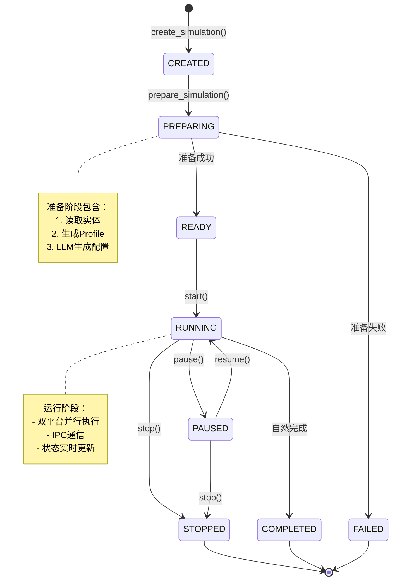

# Simulation Manager 服务文档

## 1. 服务概述

### 1.1 功能描述

Simulation Manager（模拟管理器）是 MiroFish 系统中负责管理并行模拟任务的核心服务。它协调 Twitter 和 Reddit 双平台的社交模拟，从 Zep 知识图谱读取实体信息，生成 OASIS Agent 人设，并使用 LLM 智能生成模拟配置参数。

### 1.2 核心特性

- **双平台并行模拟**：同时管理 Twitter 和 Reddit 两个社交平台的模拟
- **智能配置生成**：使用 LLM 自动分析模拟需求，生成最佳配置参数
- **状态持久化**：所有模拟状态保存在文件系统中，支持重启恢复
- **实时进度跟踪**：提供进度回调机制，实时报告准备阶段进度
- **并行人设生成**：支持并行生成多个 Agent Profile，提高准备效率

### 1.3 并发处理策略

Simulation Manager 采用多层次的并发处理策略：

1. **Profile 并行生成**：使用 `parallel_profile_count` 参数控制并行生成数量（默认 3）
2. **双平台独立进程**：Twitter 和 Reddit 模拟在独立的子进程中运行
3. **IPC 通信机制**：通过文件系统实现 Flask 后端与模拟脚本间的进程间通信
4. **异步状态更新**：状态变更实时持久化到磁盘，支持多进程读取

## 2. 核心类和方法

### 2.1 SimulationStatus 枚举

模拟状态枚举，定义模拟的完整生命周期：

```python
class SimulationStatus(str, Enum):
    CREATED = "created"       # 模拟已创建
    PREPARING = "preparing"   # 准备中
    READY = "ready"           # 准备完成，可启动
    RUNNING = "running"       # 运行中
    PAUSED = "paused"         # 暂停
    STOPPED = "stopped"       # 手动停止
    COMPLETED = "completed"   # 自然完成
    FAILED = "failed"         # 失败
```

### 2.2 SimulationState 数据类

模拟状态数据结构：

```python
@dataclass
class SimulationState:
    simulation_id: str           # 模拟ID
    project_id: str              # 项目ID
    graph_id: str                # Zep图谱ID

    # 平台启用状态
    enable_twitter: bool = True
    enable_reddit: bool = True

    # 状态信息
    status: SimulationStatus = SimulationStatus.CREATED

    # 准备阶段数据
    entities_count: int = 0      # 实体数量
    profiles_count: int = 0      # 生成的人设数量
    entity_types: List[str]      # 实体类型列表

    # 配置生成信息
    config_generated: bool = False
    config_reasoning: str = ""   # LLM 推理说明

    # 运行时数据
    current_round: int = 0
    twitter_status: str = "not_started"
    reddit_status: str = "not_started"

    # 时间戳
    created_at: str
    updated_at: str

    # 错误信息
    error: Optional[str] = None
```

### 2.3 SimulationManager 类

核心管理类，负责模拟的完整生命周期管理。

#### 2.3.1 初始化

```python
def __init__(self):
    # 确保模拟数据目录存在
    os.makedirs(self.SIMULATION_DATA_DIR, exist_ok=True)

    # 内存中的模拟状态缓存
    self._simulations: Dict[str, SimulationState] = {}
```

**存储目录结构**：
```
uploads/simulations/
├── sim_abc123/
│   ├── state.json              # 模拟状态
│   ├── simulation_config.json  # LLM 生成的配置
│   ├── reddit_profiles.json    # Reddit Agent 人设
│   ├── twitter_profiles.csv    # Twitter Agent 人设
│   ├── twitter/               # Twitter 模拟输出
│   │   └── actions.jsonl
│   ├── reddit/                # Reddit 模拟输出
│   │   └── actions.jsonl
│   ├── ipc_commands/          # IPC 命令目录
│   └── ipc_responses/         # IPC 响应目录
```

#### 2.3.2 创建模拟

```python
def create_simulation(
    self,
    project_id: str,
    graph_id: str,
    enable_twitter: bool = True,
    enable_reddit: bool = True,
) -> SimulationState
```

**功能**：创建新的模拟实例

**参数**：
- `project_id`: 项目 ID
- `graph_id`: Zep 图谱 ID
- `enable_twitter`: 是否启用 Twitter 模拟
- `enable_reddit`: 是否启用 Reddit 模拟

**返回**：SimulationState 对象，状态为 `CREATED`

**示例**：
```python
manager = SimulationManager()
state = manager.create_simulation(
    project_id="proj_001",
    graph_id="mirofish_graph",
    enable_twitter=True,
    enable_reddit=True
)
# state.simulation_id = "sim_abc123def456"
```

#### 2.3.3 准备模拟

```python
def prepare_simulation(
    self,
    simulation_id: str,
    simulation_requirement: str,
    document_text: str,
    defined_entity_types: Optional[List[str]] = None,
    use_llm_for_profiles: bool = True,
    progress_callback: Optional[callable] = None,
    parallel_profile_count: int = 3
) -> SimulationState
```

**功能**：全自动准备模拟环境

**准备阶段流程**：

1. **阶段1：读取并过滤实体**
   - 从 Zep 图谱读取节点数据
   - 按预定义类型过滤实体
   - 丰富实体边关系信息

2. **阶段2：生成 Agent Profile**
   - 为每个实体生成 OASIS Agent 人设
   - 可选 LLM 增强生成详细人设
   - 支持并行生成提高效率
   - 实时保存 Profile 文件

3. **阶段3：LLM 智能生成配置**
   - 分析模拟需求和文档内容
   - 生成时间配置（符合中国人作息）
   - 生成事件配置和热点话题
   - 分批生成 Agent 活动配置
   - 生成平台特定配置

**参数**：
- `simulation_id`: 模拟 ID
- `simulation_requirement`: 模拟需求描述
- `document_text`: 原始文档内容
- `defined_entity_types`: 预定义的实体类型（可选）
- `use_llm_for_profiles`: 是否使用 LLM 生成详细人设
- `progress_callback`: 进度回调函数
- `parallel_profile_count`: 并行生成人设数量

**进度回调格式**：
```python
def progress_callback(
    stage: str,      # 阶段标识：reading, generating_profiles, generating_config
    progress: int,   # 进度百分比 0-100
    message: str,    # 进度消息
    current: int = None,   # 当前项数
    total: int = None,     # 总项数
    item_name: str = None  # 当前项名称
):
    pass
```

**返回**：SimulationState 对象，状态为 `READY` 或 `FAILED`

**示例**：
```python
def on_progress(stage, progress, message, **kwargs):
    print(f"[{stage}] {progress}% - {message}")

state = manager.prepare_simulation(
    simulation_id="sim_abc123",
    simulation_requirement="模拟大学校园突发事件舆论演化",
    document_text="某大学发生争议事件...",
    use_llm_for_profiles=True,
    progress_callback=on_progress,
    parallel_profile_count=5
)
```

#### 2.3.4 查询模拟

```python
def get_simulation(self, simulation_id: str) -> Optional[SimulationState]
```

**功能**：获取模拟状态

**返回**：SimulationState 对象或 None

#### 2.3.5 列出模拟

```python
def list_simulations(self, project_id: Optional[str] = None) -> List[SimulationState]
```

**功能**：列出所有模拟或指定项目的模拟

**参数**：
- `project_id`: 项目 ID（可选，不提供则返回所有模拟）

**返回**：SimulationState 列表

#### 2.3.6 获取 Profile

```python
def get_profiles(
    self,
    simulation_id: str,
    platform: str = "reddit"
) -> List[Dict[str, Any]]
```

**功能**：获取模拟的 Agent Profile

**参数**：
- `simulation_id`: 模拟 ID
- `platform`: 平台名称（"reddit" 或 "twitter"）

**返回**：Profile 列表

#### 2.3.7 获取配置

```python
def get_simulation_config(self, simulation_id: str) -> Optional[Dict[str, Any]]
```

**功能**：获取模拟配置

**返回**：配置字典或 None

#### 2.3.8 获取运行说明

```python
def get_run_instructions(self, simulation_id: str) -> Dict[str, str]
```

**功能**：获取运行模拟的命令和说明

**返回**：包含命令和说明的字典

## 3. 状态管理

### 3.1 状态转换图



### 3.2 状态转换规则

| 当前状态 | 可转换到 | 触发条件 | 说明 |
|---------|---------|---------|------|
| CREATED | PREPARING | 调用 prepare_simulation() | 开始准备模拟 |
| PREPARING | READY | 准备阶段成功完成 | 可以启动模拟 |
| PREPARING | FAILED | 准备阶段出错 | 记录错误信息 |
| READY | RUNNING | 调用 start() | 模拟开始运行 |
| RUNNING | PAUSED | 调用 pause() | 暂停模拟 |
| RUNNING | STOPPED | 调用 stop() | 手动停止 |
| RUNNING | COMPLETED | 模拟自然完成 | 所有轮次执行完毕 |
| PAUSED | RUNNING | 调用 resume() | 恢复运行 |
| PAUSED | STOPPED | 调用 stop() | 停止暂停的模拟 |
| FAILED | - | - | 终态，不可转换 |

### 3.3 状态持久化

状态变更时自动保存到 `state.json` 文件：

```python
def _save_simulation_state(self, state: SimulationState):
    """保存模拟状态到文件"""
    state.updated_at = datetime.now().isoformat()

    state_file = os.path.join(sim_dir, "state.json")
    with open(state_file, 'w', encoding='utf-8') as f:
        json.dump(state.to_dict(), f, ensure_ascii=False, indent=2)

    # 更新内存缓存
    self._simulations[state.simulation_id] = state
```

**加载状态**：

```python
def _load_simulation_state(self, simulation_id: str) -> Optional[SimulationState]:
    """从文件加载模拟状态"""
    # 先检查内存缓存
    if simulation_id in self._simulations:
        return self._simulations[simulation_id]

    # 从文件加载
    state_file = os.path.join(sim_dir, "state.json")
    with open(state_file, 'r', encoding='utf-8') as f:
        data = json.load(f)

    state = SimulationState(**data)
    self._simulations[simulation_id] = state
    return state
```

## 4. 并行执行

### 4.1 双平台并行架构

Simulation Manager 采用独立进程模式运行双平台模拟：

```
┌─────────────────────────────────────────────────────────────┐
│                    Flask Backend Process                    │
│                                                               │
│  ┌─────────────────────────────────────────────────────┐   │
│  │         SimulationManager (状态管理)                 │   │
│  │  - 状态持久化                                        │   │
│  │  - Profile 生成                                     │   │
│  │  - 配置生成                                         │   │
│  └─────────────────────────────────────────────────────┘   │
│                          │                                  │
│                          ▼                                  │
│  ┌─────────────────────────────────────────────────────┐   │
│  │      SimulationRunner (进程管理)                     │   │
│  │  - 启动/停止子进程                                   │   │
│  │  - 监控进程状态                                      │   │
│  │  - 收集输出日志                                      │   │
│  └─────────────────────────────────────────────────────┘   │
└─────────────────────────────────────────────────────────────┘
                          │
          ┌───────────────┴───────────────┐
          ▼                               ▼
┌─────────────────────┐         ┌─────────────────────┐
│  Twitter Process    │         │  Reddit Process     │
│                     │         │                     │
│  - OASIS Twitter    │         │  - OASIS Reddit     │
│  - Agent 行为模拟   │         │  - Agent 行为模拟   │
│  - 动作日志记录     │         │  - 动作日志记录     │
│  - IPC Server       │         │  - IPC Server       │
└─────────────────────┘         └─────────────────────┘
          │                               │
          └───────────────┬───────────────┘
                          ▼
                  ┌───────────────┐
                  │  IPC File System│
                  │  - commands/  │
                  │  - responses/ │
                  └───────────────┘
```

### 4.2 并行 Profile 生成

准备阶段支持并行生成多个 Agent Profile：

```python
profiles = generator.generate_profiles_from_entities(
    entities=filtered.entities,
    use_llm=use_llm_for_profiles,
    progress_callback=profile_progress,
    graph_id=state.graph_id,
    parallel_count=parallel_profile_count,  # 并行数量
    realtime_output_path=realtime_output_path,
    output_platform=realtime_platform
)
```

**并行策略**：
- 使用线程池并发调用 LLM API
- 实时保存已生成的 Profile 到文件
- 支持断点续传（准备失败后可重新准备）
- 默认并行数：3（可根据 API 限制调整）

### 4.3 IPC 通信机制

通过文件系统实现跨进程通信：

**命令发送流程**：

```python
# 1. Flask 写入命令文件
command_id = str(uuid.uuid4())
command_file = f"ipc_commands/{command_id}.json"
# 写入命令内容

# 2. 模拟脚本轮询命令目录
while running:
    command = poll_commands()  # 读取命令
    if command:
        response = execute_command(command)
        send_response(response)

# 3. Flask 轮询响应目录
while time.time() - start_time < timeout:
    if response_exists(command_id):
        return read_response(command_id)
```

**支持的命令类型**：

```python
class CommandType(str, Enum):
    INTERVIEW = "interview"           # 单个 Agent 采访
    BATCH_INTERVIEW = "batch_interview"  # 批量采访
    CLOSE_ENV = "close_env"           # 关闭环境
```

### 4.4 资源分配

#### 4.4.1 计算资源

- **Profile 生成**：并行调用 LLM API，受限于 API 速率限制
- **模拟运行**：每个平台独立进程，可分配到不同 CPU 核心
- **IPC 通信**：文件 I/O，低资源消耗

#### 4.4.2 存储资源

- **状态文件**：~1KB per simulation
- **Profile 文件**：~10-100KB per simulation（取决于 Agent 数量）
- **配置文件**：~5-50KB per simulation
- **动作日志**：~1-10MB per simulation（取决于模拟时长和活跃度）

#### 4.4.3 内存资源

- **SimulationManager**：~10MB base + ~1KB per simulation（内存缓存）
- **SimulationRunner**：~50MB per running simulation
- **OASIS 模拟进程**：~200-500MB per platform

### 4.5 并发控制

#### 4.5.1 Profile 生成并发

```python
# OasisProfileGenerator 内部实现
def generate_profiles_from_entities(
    self,
    entities: List[EntityNode],
    parallel_count: int = 3,  # 控制并发数
    ...
):
    from concurrent.futures import ThreadPoolExecutor

    with ThreadPoolExecutor(max_workers=parallel_count) as executor:
        futures = []
        for entity in entities:
            future = executor.submit(self._generate_single_profile, entity)
            futures.append(future)

        for future in as_completed(futures):
            profile = future.result()
            profiles.append(profile)
            # 实时保存
            self._save_profile_realtime(profile, output_path)
```

#### 4.5.2 模拟运行并发

```python
# SimulationRunner 内部实现
def start(self, platform: str):
    if platform == "parallel":
        # 启动双平台并行
        self._start_parallel_simulation()
    elif platform == "twitter":
        # 仅启动 Twitter
        self._start_single_simulation("twitter")
    elif platform == "reddit":
        # 仅启动 Reddit
        self._start_single_simulation("reddit")

def _start_parallel_simulation(self):
    # 使用 subprocess.Popen 启动独立进程
    self.twitter_process = subprocess.Popen(
        [python, twitter_script, "--config", config_path],
        cwd=self.scripts_dir
    )
    self.reddit_process = subprocess.Popen(
        [python, reddit_script, "--config", config_path],
        cwd=self.scripts_dir
    )
```

#### 4.5.3 IPC 请求并发

```python
# SimulationIPCClient 支持并发请求
def send_interview(self, agent_id: int, prompt: str, ...):
    # 每个请求使用唯一的 command_id
    command_id = str(uuid.uuid4())
    # 写入命令文件
    # 等待响应（带超时）
```

**并发限制**：
- 建议同时采访的 Agent 数量：< 10
- 单个采访超时时间：60 秒
- 批量采访超时时间：120 秒

## 5. 使用示例

### 5.1 完整流程示例

```python
from backend.app.services.simulation_manager import SimulationManager

# 1. 创建管理器
manager = SimulationManager()

# 2. 创建模拟
state = manager.create_simulation(
    project_id="proj_001",
    graph_id="mirofish_graph",
    enable_twitter=True,
    enable_reddit=True
)
print(f"模拟创建成功: {state.simulation_id}")

# 3. 准备模拟（带进度回调）
def on_progress(stage, progress, message, current=None, total=None):
    if current is not None and total is not None:
        print(f"[{stage}] {progress}% - {message} ({current}/{total})")
    else:
        print(f"[{stage}] {progress}% - {message}")

state = manager.prepare_simulation(
    simulation_id=state.simulation_id,
    simulation_requirement="模拟大学校园突发事件舆论演化过程",
    document_text="某大学发生争议事件，引发师生热议...",
    use_llm_for_profiles=True,
    progress_callback=on_progress,
    parallel_profile_count=5
)

if state.status == SimulationStatus.READY:
    print("模拟准备完成！")
    print(f"实体数量: {state.entities_count}")
    print(f"Profile 数量: {state.profiles_count}")

    # 4. 获取运行说明
    instructions = manager.get_run_instructions(state.simulation_id)
    print("\n运行命令：")
    print(instructions['commands']['parallel'])
elif state.status == SimulationStatus.FAILED:
    print(f"准备失败: {state.error}")
```

### 5.2 查询模拟状态

```python
# 获取单个模拟状态
state = manager.get_simulation("sim_abc123")
if state:
    print(f"状态: {state.status}")
    print(f"实体数: {state.entities_count}")
    print(f"Profile 数: {state.profiles_count}")
else:
    print("模拟不存在")

# 列出项目的所有模拟
simulations = manager.list_simulations(project_id="proj_001")
for sim in simulations:
    print(f"{sim.simulation_id}: {sim.status}")
```

### 5.3 获取 Profile 和配置

```python
# 获取 Reddit Profile
profiles = manager.get_profiles("sim_abc123", platform="reddit")
for profile in profiles[:3]:  # 打印前3个
    print(f"Agent {profile['agent_id']}: {profile['name']}")
    print(f"  Bio: {profile['bio'][:100]}...")

# 获取模拟配置
config = manager.get_simulation_config("sim_abc123")
if config:
    print(f"模拟时长: {config['time_config']['total_simulation_hours']} 小时")
    print(f"Agent 数量: {len(config['agent_configs'])}")
    print(f"热点话题: {config['event_config']['hot_topics']}")
```

## 6. SimulationRunner 调用方式

SimulationRunner 是负责实际运行和管理模拟进程的核心类。它提供启动、停止、监控和结果聚合等功能。

### 6.1 RunnerStatus 枚举

模拟运行器状态枚举：

```python
class RunnerStatus(str, Enum):
    IDLE = "idle"           # 空闲
    STARTING = "starting"   # 启动中
    RUNNING = "running"     # 运行中
    PAUSED = "paused"       # 暂停
    STOPPING = "stopping"   # 停止中
    STOPPED = "stopped"     # 已停止
    COMPLETED = "completed" # 已完成
    FAILED = "failed"       # 失败
```

### 6.2 启动模拟

```python
from backend.app.services.simulation_runner import SimulationRunner

# 启动模拟（返回 SimulationRunState）
state = SimulationRunner.start_simulation(
    simulation_id="sim_abc123",
    platform="parallel",  # twitter / reddit / parallel
    max_rounds=None,      # 最大轮数限制（可选）
    enable_graph_memory_update=False,  # 是否启用图谱记忆更新
    graph_id=None         # Zep 图谱 ID（启用图谱更新时必需）
)
```

**参数说明**：
- `simulation_id`: 模拟 ID（必须先完成 prepare_simulation）
- `platform`: 运行平台
  - `"parallel"`: 双平台并行
  - `"twitter"`: 仅 Twitter
  - `"reddit"`: 仅 Reddit
- `max_rounds`: 最大模拟轮数（可选，用于截断过长的模拟）
- `enable_graph_memory_update`: 是否将 Agent 活动动态更新到 Zep 图谱
- `graph_id`: Zep 图谱 ID（启用图谱更新时必需）

### 6.3 停止模拟

```python
# 停止正在运行的模拟
state = SimulationRunner.stop_simulation("sim_abc123")
```

### 6.4 检查环境状态

```python
# 检查模拟环境是否存活（用于 Interview 功能）
is_alive = SimulationRunner.check_env_alive("sim_abc123")

# 获取环境详细状态
status_detail = SimulationRunner.get_env_status_detail("sim_abc123")
# 返回: {"status": "alive", "twitter_available": true, ...}
```

### 6.5 获取运行状态

```python
# 获取模拟运行状态
state = SimulationRunner.get_run_state("sim_abc123")
if state:
    print(f"状态: {state.runner_status}")
    print(f"当前轮次: {state.current_round}/{state.total_rounds}")
    print(f"模拟时间: {state.simulated_hours}/{state.total_simulation_hours} 小时")
    print(f"Twitter 状态: {'运行中' if state.twitter_running else '未运行'}")
    print(f"Reddit 状态: {'运行中' if state.reddit_running else '未运行'}")
    print(f"总动作数: {state.total_actions_count}")
```

### 6.6 清理模拟日志

```python
# 清理运行日志（用于强制重新开始模拟）
# 保留配置文件和 Profile，仅删除运行日志
result = SimulationRunner.cleanup_simulation_logs("sim_abc123")
# 返回: {"success": true, "cleaned_files": [...], "errors": null}
```

## 7. 模拟结果聚合

SimulationRunner 提供多种方法来获取和聚合模拟结果。

### 7.1 获取动作列表

#### 分页获取动作

```python
# 获取动作列表（带分页）
actions = SimulationRunner.get_actions(
    simulation_id="sim_abc123",
    limit=100,           # 返回数量限制
    offset=0,            # 偏移量
    platform="twitter",  # 过滤平台：twitter/reddit/None（全部）
    agent_id=1,          # 过滤 Agent ID
    round_num=5          # 过滤轮次
)

for action in actions:
    print(f"[{action.platform}] {action.agent_name}: {action.action_type}")
```

#### 获取全部动作

```python
# 获取所有动作（无分页限制）
all_actions = SimulationRunner.get_all_actions(
    simulation_id="sim_abc123",
    platform="reddit",   # 可选过滤条件
    agent_id=None,
    round_num=None
)
```

### 7.2 获取时间线

```python
# 获取按轮次汇总的时间线
timeline = SimulationRunner.get_timeline(
    simulation_id="sim_abc123",
    start_round=0,       # 起始轮次
    end_round=None       # 结束轮次（None 表示到最后一轮）
)

for round_data in timeline:
    print(f"第 {round_data['round_num']} 轮:")
    print(f"  Twitter 动作: {round_data['twitter_actions']}")
    print(f"  Reddit 动作: {round_data['reddit_actions']}")
    print(f"  总动作: {round_data['total_actions']}")
    print(f"  活跃 Agent: {round_data['active_agents_count']}")
    print(f"  动作类型: {round_data['action_types']}")
```

### 7.3 获取 Agent 统计

```python
# 获取每个 Agent 的统计信息
agent_stats = SimulationRunner.get_agent_stats("sim_abc123")

for stats in agent_stats[:5]:  # 显示前 5 个最活跃的 Agent
    print(f"Agent {stats['agent_id']} ({stats['agent_name']}):")
    print(f"  总动作: {stats['total_actions']}")
    print(f"  Twitter: {stats['twitter_actions']}")
    print(f"  Reddit: {stats['reddit_actions']}")
    print(f"  动作类型: {stats['action_types']}")
```

### 7.4 AgentAction 数据结构

```python
@dataclass
class AgentAction:
    round_num: int              # 轮次号
    timestamp: str              # 时间戳
    platform: str               # 平台（twitter/reddit）
    agent_id: int               # Agent ID
    agent_name: str             # Agent 名称
    action_type: str            # 动作类型（CREATE_POST, LIKE_POST 等）
    action_args: Dict[str, Any] # 动作参数
    result: Optional[str]       # 执行结果
    success: bool               # 是否成功
```

### 7.5 模拟运行状态结构

```python
@dataclass
class SimulationRunState:
    simulation_id: str
    runner_status: RunnerStatus

    # 进度信息
    current_round: int
    total_rounds: int
    simulated_hours: int
    total_simulation_hours: int

    # 各平台独立进度
    twitter_current_round: int
    reddit_current_round: int
    twitter_simulated_hours: int
    reddit_simulated_hours: int

    # 平台状态
    twitter_running: bool
    reddit_running: bool
    twitter_actions_count: int
    reddit_actions_count: int
    twitter_completed: bool
    reddit_completed: bool

    # 最近动作（用于前端展示）
    recent_actions: List[AgentAction]

    # 时间戳
    started_at: str
    updated_at: str
    completed_at: Optional[str]

    # 错误信息
    error: Optional[str]
    process_pid: Optional[int]
```

## 8. 错误处理和重试策略

### 8.1 LLM 调用重试策略

LLM 调用采用**降温度重试**策略：

```python
def _call_llm_with_retry(self, prompt: str, system_prompt: str) -> Dict[str, Any]:
    """带重试的 LLM 调用"""
    MAX_RETRIES = 3

    for attempt in range(MAX_RETRIES):
        try:
            # 每次重试降低 temperature，提高稳定性
            temperature = 0.7 - (attempt * 0.1)
            response = self.llm_client.generate(
                prompt=prompt,
                system_prompt=system_prompt,
                temperature=temperature
            )
            return response
        except Exception as e:
            if attempt < MAX_RETRIES - 1:
                logger.warning(f"LLM 调用失败，正在重试 ({attempt + 1}/{MAX_RETRIES})")
                time.sleep(2 ** attempt)  # 指数退避：2s, 4s
            else:
                raise
```

**重试策略特点**：
- 最大重试次数：3 次
- 退避策略：指数退避（2s, 4s）
- Temperature 递减：0.7 → 0.6 → 0.5（提高输出稳定性）
- 失败后降级：使用规则生成默认配置

### 8.2 Zep API 调用重试策略

Zep 图谱 API 采用**带退避的重试机制**：

```python
def _call_with_retry(self, func, operation_name: str, max_retries: int = 3):
    """带重试机制的 Zep API 调用"""
    RETRY_DELAY = 2.0  # 初始延迟

    for attempt in range(max_retries):
        try:
            return func()
        except Exception as e:
            if attempt < max_retries - 1:
                delay = RETRY_DELAY * (2 ** attempt)  # 指数退避
                logger.warning(f"{operation_name} 失败，{delay:.1f}秒后重试...")
                time.sleep(delay)
            else:
                raise
```

**重试策略特点**：
- 最大重试次数：3 次
- 退避策略：指数退避（2s, 4s, 8s）
- 适用场景：节点查询、边查询、图谱搜索等

### 8.3 IPC 通信超时策略

IPC 通信采用**超时机制**而非重试：

```python
class SimulationIPCClient:
    def send_command(
        self,
        command_type: CommandType,
        args: Dict[str, Any],
        timeout: float = 60.0,     # 默认超时 60 秒
        poll_interval: float = 0.5  # 轮询间隔 0.5 秒
    ) -> IPCResponse:
        """发送命令并等待响应"""
        command_id = str(uuid.uuid4())
        # 写入命令文件...

        start_time = time.time()
        while time.time() - start_time < timeout:
            if response_exists(command_id):
                return read_response(command_id)
            time.sleep(poll_interval)

        # 超时后清理命令文件
        raise TimeoutError(f"等待命令响应超时 ({timeout}秒)")
```

**超时配置**：
- 单个采访超时：60 秒
- 批量采访超时：120 秒
- 关闭环境超时：30 秒

### 8.4 Profile 生成重试策略

Profile 生成采用**并行重试**机制：

```python
def generate_profiles_from_entities(
    self,
    entities: List[EntityNode],
    parallel_count: int = 3,
    ...
):
    MAX_RETRIES = 2  # 每个实体最多重试 2 次

    for entity in entities:
        retry_count = 0
        while retry_count <= MAX_RETRIES:
            try:
                profile = self._generate_single_profile(entity)
                profiles.append(profile)
                break
            except Exception as e:
                if retry_count < MAX_RETRIES:
                    retry_count += 1
                    logger.warning(f"生成 Profile 失败，重试中...")
                else:
                    # 使用基础人设降级
                    profiles.append(self._create_fallback_profile(entity))
```

**降级策略**：
- LLM 生成失败时，使用基于实体属性的简单人设
- 确保每个实体都有可用的 Profile

### 8.5 常见错误与处理

| 错误场景 | 错误类型 | 处理策略 |
|---------|---------|---------|
| 图谱不存在 | FileNotFoundError | 检查 graph_id，重新构建图谱 |
| 实体数量为0 | ValueError | 检查实体类型配置，重新准备 |
| LLM 调用失败 | APIError | 降温度重试 3 次，失败后使用规则生成 |
| Zep API 失败 | ConnectionError | 指数退避重试 3 次 |
| IPC 超时 | TimeoutError | 检查模拟进程状态，必要时重启 |
| Profile 生成失败 | GenerationError | 重试 2 次，失败后使用降级人设 |
| 配置生成失败 | ConfigError | 使用默认时间配置和空事件列表 |
| 模拟进程崩溃 | ProcessError | 记录日志，标记为 FAILED 状态 |

### 8.6 错误恢复示例

```python
try:
    state = manager.prepare_simulation(
        simulation_id="sim_abc123",
        simulation_requirement=requirement,
        document_text=document,
        progress_callback=on_progress
    )
except Exception as e:
    # 检查错误状态
    state = manager.get_simulation("sim_abc123")
    if state and state.status == SimulationStatus.FAILED:
        logger.error(f"准备失败: {state.error}")

        # 分析错误类型
        if "LLM" in state.error:
            # LLM 相关错误，可以重试
            logger.info("LLM 调用失败，正在重试...")
            state = manager.prepare_simulation(...)
        elif "图谱" in state.error:
            # 图谱问题，需要先修复图谱
            logger.error("图谱问题，请检查 graph_id")
        else:
            # 其他错误，可以重新准备
            logger.info("正在重新准备模拟...")
            state = manager.prepare_simulation(...)
```

## 9. 性能优化

### 9.1 Profile 生成优化

- **调整并发数**：根据 LLM API 限制调整 `parallel_profile_count`
- **禁用 LLM 增强**：快速测试时可设置 `use_llm_for_profiles=False`
- **实时保存**：支持断点续传，避免重复生成

### 9.2 配置生成优化

- **分批生成**：Agent 配置分批生成，避免单次 LLM 调用过长
- **上下文截断**：智能截断文档内容，控制 token 消耗
- **降级策略**：LLM 失败时使用规则生成默认配置

### 9.3 存储优化

- **状态缓存**：内存缓存减少文件 I/O
- **增量保存**：Profile 实时保存，避免数据丢失
- **日志压缩**：动作日志使用 JSONL 格式，易于压缩

## 10. 最佳实践

### 10.1 模拟准备

1. **合理设置并发数**：根据 API 限制调整 `parallel_profile_count`
2. **提供清晰的需求描述**：帮助 LLM 生成更准确的配置
3. **使用进度回调**：提供良好的用户体验
4. **处理准备失败**：检查错误信息，必要时重试

### 10.2 状态管理

1. **定期保存状态**：关键操作后立即持久化
2. **使用内存缓存**：减少文件 I/O 开销
3. **及时清理**：删除不需要的模拟数据

### 10.3 并发控制

1. **控制并发采访数量**：避免过载 IPC 系统
2. **设置合理超时**：防止请求无限等待
3. **监控资源使用**：确保系统稳定运行

## 11. 相关文件

- **服务实现**: `/backend/app/services/simulation_manager.py`
- **模拟运行器**: `/backend/app/services/simulation_runner.py`
- **IPC 通信**: `/backend/app/services/simulation_ipc.py`
- **配置生成器**: `/backend/app/services/simulation_config_generator.py`
- **API 路由**: `/backend/app/api/simulation.py`
- **并行模拟脚本**: `/backend/scripts/run_parallel_simulation.py`
