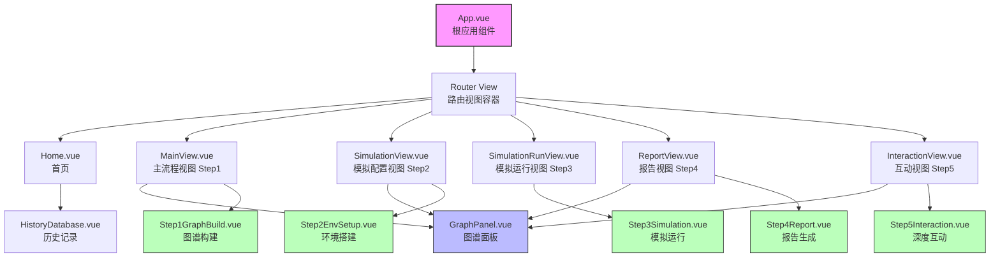
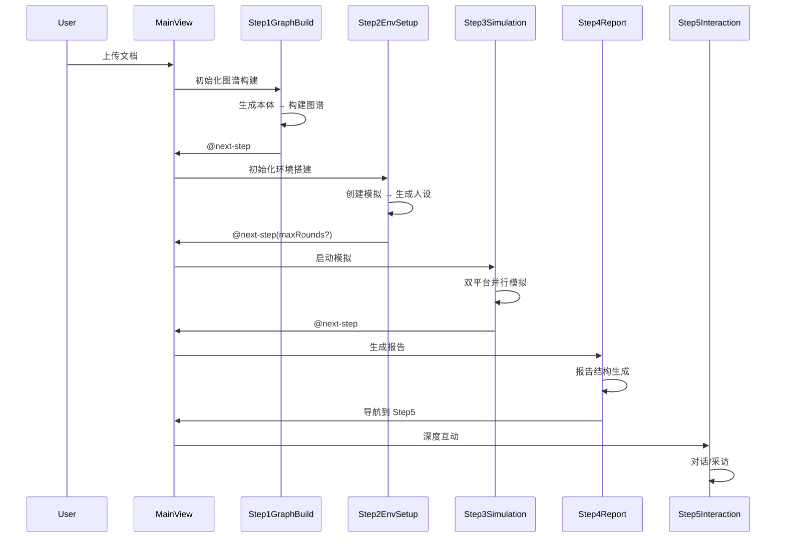

# 前端组件文档

## 组件架构概览

MiroFish 前端采用 Vue 3 + Composition API 构建，组件按功能和职责进行分层组织。

```
frontend/src/
├── components/          # 可复用功能组件
│   ├── GraphPanel.vue          # 图谱可视化面板
│   ├── HistoryDatabase.vue     # 历史记录数据库
│   ├── Step1GraphBuild.vue     # Step 1: 图谱构建
│   ├── Step2EnvSetup.vue       # Step 2: 环境搭建
│   ├── Step3Simulation.vue     # Step 3: 模拟运行
│   ├── Step4Report.vue         # Step 4: 结果报告
│   └── Step5Interaction.vue    # Step 5: 深度互动
└── views/               # 页面级组件
    ├── Home.vue                # 首页
    ├── MainView.vue           # 主流程视图
    ├── SimulationView.vue     # 模拟配置视图
    ├── SimulationRunView.vue  # 模拟运行视图
    ├── ReportView.vue         # 报告视图
    └── InteractionView.vue    # 互动视图
```

## 组件层级关系图

### Mermaid 层级图



### ASCII 层级图

```
┌─────────────────────────────────────────────────────────────┐
│                         App.vue                             │
│                      (根应用组件)                            │
└──────────────────────────┬──────────────────────────────────┘
                           │
                           ▼
┌─────────────────────────────────────────────────────────────┐
│                      Router View                            │
│                   (路由视图容器)                             │
└──┬─────────┬─────────┬─────────┬─────────┬─────────┬──────┘
   │         │         │         │         │         │
   ▼         ▼         ▼         ▼         ▼         ▼
  Home   MainView  SimView  SimRun   Report  Interact
   │         │         │       View      View     View
   │         │         │
   │         │    ┌────┴────┐
   │         │    ▼         ▼
   │         │ Step1     Step2
   │         │ GraphBuild EnvSetup
   │         │    │         │
   │         │    │    ┌────┴────┐
   │         │    └────┤ Graph   │
   │         │         │ Panel   │
   │         │         └─────────┘
   │         │
   │    ┌────┴────────────────────┐
   ▼    ▼                         ▼
 History                      Step3
 Database                  Simulation
                              │
                              ▼
                           Step4
                           Report
                              │
                              ▼
                           Step5
                       Interaction
```

## 5步工作流组件交互

### 工作流概览

MiroFish 遵循 **5步工作流** 设计，每一步由专门的组件负责：

```mermaid
graph LR
    S1[Step 1: 图谱构建<br/>Step1GraphBuild.vue] -->|@next-step| S2[Step 2: 环境搭建<br/>Step2EnvSetup.vue]
    S2 -->|@next-step| S3[Step 3: 模拟运行<br/>Step3Simulation.vue]
    S3 -->|@next-step| S4[Step 4: 报告生成<br/>Step4Report.vue]
    S4 -->|@next-step| S5[Step 5: 深度互动<br/>Step5Interaction.vue]

    S2 -.->|@go-back| S1
    S3 -.->|@go-back| S2

    style S1 fill:#e3f2fd
    style S2 fill:#fff3e0
    style S3 fill:#f3e5f5
    style S4 fill:#e8f5e9
    style S5 fill:#fce4ec
```

### 步骤间数据传递

**Step 1 → Step 2**:
```typescript
// MainView.vue 传递给 Step2EnvSetup
{
  simulationId: string,        // 由 Step1 创建的 simulation ID
  projectData: {               // 从 Step1 继承的项目数据
    project_id: string,
    graph_id: string,
    ontology: object
  },
  graphData: object           // 从 Step1 继承的图谱数据
}
```

**Step 2 → Step 3**:
```typescript
// SimulationRunView.vue 传递给 Step3Simulation
{
  simulationId: string,        // 现有模拟 ID
  maxRounds: number,          // 可选：自定义模拟轮数
  minutesPerRound: number     // 每轮模拟分钟数
}
```

**Step 3 → Step 4**:
```typescript
// Step3Simulation 触发报告生成
emit('next-step')
// → 调用 generateReport API
// → 路由跳转到 /report/:reportId
```

**Step 4 → Step 5**:
```typescript
// InteractionView.vue 传递给 Step5Interaction
{
  reportId: string,           // 从 Step4 继承
  simulationId: string,       // 从 report 关联获取
  systemLogs: array          // 共享日志
}
```

### 事件流



### 状态共享机制

**共享状态 (通过 Props/Emit)**:
- `systemLogs`: 系统日志数组，所有步骤共享
- `projectData`: 项目基础数据，从 Step1 传递到后续步骤
- `graphData`: 图谱数据，GraphPanel 在所有步骤中显示
- `simulationId`: 模拟ID，从 Step2 创建后传递到后续步骤

**路由参数传递**:
```typescript
// Step 1
/process/:projectId

// Step 2
/simulation/:simulationId

// Step 3
/simulation/:simulationId/start?maxRounds=N

// Step 4
/report/:reportId

// Step 5
/interaction/:reportId
```

### 工作流组件 (Workflow Components)

### Step1GraphBuild.vue

**职责**: 图谱构建流程组件，处理本体生成和 GraphRAG 构建。

**Props**:
```typescript
{
  currentPhase: Number           // 当前阶段 (0: 本体生成, 1: 图谱构建, 2: 完成)
  projectData: Object           // 项目数据
  ontologyProgress: Object      // 本体生成进度
  buildProgress: Object         // 图谱构建进度
  graphData: Object            // 图谱数据
  systemLogs: Array            // 系统日志
}
```

**Events**:
```typescript
{
  'next-step': void            // 进入下一步
}
```

**核心功能**:
- 本体生成 (Phase 0): LLM 分析文档生成本体结构
- GraphRAG 构建 (Phase 1): 基于 Zep 构建知识图谱
- 构建完成 (Phase 2): 显示统计数据和下一步按钮

**状态指示**:
- `currentPhase > 0`: 本体生成已完成
- `currentPhase > 1`: 图谱构建已完成
- `currentPhase === 2`: 可以进入环境搭建

### Step2EnvSetup.vue

**职责**: 模拟环境搭建，初始化模拟实例和 Agent 人设。

**Props**:
```typescript
{
  simulationId: String          // 模拟ID
  projectData: Object          // 项目数据
  graphData: Object           // 图谱数据
  systemLogs: Array           // 系统日志
}
```

**Events**:
```typescript
{
  'go-back': void              // 返回上一步
  'next-step': (params?: { maxRounds: number })  // 进入下一步
  'add-log': (msg: string)     // 添加日志
  'update-status': (status)    // 更新状态
}
```

**主要步骤**:
1. 模拟实例初始化 (POST /api/simulation/create)
2. 生成 Agent 人设 (LLM 生成)
3. 配置世界参数 (时间、轮次等)
4. 环境配置完成

**核心功能**:
- 创建 simulation 实例
- 生成智能体人设
- 配置模拟参数 (maxRounds 支持自定义轮数)
- 启动模拟准备

### Step3Simulation.vue

**职责**: 模拟运行控制面板，实时显示 Agent 行为时间轴。

**Props**:
```typescript
{
  simulationId: String          // 模拟ID
  maxRounds: Number            // 最大轮数
  minutesPerRound: Number      // 每轮分钟数 (默认: 30)
  projectData: Object          // 项目数据
  graphData: Object           // 图谱数据
  systemLogs: Array           // 系统日志
}
```

**Events**:
```typescript
{
  'go-back': void              // 返回上一步
  'next-step': void            // 进入下一步（生成报告）
  'add-log': (msg: string)     // 添加日志
  'update-status': (status)    // 更新状态
}
```

**核心功能**:
- 双平台并行模拟 (Twitter / Reddit)
- 实时时间轴展示
- Agent 行为可视化
- 模拟控制 (启动/停止)

**动作类型**:
```typescript
// Twitter 平台
CREATE_POST | QUOTE_POST | REPOST | LIKE_POST
FOLLOW | DO_NOTHING

// Reddit 平台
CREATE_POST | CREATE_COMMENT | UPVOTE_POST | DOWNVOTE_POST
FOLLOW | SEARCH_POSTS | TREND | MUTE | REFRESH | DO_NOTHING
```

**状态追踪**:
- `twitter_current_round` / `reddit_current_round`: 当前轮次
- `twitter_actions_count` / `reddit_actions_count`: 动作计数
- `twitter_completed` / `reddit_completed`: 完成状态

### Step4Report.vue

**职责**: 报告生成和展示组件。

**Props**:
```typescript
{
  reportId: String            // 报告ID
  simulationId: String        // 模拟ID
  systemLogs: Array          // 系统日志
}
```

**Events**:
```typescript
{
  'add-log': (msg: string)     // 添加日志
  'update-status': (status)    // 更新状态 (processing/completed/error)
}
```

**核心功能**:
- 报告生成进度显示
- 报告结构展示 (outline sections)
- 章节导航和展开/折叠
- 章节完成状态指示
- 下一章引导式交互

### Step5Interaction.vue

**职责**: 深度互动界面，支持与报告进行多轮对话。

**Props**:
```typescript
{
  reportId: String            // 报告ID
  simulationId: String        // 模拟ID
  systemLogs: Array          // 系统日志
}
```

**Events**:
```typescript
{
  'add-log': (msg: string)     // 添加日志
  'update-status': (status)    // 更新状态 (ready/processing/completed/error)
}
```

**核心功能**:
- 报告章节导航 (左侧大纲)
- 交互式问答 (右侧对话区)
- 内容展开/折叠 (章节详情)
- 引导式交互 (建议问题)
- 多 Agent 批量采访支持

## 布局组件 (Layout Components)

### GraphPanel.vue

**职责**: 图谱可视化面板，使用 D3.js 渲染知识图谱。

**Props**:
```typescript
{
  graphData: Object            // 图谱数据 { nodes, edges }
  loading: Boolean            // 加载状态
  currentPhase: Number        // 当前阶段
  isSimulating: Boolean       // 是否在模拟中
}
```

**Events**:
```typescript
{
  'refresh': void             // 刷新图谱
  'toggle-maximize': void     // 最大化/还原
}
```

**核心功能**:
- D3.js 力导向图渲染
- 节点/边交互 (点击、拖拽)
- 详情面板展示
- 实时更新支持
- 自环边处理
- 多边曲率处理

**特性**:
- 节点类型图例
- 边标签显示/隐藏
- 缩放和平移
- 节点/边高亮
- 响应式布局

### HistoryDatabase.vue

**职责**: 历史记录展示组件，支持卡片式布局和详情弹窗。

**核心功能**:
- 历史项目列表
- 扇形堆叠布局 (折叠态)
- 网格布局 (展开态)
- 项目详情弹窗
- 历史回放导航

**状态指示**:
- `◇`: 图谱构建状态
- `◈`: 环境搭建状态
- `◆`: 分析报告状态

**布局切换**:
- 折叠态: 扇形堆叠，节省空间
- 展开态: 网格布局，查看详情
- IntersectionObserver 自动切换

## 页面组件 (View Components)

### Home.vue

**职责**: 首页，展示项目介绍和历史记录。

**核心功能**:
- 新建项目入口
- 历史记录展示
- 项目导航

### MainView.vue

**职责**: 主流程视图 (Step 1: 图谱构建)。

**核心功能**:
- 左右分栏布局
- 左侧: GraphPanel 实时图谱
- 右侧: Step1GraphBuild 构建流程
- 顶部导航栏
- 系统日志

### SimulationView.vue

**职责**: 模拟配置视图 (Step 2: 环境搭建)。

**核心功能**:
- 左侧: GraphPanel 图谱展示
- 右侧: Step2EnvSetup 环境配置
- Agent 人设生成
- 模拟参数配置

### SimulationRunView.vue

**职责**: 模拟运行视图 (Step 3: 开始模拟)。

**核心功能**:
- 全屏 Step3Simulation 组件
- 实时行为时间轴
- 双平台进度监控
- 模拟控制

### ReportView.vue

**职责**: 报告视图 (Step 4: 结果报告)。

**核心功能**:
- 报告生成进度
- 报告内容展示
- 章节导航
- 导出功能

### InteractionView.vue

**职责**: 互动视图 (Step 5: 深度互动)。

**核心功能**:
- 全屏 Step5Interaction 组件
- 报告阅读
- 交互式问答
- 多轮对话

## 通用组件特性

### 响应式设计

所有组件支持响应式布局:
- 桌面端: 完整布局
- 平板端: 自适应布局
- 移动端: 简化布局

### 状态管理

组件使用 Vue 3 Composition API:
- `ref()`: 响应式数据
- `computed()`: 计算属性
- `watch()`: 监听器
- `onMounted()` / `onUnmounted()`: 生命周期

### 样式系统

**CSS 架构**:
- Scoped CSS: 组件样式隔离
- BEM 命名: 块-元素-修饰符
- CSS 变量: 主题配置

**颜色方案**:
```css
--primary: #FF5722      /* 主色调 - 橙色 */
--success: #1A936F      /* 成功 - 绿色 */
--info: #004E89         /* 信息 - 蓝色 */
--warning: #F59E0B      /* 警告 - 黄色 */
--error: #C5283D        /* 错误 - 红色 */
```

**字体系统**:
- 标题: 'Space Grotesk', 'Noto Sans SC'
- 代码: 'JetBrains Mono', 'SF Mono'
- 正文: 'Inter', system-ui

### 动画系统

**过渡效果**:
- Vue `<TransitionGroup>`: 列表动画
- CSS Transitions: 状态过渡
- Keyframe Animations: 循环动画

**缓动函数**:
- `cubic-bezier(0.23, 1, 0.32, 1)`: 主要过渡
- `ease-in-out`: 标准过渡
- `linear`: 循环动画

## API 集成

### Graph API
```typescript
// Step1GraphBuild.vue
POST /api/graph/ontology/generate  // 生成本体
POST /api/graph/build               // 构建图谱
GET  /api/graph/{graph_id}          // 获取图谱
```

### Simulation API
```typescript
// Step2EnvSetup.vue, Step3Simulation.vue
POST /api/simulation/create         // 创建模拟
POST /api/simulation/start          // 启动模拟
POST /api/simulation/stop           // 停止模拟
GET  /api/simulation/{id}/status    // 获取状态
GET  /api/simulation/{id}/detail    // 获取详情
```

### Report API
```typescript
// Step4Report.vue, Step5Interaction.vue
POST /api/report/generate           // 生成报告
GET  /api/report/{report_id}        // 获取报告
POST /api/report/{report_id}/chat   // 交互问答
```

### History API
```typescript
// HistoryDatabase.vue
GET  /api/simulation/history        // 获取历史
```

## 组件通信模式

### Props Down, Events Up
```vue
<!-- 父组件 -->
<template>
  <Step1GraphBuild
    :currentPhase="phase"
    :projectData="data"
    @next-step="handleNext"
  />
</template>
```

### Provide / Inject
```typescript
// 跨层级通信
provide('simulationId', simulationId)

// 子组件注入
const simulationId = inject('simulationId')
```

### Router 传参
```typescript
// 路由跳转带参数
router.push({
  name: 'Simulation',
  params: { simulationId: 'sim_xxx' }
})

// 组件接收
const props = defineProps({
  simulationId: String
})
```

## 性能优化

### 懒加载
```typescript
// 路由懒加载
const SimulationView = () => import('../views/SimulationView.vue')
```

### 防抖/节流
```typescript
// 防抖搜索
const debouncedSearch = useDebounceFn(search, 300)

// 节流滚动
const throttledScroll = useThrottleFn(handleScroll, 100)
```

### 虚拟滚动
```typescript
// 长列表优化
const { list, containerProps, wrapperProps } = useVirtualList(
  items,
  { itemHeight: 60 }
)
```

### 计算属性缓存
```typescript
// 避免重复计算
const filteredActions = computed(() => {
  return actions.value.filter(/* ... */)
})
```

## 可访问性

### 键盘导航
- `Tab`: 焦点导航
- `Enter` / `Space`: 激活按钮
- `Escape`: 关闭弹窗

### ARIA 属性
```vue
<button
  aria-label="刷新图谱"
  :aria-disabled="loading"
>
  <span>↻</span>
</button>
```

### 屏幕阅读器
```vue
<div role="status" aria-live="polite">
  {{ statusText }}
</div>
```

## 测试支持

### 组件测试
```typescript
import { mount } from '@vue/test-utils'
import Step1GraphBuild from '@/components/Step1GraphBuild.vue'

test('renders phase indicator', () => {
  const wrapper = mount(Step1GraphBuild, {
    props: { currentPhase: 1 }
  })
  expect(wrapper.find('.step-card.active').exists()).toBe(true)
})
```

### E2E 测试
```typescript
test('complete workflow', async () => {
  await page.goto('/')
  await page.click('[data-test="new-project"]')
  await page.fill('[data-test="project-name"]', 'Test Project')
  await page.click('[data-test="create-button"]")
  await expect(page.locator('.step-card')).toHaveCount(3)
})
```

## 最佳实践

### 组件设计原则
1. **单一职责**: 每个组件只做一件事
2. **Props 向下**: 数据从父组件流向子组件
3. **Events 向上**: 事件从子组件传递到父组件
4. **可复用性**: 通过 props 实现灵活配置
5. **样式隔离**: 使用 Scoped CSS

### 命名规范
- 组件文件: PascalCase (e.g., `Step1GraphBuild.vue`)
- 组件注册: PascalCase (e.g., `<Step1GraphBuild />`)
- Props: camelCase (e.g., `currentPhase`)
- Events: kebab-case (e.g., `@next-step`)
- CSS 类: kebab-case (e.g., `.step-card`)

### 代码组织
```vue
<template>
  <!-- 模板 -->
</template>

<script setup>
// 1. Imports
import { ref, computed } from 'vue'

// 2. Props & Emits
const props = defineProps({ /* ... */ })
const emit = defineEmits(['change'])

// 3. Reactive State
const state = ref(null)

// 4. Computed
const computed = computed(() => /* ... */)

// 5. Methods
const method = () => { /* ... */ }

// 6. Lifecycle
onMounted(() => { /* ... */ })
</script>

<style scoped>
/* 样式 */
</style>
```

## 故障排查

### 常见问题

**Q: 图谱不显示?**
A: 检查 `graphData` 是否正确传入，查看控制台是否有 D3.js 错误

**Q: 模拟不启动?**
A: 确认 `simulationId` 有效，检查后端 API 状态

**Q: 历史记录不加载?**
A: 检查网络请求，确认 API 端点正确

**Q: 组件样式冲突?**
A: 确保使用 Scoped CSS，检查类名命名

### 调试技巧

```typescript
// 开发工具
console.log('Current phase:', props.currentPhase)

// Vue DevTools
// 安装 Vue.js devtools 浏览器扩展

// 网络监控
// 浏览器 DevTools Network 面板

// 组件检查
// 在模板中使用 {{ JSON.stringify(data) }} 查看数据
```

## 扩展指南

### 添加新步骤组件

1. 创建组件文件:
```bash
touch frontend/src/components/StepXNewFeature.vue
```

2. 定义组件结构:
```vue
<template>
  <div class="step-x-panel">
    <!-- 步骤内容 -->
  </div>
</template>

<script setup>
const props = defineProps({
  // Props 定义
})

const emit = defineEmits(['next-step'])
</script>

<style scoped>
/* 组件样式 */
</style>
```

3. 在路由中注册:
```javascript
{
  path: '/new-feature/:id',
  name: 'NewFeature',
  component: () => import('../views/NewFeatureView.vue')
}
```

### 自定义可视化

1. 选择可视化库:
- D3.js: 灵活的图表和可视化
- ECharts: 丰富的图表类型
- Three.js: 3D 可视化

2. 创建封装组件:
```vue
<template>
  <div ref="chartContainer" class="chart-container"></div>
</template>

<script setup>
import { onMounted, ref } from 'vue'
import * as d3 from 'd3'

const chartContainer = ref(null)

onMounted(() => {
  // 初始化图表
  const svg = d3.select(chartContainer.value)
    .append('svg')
    .attr('width', 800)
    .attr('height', 600)

  // 渲染逻辑
})
</script>
```

## 相关文档

- [前端概览](./01-overview.md)
- [API 集成](./03-api-integration.md)
- [后端 API 文档](../03-backend/02-api-reference.md)
